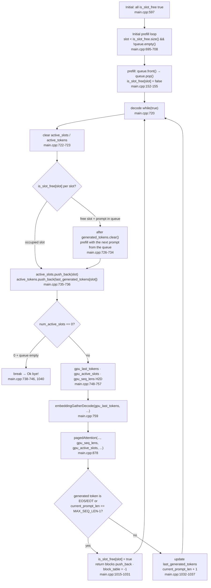

# 7. Overlapping multiple requests with slots and a queue — implementing continuous batching

If the GPU processes only one sequence at a time, it sits idle while that sequence finishes prefill and moves on to decode. Continuous batching is the approach of feeding the next request waiting in the queue into the spot of a request that finishes, so the GPU is never idle. This repository's README also summarizes the principle in one paragraph — "fill slots with prompts, and when any slot finishes generating, return its result and then fill the just-emptied slot with a prompt waiting in the queue."

This part looks at how that sentence becomes two data structures in the code — **slots and a queue**. Part 3 covered prefill's kernel order, part 5 the decode kernel variants, and part 6 reading the block table. On top of that, this part handles only "which slot is filled when and when it empties." The decode loop rebuilds the slots on every iteration, and a finished slot is refilled with the next prompt from the queue. How blocks are read is part 6's territory, so here we focus only on slots and the queue.

> All quotes in this series are relative to commit [`e25bf19`](https://github.com/jmaczan/tiny-vllm/tree/e25bf1994efa90bc98b721ba7c527402f86fbeaf). The author has no NVIDIA GPU, so nothing was built or run; all explanations below come from reading the source.

## Two data structures: slots and the queue

To start a batch, two data structures are needed on the CPU side. One is the slot — **the seat where a currently running sequence sits** — and the other is the **queue**, where prompts that haven't started yet line up. These two data structures are all this part looks at. Let's start with the queue.

```cpp
    // PROMPT 0 (What is 2+2?) - length 17
    std::queue<std::vector<int>> queue;
    queue.push({128000, 128006, 882, 128007, 271, 3923, 374, 220, 17, 10, 17, 30, 128009, 128006, 78191, 128007, 271});

    // PROMPT 1 (Name a color.) - length 14
    queue.push({128000, 128006, 882, 128007, 271, 678, 264, 1933, 13, 128009, 128006, 78191, 128007, 271});

    // PROMPT 2 (Say hello.) - length 13
    queue.push({128000, 128006, 882, 128007, 271, 46864, 24748, 13, 128009, 128006, 78191, 128007, 271});

    // PROMPT 3 (Capital of France?) - length 14
    queue.push({128000, 128006, 882, 128007, 271, 64693, 315, 9822, 30, 128009, 128006, 78191, 128007, 271});
```
— [`src/main.cpp:583-594`](https://github.com/jmaczan/tiny-vllm/blob/e25bf1994efa90bc98b721ba7c527402f86fbeaf/src/main.cpp#L583-L594)

A queue element is a `std::vector<int>`. Each vector is a sequence of token IDs wrapping one prompt in the Llama 3 chat template. Where these IDs come from is shown by `python/batching_test_tokens.py`. This script feeds four sentences into the same template with the `Llama-3.2-1B-Instruct` tokenizer and prints the tokens; the four pushes in `main.cpp` are copied from that output.

```python
from transformers import AutoTokenizer
t = AutoTokenizer.from_pretrained("meta-llama/Llama-3.2-1B-Instruct")

prompts = [
    "What is 2+2?",
    "Name a color.",
    "Say hello.",
    "Capital of France?",
]

offset = 0
for i, p in enumerate(prompts):
    text = f"<|begin_of_text|><|start_header_id|>user<|end_header_id|>\n\n{p}<|eot_id|><|start_header_id|>assistant<|end_header_id|>\n\n"
    tokens = t.encode(text, add_special_tokens=False)
    print(f"// PROMPT {i} ({p}) - length {len(tokens)}")
```
— [`python/batching_test_tokens.py:1-15`](https://github.com/jmaczan/tiny-vllm/blob/e25bf1994efa90bc98b721ba7c527402f86fbeaf/python/batching_test_tokens.py#L1-L15)

It turns off special tokens with `add_special_tokens=False`, puts the template's special tokens directly into the string, and prints the length as a comment. This matches exactly the comments "length 17" and "length 14" in `main.cpp`. What each token ID means was covered in part 1. What matters here is that the ID sequence is **fixed in the source with no tokenizer**, and that the four prompts have different lengths — 17, 14, 13, 14. Overlapping requests of different lengths in the same batch is the starting point of continuous batching.

The number of slots is `BATCH_SIZE = 2`. The comment attached to the constant declaration tells us the character of this value.

```cpp
constexpr int BATCH_SIZE = 2;                // TODO: not even close to being good, it's just here to have batching
```
— [`src/main.cpp:29`](https://github.com/jmaczan/tiny-vllm/blob/e25bf1994efa90bc98b721ba7c527402f86fbeaf/src/main.cpp#L29)

It means "not even close to being good, just enough to be able to say there is batching." This value is aliased as `MAX_SEQUENCES` and becomes the first dimension of the block table (`src/main.cpp:38`). So the block table has 2 × 16 × 128 = 4096 entries, and each slot is assigned a bundle of 16 layers × 128 logical blocks = 2048 entries. That this is not "one row per slot" but rather each slot owning the entire bundle split by layer and logical block was also covered in part 6.

A slot's occupancy state is managed by the `is_slot_free` vector.

```cpp
    std::vector<bool> is_slot_free(BATCH_SIZE, true); // set to false when slot taken, set to true when free
```
— [`src/main.cpp:597`](https://github.com/jmaczan/tiny-vllm/blob/e25bf1994efa90bc98b721ba7c527402f86fbeaf/src/main.cpp#L597)

Each slot's state is tracked by three vectors that follow. `generated_tokens` accumulates the tokens that slot has produced, `last_generated_tokens` is the last one of them, and `current_prompt_len` is the current sequence length (initially 0).

```cpp
    std::vector<std::vector<int>> generated_tokens(BATCH_SIZE);
    std::vector<int> last_generated_tokens(BATCH_SIZE);
    std::vector<int> current_prompt_len(BATCH_SIZE, 0);

    // needed to provide contiguous data for decode
    std::vector<int> active_slots;
    std::vector<int> active_tokens;
```
— [`src/main.cpp:599-605`](https://github.com/jmaczan/tiny-vllm/blob/e25bf1994efa90bc98b721ba7c527402f86fbeaf/src/main.cpp#L599-L605)

As the comment says, `active_slots` and `active_tokens` are a CPU-side collection point for building the **contiguous arrays** that decode passes to the kernels. They are refilled every iteration, so they start empty. The sizes and allocations of these arrays and their device copies (`gpu_active_slots`, `gpu_seq_lens`, `gpu_last_tokens`) were shown in a table in part 2.

## Initial fill: slots 0 and 1 take the prompts

Before the batch starts, `main` fills the empty slots with prompts. The loop below does that. It is a preview of what the later decode loop does on every iteration.

```cpp
    for (int slot = 0; slot < is_slot_free.size() && !queue.empty(); ++slot)
    {
        if (!is_slot_free[slot])
        {
            continue; // slot taken, skip
        }
        prefill(prompt, queue, prompt_len, is_slot_free, slot, ...);
    }
```
— [`src/main.cpp:695-708`](https://github.com/jmaczan/tiny-vllm/blob/e25bf1994efa90bc98b721ba7c527402f86fbeaf/src/main.cpp#L695-L708)

The condition is `slot < is_slot_free.size() && !queue.empty()`. It runs while empty slots remain and there is a prompt in the queue. `is_slot_free.size()` is `BATCH_SIZE`, i.e. 2, so this loop fills slots 0 and 1 in turn and ends at slot 2. The `continue` is there to skip occupied slots, but initially all slots are free so it never triggers in this loop.

The move of a prompt into a slot is done by `prefill`'s entry. These four lines are the only place where a prompt moves from the queue into a slot.

```cpp
    prompt = queue.front();
    prompt_len = prompt.size();
    queue.pop();
    is_slot_free[slot] = false;
```
— [`src/main.cpp:152-155`](https://github.com/jmaczan/tiny-vllm/blob/e25bf1994efa90bc98b721ba7c527402f86fbeaf/src/main.cpp#L152-L155)

The order is: take the front of the queue, record its length, pop it from the queue, and mark the slot occupied. Once a prompt enters a slot, that slot holds it exclusively until it is freed again. So the result of the initial fill is that slots 0 and 1 take prompts 0 and 1, while prompts 2 and 3 remain in the queue. How prefill then records the slot state (pushing to `generated_tokens`, setting `current_prompt_len`) and syncs the block table was covered in parts 3 and 6.

## The decode loop rebuilds the slots

Generation enters a `while (true)` loop. The comment above the loop says "inference server that's supposed to run foreveeer!!!" — the same point part 1 called out as "a batch program, not a server." This part looks at how the loop head **rebuilds the slots** on every iteration.

```cpp
    while (true) // exit condition irrelevant for now, since it's an inference server that's supposed to run foreveeer!!!
    {
        active_slots.clear();
        active_tokens.clear();
        for (int slot = 0; slot < BATCH_SIZE; ++slot)
        {
            if (is_slot_free[slot])
            {
                if (queue.empty())
                {
                    continue;
                }
                generated_tokens[slot].clear();
                prefill(prompt, queue, prompt_len, is_slot_free, slot, ...);
            }
            active_slots.push_back(slot);
            active_tokens.push_back(last_generated_tokens[slot]);
        }
        int num_active_slots = active_slots.size();
        if (num_active_slots == 0)
        {
            if (queue.empty())
            {
                break; // TODO: continue will make sense when I will finally write to queue, for now it has predefined size so break instead
            }
            continue;
        }
```
— [`src/main.cpp:720-746`](https://github.com/jmaczan/tiny-vllm/blob/e25bf1994efa90bc98b721ba7c527402f86fbeaf/src/main.cpp#L720-L746)

Each iteration begins by clearing the two active arrays. Then it examines the slots one by one. If a slot is free (`is_slot_free[slot]`), it pulls the next prompt from the queue and fills it via `prefill`. The reason it clears that slot's `generated_tokens` first is to keep the previous sequence's token record from mixing into the new sequence. `prefill` overwrites `current_prompt_len` with the new prompt's length (`src/main.cpp:548`), so a reused slot does not inherit the previous sequence's length state. If the queue is empty, it skips the slot with `continue`.

The key point is that `active_slots.push_back(slot)` sits **outside** the `if` block (`735`). Both the slot just filled and slots still occupied go into this step's active list. `active_tokens` is filled the same way, holding each slot's `last_generated_tokens`. So the two arrays always hold, in compacted order, "only the slots to compute right now" — which is exactly what the comment "contiguous data for decode" means.

If there are 0 active slots, it branches. If the queue is also empty it `break`s; if prompts remain it `continue`s and retries the fill on the next iteration. The TODO comment on the break line tells us the character of this branch.

> continue will make sense when I will finally write to queue, for now it has predefined size so break instead

— [`src/main.cpp:743`](https://github.com/jmaczan/tiny-vllm/blob/e25bf1994efa90bc98b721ba7c527402f86fbeaf/src/main.cpp#L743)

It means "once there's a way to put new requests into the queue, continue will make sense; for now the queue size is fixed from the start, so break instead." Unlike the comment's intent of an always-on server, the actual execution is a **finite batch program** that ends with `break` once the queue is empty and all active slots are gone.

## Uploading the active arrays to the GPU

Once the slots are decided, three arrays are uploaded to the GPU. It is important to separate out which consumer each of these arrays goes to.

```cpp
        // copy useful data to gpu
        cudaMemcpy(gpu_last_tokens, active_tokens.data(), num_active_slots * sizeof(int), cudaMemcpyHostToDevice);
        cudaMemcpy(gpu_active_slots, active_slots.data(), num_active_slots * sizeof(int), cudaMemcpyHostToDevice);
        std::vector<int> seq_lens(num_active_slots);
        for (int slot = 0; slot < num_active_slots; ++slot)
        {
            int active_slot = active_slots[slot];
            seq_lens[slot] = current_prompt_len[active_slot] + 1;
        }
        cudaMemcpy(gpu_seq_lens, seq_lens.data(), seq_lens.size() * sizeof(int), cudaMemcpyHostToDevice);
```
— [`src/main.cpp:748-757`](https://github.com/jmaczan/tiny-vllm/blob/e25bf1994efa90bc98b721ba7c527402f86fbeaf/src/main.cpp#L748-L757)

The consumers differ. `gpu_last_tokens` is a copy of `active_tokens` and is the input to the embedding kernel `embeddingGatherDecode` (`src/main.cpp:759`). By contrast, the state passed to `pagedAttention` is exactly the four things covered in part 6 — `kv_cache`, `block_table_gpu`, `gpu_seq_lens`, `gpu_active_slots`. The call site passes exactly those four (`src/main.cpp:878`). The kernel gets the active slots from `gpu_active_slots` and each slot's current length from `gpu_seq_lens`. `gpu_last_tokens` is not an attention input but the per-slot last-token buffer the embedding kernel uses. The two device arrays' purposes do not mix.

The `+1` in `seq_lens` includes this step's current token. Decode writes the new token's K/V into the block first and then computes attention, so the length attention reads must be the existing length plus the current token for the block count to come out right. This `+1` is consumed in part 6 as `(seq_len + BLOCK_SIZE - 1) / BLOCK_SIZE`.

## Slot lifetime

Binding the flow we've seen so far into one gives a slot's lifetime. A slot is filled, enters the active list every step, and when it finishes is freed again to become a candidate for the next prompt — that is all there is.

<!-- visual: slot-lifecycle supports: [slot-lifecycle] -->


Occupancy is managed by `is_slot_free` alone, a free slot is filled with the next prompt from the queue, only occupied slots gather into the active arrays and are passed to the kernels each step, and when the termination condition comes the slot is freed and becomes a refill candidate on the next iteration. This cycle is what "overlapping multiple requests" means. Under what conditions and in what order the teardown happens is the next section.

## Termination and returning blocks

After each step's argmax, whether to terminate is decided per slot. If the generated token is EOS/EOT or the total length has reached `MAX_SEQ_LEN-1`, that slot is done.

```cpp
            if (max_token_idx == END_OF_TEXT_TOKEN_ID || max_token_idx == EOT_ID_TOKEN_ID || current_prompt_len[active_slot] == MAX_SEQ_LEN - 1)
            {
                is_slot_free[active_slot] = true;
                for (int layer = 0; layer < N_LAYERS; ++layer)
                {
                    for (int logical_block_idx = 0; logical_block_idx < MAX_BLOCKS_PER_SEQ; ++logical_block_idx)
                    {
                        int block_idx = active_slot * N_LAYERS * MAX_BLOCKS_PER_SEQ + layer * MAX_BLOCKS_PER_SEQ + logical_block_idx;
                        if (block_table[block_idx] != -1)
                        {
                            free_blocks.push_back(block_table[block_idx]);
                            block_table[block_idx] = -1;
                        }
                    }
                }
                cudaMemcpy(block_table_gpu, block_table.data(), MAX_SEQUENCES * N_LAYERS * MAX_BLOCKS_PER_SEQ * sizeof(int), cudaMemcpyHostToDevice);
            }
            else
            {
                last_generated_tokens[active_slot] = max_token_idx;
                generated_tokens[active_slot].push_back(max_token_idx);
                current_prompt_len[active_slot] = current_prompt_len[active_slot] + 1;
            }
```
— [`src/main.cpp:1015-1037`](https://github.com/jmaczan/tiny-vllm/blob/e25bf1994efa90bc98b721ba7c527402f86fbeaf/src/main.cpp#L1015-L1037)

There are three termination conditions. The generated token is `<|end_of_text|>` (128001, `src/main.cpp:26`), or `<|eot_id|>` (128009, `src/main.cpp:27`), or `current_prompt_len[active_slot] == MAX_SEQ_LEN - 1` (`src/main.cpp:1015`). The last condition is **a cap on total sequence length, not on the number of generated tokens**. Because `current_prompt_len` is the prompt length plus the number of generated tokens, a longer prompt reaches that limit sooner.

Three things happen at termination. It frees the slot (`is_slot_free[active_slot] = true`, `1017`), returns every block the slot owned to `free_blocks`, and syncs the block table's device copy host-to-device (`1030`). The return walks the three dimensions covered in part 6 (`active_slot · N_LAYERS · MAX_BLOCKS_PER_SEQ + layer · MAX_BLOCKS_PER_SEQ + logical_block_idx`) to find all of the slot's logical blocks, `push_back`s the physical block number for those that aren't `-1`, and resets them to `-1`. A returned physical block can be reused by another slot's later allocation (`pop_back`).

If not terminating, the slot stays occupied. It updates `last_generated_tokens`, accumulates the token into `generated_tokens`, and increments `current_prompt_len` by 1 (`1032-1037`). This value goes through the next iteration's `active_tokens.push_back` and is sent back to the kernels.

One constant stands out. `MAX_NEW_TOKENS_GENERATED = 20` (`src/main.cpp:12`) is only declared and never referenced anywhere else. Generation termination is determined solely by the EOS/EOT token or reaching `MAX_SEQ_LEN-1`, so this constant does not act as a termination condition.

## Further reading

Material this repository points to as background for this topic.

- [vLLM](https://github.com/vllm-project/vllm) — the original project the README calls the "younger and smaller sibling." Where continuous batching and PagedAttention became famous.
- [PagedAttention paper (Kwon et al., SOSP 2023)](https://arxiv.org/pdf/2309.06180) — background for the structure that returns and reallocates blocks when a slot ends.

## Limitations of this article

Nothing was built or run, and every explanation above is a static quotation obtained by reading commit `e25bf19`'s source. In particular, four points remain without runtime verification. First, a slot terminates only on the EOS/EOT token or reaching `MAX_SEQ_LEN-1`, and `MAX_NEW_TOKENS_GENERATED = 20` is an unreferenced constant. Second, the loop comment (`src/main.cpp:720`) intends an always-on server, but because it breaks when there are 0 active slots and the queue is empty (`src/main.cpp:739-744`), the actual execution is finite. The feature for putting new requests into the queue remains a TODO (`src/main.cpp:743`). Third, the `+1` in `seq_lens = current_prompt_len + 1` is the interpretation that it includes the current token's KV, which fits the source flow but has no runtime verification. Fourth, decode copies all 4096 block table entries host-to-device per layer (`src/main.cpp:876`) and copies once more after returning a slot (`src/main.cpp:1030`). This cost was not measured. The weights file is the gated model `meta-llama/Llama-3.2-1B-Instruct`'s `model.safetensors`, so actually running the batch remains a follow-up task.
