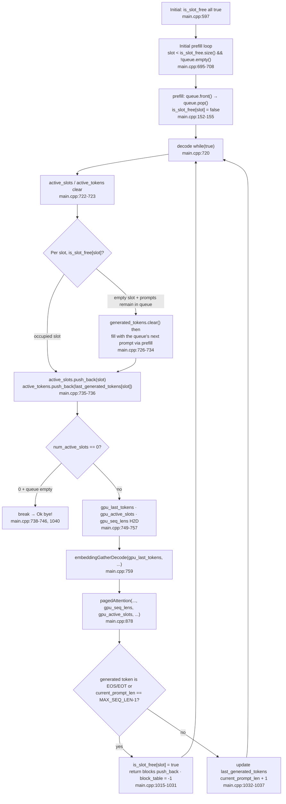

# 7. Running Multiple Requests Together with a Slot Table

All paths and line numbers in this article refer to the tree at the pinned revision
`e25bf1994efa90bc98b721ba7c527402f86fbeaf`. The notation is `file:start-end`, and the
results are source quotations, not execution output.

## The Question of This Chapter

How are slots and queues used to process multiple prompts concurrently? The code scope
is two files, `src/main.cpp` and `python/batching_test_tokens.py`. The minimum evidence
for this chapter is 4 code citations, 0 tests, and 0 executions. Since there are no
tests, all verification is done through source citations alone.

The motivation and concept of continuous batching are taken as given. What this chapter
owns is how that concept is implemented in this codebase as **two stores: slots and
queues**. How decode reads the paged KV cache is owned by episode 6; this chapter only
covers the order in which slots are filled and freed on top of episode 6's block table
allocation and return structure. The full prefill kernel sequence is episode 3, the
cuBLAS transpose trick is episode 4, decode-family kernel variants are episode 5, and
buffer size computation and aliasing design are episode 2.

This series was written in an environment without an NVIDIA GPU or CUDA toolchain, and
not a single decode step was executed. Every ordering and state claim below is a source
citation, and kernel execution time, throughput, and memory usage are not measured.

## Two Stores: Slots and Queues

Batching starts with two pieces of CPU-side state. One is the slot, the place of a
running sequence; the other is the queue of prompts that have not yet started.

The queue is `std::queue<std::vector<int>>` (`src/main.cpp:584`). Each element is a
vector of token IDs of a prompt wrapped in the chat template, and `main` pre-fills four
of them (`src/main.cpp:583-594`): "What is 2+2?" (length 17), "Name a color." (length
14), "Say hello." (length 13), "Capital of France?" (length 14). These token ID
sequences are produced by `python/batching_test_tokens.py`. This script uses the
`Llama-3.2-1B-Instruct` tokenizer to wrap the same four prompts in the format
`<|begin_of_text|><|start_header_id|>user<|end_header_id|>...<|eot_id|><|start_header_id|>assistant<|end_header_id|>`
and prints the tokens (`python/batching_test_tokens.py:1-21`). The four pushes in
`main.cpp` are that output transcribed into the queue structure.

The number of slots is `BATCH_SIZE = 2`. The constant declaration carries the comment
"not even close to being good, it's just here to have batching" (`src/main.cpp:29`).
That means it is a temporary value put in so that batching works. It is aliased as
`MAX_SEQUENCES = BATCH_SIZE` (`src/main.cpp:38`), and the first dimension of the block
table is this value (`src/main.cpp:579`). Therefore the block_table has
2 × 16 × 128 = 4096 entries, and each slot is assigned a bundle of
`N_LAYERS × MAX_BLOCKS_PER_SEQ = 16 × 128 = 2048` entries. It is not "one table row per
slot"; rather, a single slot has the entire bundle of entries divided by layer and
logical block.

Occupancy state is managed by the `is_slot_free` vector. Initialized as
`std::vector<bool>(BATCH_SIZE, true)` ("set to false when slot taken, set to true when
free"), all slots are initially empty (`src/main.cpp:597`). Three state vectors follow
each slot: `generated_tokens` (accumulated generated tokens), `last_generated_tokens`
(last token), and `current_prompt_len` (current sequence length, initialized to 0)
(`src/main.cpp:599-601`).

The CPU-side collection for building the contiguous array that decode passes to the GPU
kernel is also declared here. `active_slots` and `active_tokens` start as empty vectors
with the comment "needed to provide contiguous data for decode" (`src/main.cpp:603-605`).
Device arrays to hold their copies are allocated: `gpu_active_slots`
(`src/main.cpp:607-608`) and `gpu_seq_lens` (`src/main.cpp:609-610`). To these is added
the decode-only buffer `gpu_last_tokens` (`src/main.cpp:684-685`). These three are this
chapter's stage.

## Initial Fill: Slots 0 and 1 Take Prompts

Before the batch starts, `main` fills the empty slots with a single prefill loop
(`src/main.cpp:695-708`).

```cpp
for (int slot = 0; slot < is_slot_free.size() && !queue.empty(); ++slot)
{
    if (!is_slot_free[slot])
    {
        continue; // slot taken, skip
    }
    prefill(prompt, queue, prompt_len, is_slot_free, slot, ...);
}
```

Citation: [`src/main.cpp:695-708`](https://github.com/jmaczan/tiny-vllm/blob/e25bf1994efa90bc98b721ba7c527402f86fbeaf/src/main.cpp#L695-L708)

The condition is `slot < is_slot_free.size() && !queue.empty()`. It runs while empty
slots remain and prompts remain in the queue, and non-empty slots are skipped with
`continue` inside the loop (`src/main.cpp:697-700`). `is_slot_free.size()` equals
`BATCH_SIZE`, so there are only two slots, 0 and 1. The loop fills slot 0 and slot 1 in
turn with `prefill`, and the condition ends at slot 2.

`prefill`'s entry consumes the queue. The order is `prompt = queue.front()`,
`prompt_len = prompt.size()`, `queue.pop()`, `is_slot_free[slot] = false`
(`src/main.cpp:152-155`). Once a prompt is moved to a slot, that slot becomes occupied
and leaves the queue. In this way slots 0 and 1 take prompts 0 and 1. Prompts 2 and 3
remain in the queue. How prefill records the slot's state (generated tokens, length,
block_table synchronization) is covered by episodes 3 and 6.

## The Decode Loop Rebuilds the Slots

Generation enters a `while (true)` loop (`src/main.cpp:720`). The comment above the loop
says "an inference server that's supposed to run foreveeer!!!". Each iteration begins by
clearing two arrays (`src/main.cpp:722-723`).

```cpp
active_slots.clear();
active_tokens.clear();
for (int slot = 0; slot < BATCH_SIZE; ++slot)
{
    if (is_slot_free[slot])
    {
        if (queue.empty())
        {
            continue;
        }
        generated_tokens[slot].clear();
        prefill(prompt, queue, prompt_len, is_slot_free, slot, ...);
    }
    active_slots.push_back(slot);
    active_tokens.push_back(last_generated_tokens[slot]);
}
```

Citation: [`src/main.cpp:722-737`](https://github.com/jmaczan/tiny-vllm/blob/e25bf1994efa90bc98b721ba7c527402f86fbeaf/src/main.cpp#L722-L737)

This loop rebuilds the slots. If a slot is empty (`is_slot_free[slot]`), the next prompt
is taken from the queue and filled with `prefill`. At this point that slot's
`generated_tokens` is cleared first (`src/main.cpp:732`). Since prefill resets
`current_prompt_len` to the prompt length (`src/main.cpp:548`), a reused slot does not
inherit the previous sequence's length state. If the queue is empty, `continue` skips
that slot (`src/main.cpp:728-731`).

The key point is that `active_slots.push_back(slot)` is **outside** the `if` block
(`src/main.cpp:735`). Both the slot just filled and already-occupied slots enter this
step's active list. `active_tokens` is filled the same way, holding each slot's
`last_generated_tokens` (`src/main.cpp:736`). Thus these two arrays always hold "only
the slots to compute now" in compressed order. This is the substance of "contiguous data
for decode".

If the number of slots is 0, the loop branches (`src/main.cpp:738-746`). If the queue is
also empty it does `break`, and if prompts remain it does `continue` to retry filling on
the next iteration. There is a TODO comment at this break point.

> continue will make sense when I will finally write to queue, for now it has
> predefined size so break instead

Citation: [`src/main.cpp:743`](https://github.com/jmaczan/tiny-vllm/blob/e25bf1994efa90bc98b721ba7c527402f86fbeaf/src/main.cpp#L743)

What the comment says is that once the feature to write new requests into the queue
exists, `continue` will make sense, but for now the queue size is fixed from the start,
so `break` is used. This has nothing to do with `BATCH_SIZE`. The basis for `BATCH_SIZE`
being a temporary value is handled separately by the "not even close to being good"
comment on line 29. Because of this, actual execution is a finite program that ends when
the queue is exhausted and the active slots disappear.

## Moving the Active Arrays to the GPU

Once the slots are determined, three arrays are copied H2D (`src/main.cpp:748-757`).

- `gpu_last_tokens` ← `active_tokens` (`src/main.cpp:749`).
- `gpu_active_slots` ← `active_slots` (`src/main.cpp:750`).
- `seq_lens[slot] = current_prompt_len[active_slot] + 1` is computed separately and
  uploaded to `gpu_seq_lens` (`src/main.cpp:751-757`).

The `+1` includes the KV of the current token just recorded by scatter. Since decode
writes K/V into blocks this step and then computes attention, the sequence length that
attention must read is the existing length plus the current token (an interpretation
that connects to episode 6's `seq_len` consumption).

Here the consumer of each array must be split precisely. `gpu_last_tokens` is the input
to `embeddingGatherDecode` (`src/main.cpp:759`). By contrast, the state that
`pagedAttentionKernel` receives is only four things: `kv_cache`, `block_table_gpu`,
`gpu_seq_lens`, and `gpu_active_slots`. The call site passes exactly these four
(`src/main.cpp:878`). It gets the active slots from `gpu_active_slots` and each slot's
current length from `gpu_seq_lens` (owned by episode 6). `gpu_last_tokens` is not an
input to paged attention but the per-slot last token ID buffer that the embedding kernel
will use. The two device arrays have different purposes and are not mixed.

## Slot Lifecycle

Here the chapter's core flow is tied into one. How a slot is filled, enters the active
list each step, and is freed again as it terminates is all there is.

<!-- visual: slot-lifecycle supports: [slot-lifecycle, decode-termination] -->


This diagram captures what `slot-lifecycle` must answer: "how slots are filled and
freed". Occupancy is managed by `is_slot_free`, an empty slot is filled with the queue's
next prompt, only occupied slots gather into the active arrays and are passed to the
kernel each step, and on the termination condition the slot is released and becomes a
refill target on the next iteration—that cycle is all there is. The chain of block
returns in the termination procedure continues in the next section.

## Termination and Block Return

After each step's argmax, termination is decided per slot (`src/main.cpp:1015-1037`).

```cpp
if (max_token_idx == END_OF_TEXT_TOKEN_ID || max_token_idx == EOT_ID_TOKEN_ID || current_prompt_len[active_slot] == MAX_SEQ_LEN - 1)
{
    is_slot_free[active_slot] = true;
    for (int layer = 0; layer < N_LAYERS; ++layer)
    {
        for (int logical_block_idx = 0; logical_block_idx < MAX_BLOCKS_PER_SEQ; ++logical_block_idx)
        {
            int block_idx = active_slot * N_LAYERS * MAX_BLOCKS_PER_SEQ + layer * MAX_BLOCKS_PER_SEQ + logical_block_idx;
            if (block_table[block_idx] != -1)
            {
                free_blocks.push_back(block_table[block_idx]);
                block_table[block_idx] = -1;
            }
        }
    }
    cudaMemcpy(block_table_gpu, block_table.data(), MAX_SEQUENCES * N_LAYERS * MAX_BLOCKS_PER_SEQ * sizeof(int), cudaMemcpyHostToDevice);
}
else
{
    last_generated_tokens[active_slot] = max_token_idx;
    generated_tokens[active_slot].push_back(max_token_idx);
    current_prompt_len[active_slot] = current_prompt_len[active_slot] + 1;
}
```

Citation: [`src/main.cpp:1015-1037`](https://github.com/jmaczan/tiny-vllm/blob/e25bf1994efa90bc98b721ba7c527402f86fbeaf/src/main.cpp#L1015-L1037)

There are three termination conditions. The generated token is `<|end_of_text|>` (128001,
`src/main.cpp:26`) or `<|eot_id|>` (128009, `src/main.cpp:27`), or
`current_prompt_len[active_slot] == MAX_SEQ_LEN - 1` (`src/main.cpp:1015`). The last
condition is not a cap on the number of generated tokens but on the **total sequence
length**. Since `current_prompt_len` is the prefill length (prompt) plus generated
tokens combined, the `MAX_SEQ_LEN` limit is hit earlier the longer the prompt is.

On termination three things happen. The slot is freed
(`is_slot_free[active_slot] = true`, `src/main.cpp:1017`), and all blocks owned by that
slot are returned to `free_blocks`. A 3-dimensional traversal finds entries by
`active_slot * N_LAYERS * MAX_BLOCKS_PER_SEQ + layer * MAX_BLOCKS_PER_SEQ +
logical_block_idx`, `push_back`s only those whose value is not `-1`, and sets them back
to `-1` (`src/main.cpp:1018-1029`). The block table change is synchronized to the device
copy with a full H2D (`src/main.cpp:1030`). Returned physical blocks can later be reused
by another slot's allocation via `free_blocks`'s `pop_back` (owned by episode 6).

If not terminating, the slot lives on. It updates `last_generated_tokens`, accumulates
the token into `generated_tokens`, and increments `current_prompt_len` by 1
(`src/main.cpp:1032-1037`). The next iteration's `active_tokens.push_back` sends this
value to the kernel again.

One constant is worth noting. `MAX_NEW_TOKENS_GENERATED = 20` is only declared
(`src/main.cpp:12`) and is never referenced anywhere. Generation termination is decided
only by EOS/EOT tokens or reaching `MAX_SEQ_LEN - 1`, so this constant is not a
termination condition.

## What This Chapter Does Not Cover

- The block layout of the paged KV cache and the read order of `pagedAttentionKernel`:
  episode 6. This chapter covers only slots and queues.
- Why decode uses a different kernel variant from prefill, and per-slot batched K/V
  projection: episode 5.
- The full prefill kernel call sequence and GQA: episode 3.
- cuBLAS's transpose flags and column-major layout: episode 4.
- Buffer size computation including the KV cache and aliasing design in general:
  episode 2.

## Limitations of This Chapter

- This series was written in an environment without an NVIDIA GPU or CUDA toolchain, so
  not a single decode loop iteration was executed. All ordering claims about slots and
  queues are source citations with no execution verification.
- The execution correctness of the block table's slot index arithmetic
  (`slot * N_LAYERS * MAX_BLOCKS_PER_SEQ + layer * MAX_BLOCKS_PER_SEQ +
  logical_block_idx`) was not verified without a GPU. The 4096 entries and 2048 entries
  per slot are constant arithmetic.
- Slot termination is only via EOS/EOT tokens or reaching `MAX_SEQ_LEN - 1`.
  `MAX_SEQ_LEN - 1` is a total sequence length limit, so a long prompt ends early even
  if the number of generated tokens is small relative to `MAX_SEQ_LEN`.
- `MAX_NEW_TOKENS_GENERATED = 20` (`src/main.cpp:12`) is only declared and never
  referenced, so it does not act as a generated-token limit (per `src/main.cpp:1015`).
- The comment on the `while (true)` loop (`src/main.cpp:720`) intends an always-on
  server, but when active slots reach 0 and the queue is empty it ends with `break`
  (`src/main.cpp:739-744`). Actual execution is therefore finite. The feature to write
  new requests into the queue remains a TODO (`src/main.cpp:743`).
- The `+1` in `seq_lens = current_prompt_len + 1` is an interpretation that it includes
  the current token's KV. It fits the source flow, but it is an inference beyond the
  cited range and has no execution verification.
- Decode copies the entire 4096-entry block table H2D on every layer (`src/main.cpp:876`)
  and copies it once more after a slot is returned (`src/main.cpp:1030`). This cost was
  not measured, and the source's TODO (`src/main.cpp:551`) remains unresolved.
- The weight file is the `model.safetensors` of the gated model
  `meta-llama/Llama-3.2-1B-Instruct`, so actually running the batch remains future work.
  The fact that the token ID sequences in `python/batching_test_tokens.py` depend on this
  model's tokenizer is bound by the same constraint.

## Sources

- `src/main.cpp:12` — `MAX_NEW_TOKENS_GENERATED` (unreferenced constant).
- `src/main.cpp:26-29` — termination token IDs, `MAX_SEQ_LEN`, `BATCH_SIZE`.
- `src/main.cpp:38` — `MAX_SEQUENCES = BATCH_SIZE`.
- `src/main.cpp:152-155` — queue consumption and slot occupancy at `prefill`'s entry.
- `src/main.cpp:546-548` — prefill's slot state recording.
- `src/main.cpp:579-581` — block table and device copy allocation.
- `src/main.cpp:583-594` — queue initialization (four prompts).
- `src/main.cpp:597` — `is_slot_free` initialization.
- `src/main.cpp:599-605` — per-slot state vectors and active arrays.
- `src/main.cpp:607-610`, `684-685` — device array allocation (`gpu_active_slots`,
  `gpu_seq_lens`, `gpu_last_tokens`).
- `src/main.cpp:695-708` — initial prefill loop.
- `src/main.cpp:720-737` — decode loop's slot rebuild and refill.
- `src/main.cpp:738-746` — active-slot branch and break/continue.
- `src/main.cpp:749-757` — active array H2D copy and `seq_lens` computation.
- `src/main.cpp:759` — `embeddingGatherDecode(gpu_last_tokens, ...)`.
- `src/main.cpp:878` — `pagedAttention` call (four state arguments).
- `src/main.cpp:1015-1037` — termination decision, block return, token accumulation.
- `src/main.cpp:1040-1043` — termination output and cleanup.
- `python/batching_test_tokens.py:1-21` — script that generates the token ID sequences
  in the queue.
