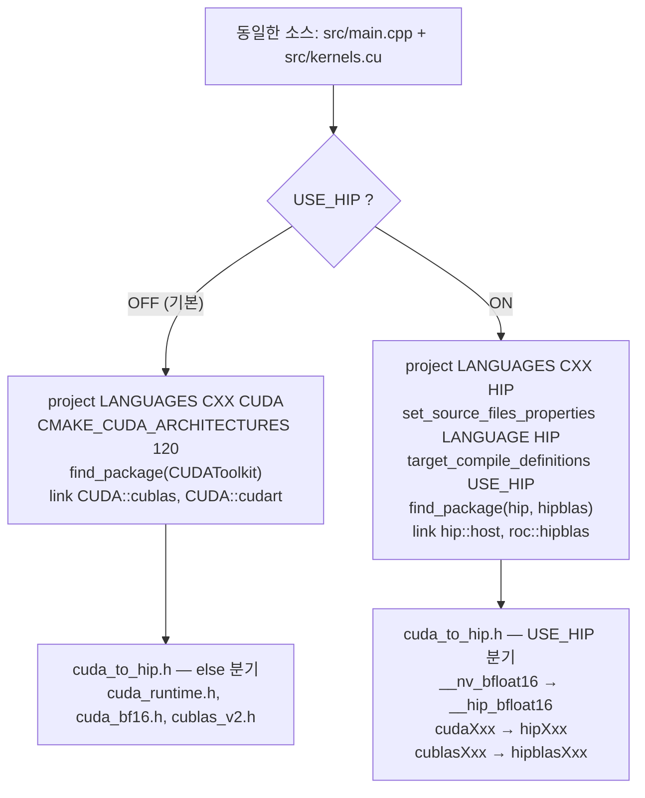

# tiny-vLLM 코드 읽기 1편 — 제품 경계와 실행 진입점

이 시리즈는 `jmaczan/tiny-vllm` 저장소를 고정 revision 에서 읽는다. 1편의
질문은 시리즈의 출발점이다. 이 저장소에서 **제품으로 빌드되는 것은 정확히
무엇이고, 한 번의 실행은 어디서 시작하는가.** 답을 찾기 위해 `CMakeLists.txt`,
네 개의 셸 스크립트, 이식 헤더 하나를 본다. 커널 내부와 가중치 적재는 각각
3편과 2편의 몫이므로 여기서는 경계만 확정한다.

## 고정 revision

- Repository: https://github.com/jmaczan/tiny-vllm
- Commit: `e25bf1994efa90bc98b721ba7c527402f86fbeaf`

이 편의 모든 인용은 위 커밋의 트리를 가리키는 permalink 다. 기본 브랜치를 다시
해석하거나 이후 revision 으로 대체하지 않는다. 저장소는 제품 규모가 작아
(`include/json.hpp` 를 제외하면 약 78KB) 디렉터리 구조보다 **런타임 경로**가
분할 축이 된다. 그 첫 경계가 "무엇이 제품인가"다.

## 제품으로 빌드되는 두 개의 번역 단위

`CMakeLists.txt` 의 `add_executable` 은 제품 바이너리의 번역 단위를 두 개로
못박는다.

<!-- visual: product-translation-units supports: [product-translation-units] -->
| 산출물 | 구성 | 근거 |
| --- | --- | --- |
| `tiny-vllm` 실행 파일 | `src/main.cpp`, `src/kernels.cu` | [`CMakeLists.txt:49-52`](https://github.com/jmaczan/tiny-vllm/blob/e25bf1994efa90bc98b721ba7c527402f86fbeaf/CMakeLists.txt#L49-L52) |
| include 경로 `src` | `cuda_to_hip.h`, `kernels.cuh` | [`CMakeLists.txt:62`](https://github.com/jmaczan/tiny-vllm/blob/e25bf1994efa90bc98b721ba7c527402f86fbeaf/CMakeLists.txt#L62) |
| include 경로 `include` | `json.hpp`(vendored 단일 헤더) | [`CMakeLists.txt:63`](https://github.com/jmaczan/tiny-vllm/blob/e25bf1994efa90bc98b721ba7c527402f86fbeaf/CMakeLists.txt#L63) |

`add_executable(tiny-vllm src/main.cpp src/kernels.cu)` 한 줄이 제품의 전부다.
`src/main.cpp` 는 호스트 오케스트레이션(가중치 적재, 버퍼 할당, 커널 호출,
슬롯 관리)을, `src/kernels.cu` 는 11개 `__global__` 커널을 담는다. 두 파일이
각각 하나의 번역 단위이므로, 제품은 정확히 두 번역 단위로만 빌드된다.

나머지 경로는 번역 단위가 아니라 헤더 의존이다. `src/kernels.cuh` 는 28줄짜리
함수 선언 모음이고([`src/kernels.cuh:1-28`](https://github.com/jmaczan/tiny-vllm/blob/e25bf1994efa90bc98b721ba7c527402f86fbeaf/src/kernels.cuh#L1-L28)),
`src/cuda_to_hip.h` 는 이식 shim 이다. `src/main.cpp` 의 include 블록은 이
구성을 그대로 반영한다.

```cpp
#include <iostream>
#include <numeric>
#include <fstream>
#include "cuda_to_hip.h"
#include <queue>
#define JSON_USE_IMPLICIT_CONVERSIONS 0
#include "json.hpp"
#include "kernels.cuh"
```

인용: [`src/main.cpp:1-8`](https://github.com/jmaczan/tiny-vllm/blob/e25bf1994efa90bc98b721ba7c527402f86fbeaf/src/main.cpp#L1-L8)

`cuda_to_hip.h` 와 `kernels.cuh` 는 include 경로 `src` 로,
`json.hpp` 는 include 경로 `include` 로 들어온다. `json.hpp` 는 제품 코드가
아니라 **include 경로로 끌려오는 제3자 의존**이다. 이 시리즈는 이 파일을
vendored 단일 헤더(`JSON for Modern C++ 3.12.0`, MIT)로 취급해 분석 범위에서
제외한다.
실제로 `main.cpp` 는 `json.hpp` 를 safetensors 헤더 파싱에만 쓴다
([`src/main.cpp:104-106`](https://github.com/jmaczan/tiny-vllm/blob/e25bf1994efa90bc98b721ba7c527402f86fbeaf/src/main.cpp#L104-L106),
2편에서 다룬다). `main.cpp` 의 include 목록에 `json.hpp` 가 있다는 사실만으로
그것이 제품 소스가 되지는 않는다.

## 같은 소스, 두 개의 백엔드

`CMakeLists.txt` 는 제품 번역 단위를 두 백엔드로 분기한다. 첫 줄에
`option(USE_HIP "Build with HIP for AMD GPUs" OFF)` 가 있고
([`CMakeLists.txt:3`](https://github.com/jmaczan/tiny-vllm/blob/e25bf1994efa90bc98b721ba7c527402f86fbeaf/CMakeLists.txt#L3)),
기본값은 CUDA 경로다.

<!-- visual: dual-backend-branch supports: [dual-backend-branch] -->


분기의 실제 지점은 다섯 곳이다.

- 언어 선택: `USE_HIP` 이면 `project(tiny-vllm LANGUAGES CXX HIP)`, 아니면
  `CXX CUDA` ([`CMakeLists.txt:10-16`](https://github.com/jmaczan/tiny-vllm/blob/e25bf1994efa90bc98b721ba7c527402f86fbeaf/CMakeLists.txt#L10-L16)).
- CUDA 아키텍처: CUDA 경로에서만 `CMAKE_CUDA_ARCHITECTURES 120` 을 지정한다
  ([`CMakeLists.txt:21-25`](https://github.com/jmaczan/tiny-vllm/blob/e25bf1994efa90bc98b721ba7c527402f86fbeaf/CMakeLists.txt#L21-L25)).
- 패키지 탐색: `find_package(hipblas)`·`find_package(hip)` 대
  `find_package(CUDAToolkit)`
  ([`CMakeLists.txt:42-47`](https://github.com/jmaczan/tiny-vllm/blob/e25bf1994efa90bc98b721ba7c527402f86fbeaf/CMakeLists.txt#L42-L47)).
- 소스 언어 강제: HIP 경로에서만 `src/main.cpp`·`src/kernels.cu` 에
  `LANGUAGE HIP` 을 걸고 `USE_HIP` 매크로를 정의한다
  ([`CMakeLists.txt:54-60`](https://github.com/jmaczan/tiny-vllm/blob/e25bf1994efa90bc98b721ba7c527402f86fbeaf/CMakeLists.txt#L54-L60)).
- 링크: `hip::host`·`roc::hipblas` 대 `CUDA::cublas`·`CUDA::cudart`
  ([`CMakeLists.txt:65-75`](https://github.com/jmaczan/tiny-vllm/blob/e25bf1994efa90bc98b721ba7c527402f86fbeaf/CMakeLists.txt#L65-L75)).

"같은 CUDA 소스"라는 표현은 정확히는 **소스가 CUDA 철자를 유지한 채
컴파일된다**는 뜻이다. 두 번역 단위는 모두 `cuda_to_hip.h` 를 첫 include 로
끌어온다(`src/main.cpp:4`, `src/kernels.cu:1`). 이 헤더가 백엔드 차이를
흡수한다.

`src/cuda_to_hip.h` 는 `#if defined(USE_HIP) || defined(__HIP_PLATFORM_AMD__)`
조건으로 갈린다([`src/cuda_to_hip.h:6`](https://github.com/jmaczan/tiny-vllm/blob/e25bf1994efa90bc98b721ba7c527402f86fbeaf/src/cuda_to_hip.h#L6)).
HIP 경로에서는 세 종류의 이름을 매크로로 바꾼다.

- bfloat16 타입: `#define __nv_bfloat16 __hip_bfloat16`,
  `#define nv_bfloat16 __hip_bfloat16`
  ([`src/cuda_to_hip.h:12-14`](https://github.com/jmaczan/tiny-vllm/blob/e25bf1994efa90bc98b721ba7c527402f86fbeaf/src/cuda_to_hip.h#L12-L14)).
- CUDA 런타임 호출: `cudaMalloc` → `hipMalloc`, `cudaMemcpy` → `hipMemcpy`,
  `cudaGetDeviceProperties` → `hipGetDeviceProperties` 등
  ([`src/cuda_to_hip.h:16-31`](https://github.com/jmaczan/tiny-vllm/blob/e25bf1994efa90bc98b721ba7c527402f86fbeaf/src/cuda_to_hip.h#L16-L31)).
- cuBLAS 이름: `cublasGemmEx` → `hipblasGemmEx`, `CUBLAS_OP_T` →
  `HIPBLAS_OP_T`, `CUDA_R_16BF` → `HIP_R_16BF` 등
  ([`src/cuda_to_hip.h:33-46`](https://github.com/jmaczan/tiny-vllm/blob/e25bf1994efa90bc98b721ba7c527402f86fbeaf/src/cuda_to_hip.h#L33-L46)).

CUDA 경로(else 분기)는 반대로 `cuda_runtime.h`·`cuda_bf16.h`·`cublas_v2.h` 를
그대로 include 한다([`src/cuda_to_hip.h:52-59`](https://github.com/jmaczan/tiny-vllm/blob/e25bf1994efa90bc98b721ba7c527402f86fbeaf/src/cuda_to_hip.h#L52-L59)).
제품 전역이 `__nv_bfloat16` 을 타입으로 쓰므로
([`src/main.cpp:66-76`](https://github.com/jmaczan/tiny-vllm/blob/e25bf1994efa90bc98b721ba7c527402f86fbeaf/src/main.cpp#L66-L76),
[`src/kernels.cu:32-40`](https://github.com/jmaczan/tiny-vllm/blob/e25bf1994efa90bc98b721ba7c527402f86fbeaf/src/kernels.cu#L32-L40)),
이 한 줄의 매크로가 두 백엔드를 같은 소스로 성립시킨다. `src/kernels.cuh` 도
동일한 bf16 별칭을 중복 정의한다
([`src/kernels.cuh:3-9`](https://github.com/jmaczan/tiny-vllm/blob/e25bf1994efa90bc98b721ba7c527402f86fbeaf/src/kernels.cuh#L3-L9)).

빌드 산출물은 기본 `Release` 이고 최적화 플래그는 `-O2` 다
([`CMakeLists.txt:27-38`](https://github.com/jmaczan/tiny-vllm/blob/e25bf1994efa90bc98b721ba7c527402f86fbeaf/CMakeLists.txt#L27-L38)).
CUDA 경로는 `nvcc` 경로를 `/opt/cuda/bin/nvcc` 로 하드코딩한다
([`CMakeLists.txt:5-8`](https://github.com/jmaczan/tiny-vllm/blob/e25bf1994efa90bc98b721ba7c527402f86fbeaf/CMakeLists.txt#L5-L8)).

## 저장소가 규정한 대표 실행 경로

제품 바이너리를 만드는 것과 실행하는 것은 네 개의 셸 스크립트가 규정한다.
저장소가 스스로 규정한 대표 경로는 `full_test.sh` 하나다.

```text
full_test.sh
  └── echo "<token ids>" | ./test.sh
        ├── ./build.sh      (cmake + ninja)
        └── ./run.sh        (./build/tiny-vllm)
```

각 단계는 본문이 짧아 전문을 인용할 수 있다.

- `full_test.sh` 는 하드코딩된 Llama-3 채팅 템플릿 토큰 ID 열을 표준 입력으로
  `./test.sh` 에 넘긴다. 한 줄짜리 스크립트다
  ([`full_test.sh:1`](https://github.com/jmaczan/tiny-vllm/blob/e25bf1994efa90bc98b721ba7c527402f86fbeaf/full_test.sh#L1)).
- `test.sh` 는 `./build.sh` 를 실행한 뒤 `./run.sh` 를 실행한다
  ([`test.sh:1-2`](https://github.com/jmaczan/tiny-vllm/blob/e25bf1994efa90bc98b721ba7c527402f86fbeaf/test.sh#L1-L2)).
- `build.sh` 는 `build/` 를 지우고 다시 만들고, 그 안에서
  `cmake .. -G Ninja && ninja` 를 돌린다
  ([`build.sh:1-3`](https://github.com/jmaczan/tiny-vllm/blob/e25bf1994efa90bc98b721ba7c527402f86fbeaf/build.sh#L1-L3)).
- `run.sh` 는 `./build/tiny-vllm` 을 실행한다
  ([`run.sh:1`](https://github.com/jmaczan/tiny-vllm/blob/e25bf1994efa90bc98b721ba7c527402f86fbeaf/run.sh#L1)).

두 가지가 이 경로에서 읽힌다. 첫째, `full_test.sh` 는 `./test.sh` 를 상대
경로로 부르므로 저장소 루트에서 실행해야 한다. 둘째, 제품 바이너리는
`./build/tiny-vllm` 이라는 하나의 실행 파일로 인자 없이 실행된다. 표준 입력으로
들어온 토큰 열이 실제로 프로그램을 움직이는지는 다음 절에서 `main` 을 보며
확인한다.

## 실행 진입점: `main`

C++ 진입점은 `src/main.cpp` 의 `main` 이다
([`src/main.cpp:555`](https://github.com/jmaczan/tiny-vllm/blob/e25bf1994efa90bc98b721ba7c527402f86fbeaf/src/main.cpp#L555)).
호스트 함수는 네 개뿐이다: `checkGPUStatus`, `loadWeights`, `prefill`, `main`.
모델 forward 전체와 paged KV cache 관리가 `prefill` 과 `main` 안에 들어 있다.
`main` 이 실행의 주도권을 쥐고, 순서는 다음과 같다.

1. cuBLAS 핸들 생성: `cublasCreate` — 실패하면 `return 1`
   ([`src/main.cpp:557-563`](https://github.com/jmaczan/tiny-vllm/blob/e25bf1994efa90bc98b721ba7c527402f86fbeaf/src/main.cpp#L557-L563)).
2. 가중치 적재: `loadWeights(weights)` — 실패하면 `return 1`
   ([`src/main.cpp:566-569`](https://github.com/jmaczan/tiny-vllm/blob/e25bf1994efa90bc98b721ba7c527402f86fbeaf/src/main.cpp#L566-L569)).
   `loadWeights` 는 먼저 `checkGPUStatus` 를 호출하고
   ([`src/main.cpp:79-84`](https://github.com/jmaczan/tiny-vllm/blob/e25bf1994efa90bc98b721ba7c527402f86fbeaf/src/main.cpp#L79-L84)),
   GPU 가 없으면 오류를 출력하고 `1` 을 돌려준다
   ([`src/main.cpp:40-62`](https://github.com/jmaczan/tiny-vllm/blob/e25bf1994efa90bc98b721ba7c527402f86fbeaf/src/main.cpp#L40-L62)).
3. RoPE 주파수 초기화: `init_rope_frequencies(...)`
   ([`src/main.cpp:572`](https://github.com/jmaczan/tiny-vllm/blob/e25bf1994efa90bc98b721ba7c527402f86fbeaf/src/main.cpp#L572)).
4. paged KV cache 할당자 준비: `kv_cache` 2GB `cudaMalloc`, `free_blocks` 를
   `0..65535` 로 채우고, `block_table` 을 `-1` 로 초기화한 뒤
   `block_table_gpu` 를 할당한다
   ([`src/main.cpp:574-581`](https://github.com/jmaczan/tiny-vllm/blob/e25bf1994efa90bc98b721ba7c527402f86fbeaf/src/main.cpp#L574-L581)).
5. 요청 큐: 프롬프트 4개를 큐에 넣는다
   ([`src/main.cpp:583-594`](https://github.com/jmaczan/tiny-vllm/blob/e25bf1994efa90bc98b721ba7c527402f86fbeaf/src/main.cpp#L583-L594)).
6. 이후 prefill 버퍼와 decode 전용 버퍼를 할당하고(2편), 슬롯을 채우고
   prefill·decode 루프를 돈다.

`main` 의 시그니처는 `int main(int argc, char *argv[])` 지만
([`src/main.cpp:555`](https://github.com/jmaczan/tiny-vllm/blob/e25bf1994efa90bc98b721ba7c527402f86fbeaf/src/main.cpp#L555)),
`argc`·`argv` 는 본문에서 참조되지 않는다. 프롬프트는 명령행이 아니라 코드에
하드코딩된 큐에서 온다. 그래서 `full_test.sh` 가 표준 입력으로 넘긴 토큰 열은
`main` 이 읽는 입력이 아니다. 정상 종료 경로는 decode 루프가 큐와 활성 슬롯이
모두 비었을 때의 `break` 하나뿐이며, 이후 `Ok bye!` 출력, `cublasDestroy`,
`cudaDeviceSynchronize`, `return 0` 순으로 끝난다
([`src/main.cpp:1040-1044`](https://github.com/jmaczan/tiny-vllm/blob/e25bf1994efa90bc98b721ba7c527402f86fbeaf/src/main.cpp#L1040-L1044)).

## 이 편이 확정한 것

- 제품 바이너리 `tiny-vllm` 은 `src/main.cpp` 와 `src/kernels.cu` 두 번역
  단위로만 빌드된다. `include/json.hpp` 는 include 경로로 들어오는 vendored
  의존이지 제품 코드가 아니다.
- 같은 소스가 `USE_HIP` 옵션 하나로 CUDA/hipBLAS 경로를 오가며,
  `src/cuda_to_hip.h` 가 bfloat16 타입과 런타임·BLAS 이름 차이를 흡수한다.
- 실행은 `full_test.sh → test.sh → build.sh → run.sh` 로 이어지고, 실제
  진입점은 `build/tiny-vllm` 의 `main` 이다.

## 한계와 미해결

- **실행 검증 없음.** 이 시리즈를 쓰는 환경에는 NVIDIA GPU 도 CUDA 툴체인도
  없다. 빌드·실행·프로파일링을 수행하지 않았고, 위 순서와 분기는 전부 소스
  인용으로만 뒷받침된다. 모든 편의 `required_evidence.runtime` 은 0 이다.
- **빌드 환경 의존.** `CMakeLists.txt` 는 `nvcc` 경로를 `/opt/cuda/bin/nvcc`
  로, CUDA 아키텍처를 `120` 으로 하드코딩한다. upstream 이 밝힌 개발·검증
  환경은 NVIDIA RTX 5090, CUDA Toolkit 13.1, GCC 15.2.1 이며, 이 환경에서는
  그대로 재현할 수 없다.
- **가중치 제약.** `main` 은 작업 디렉터리의 `model.safetensors` 를 직접
  연다. 이는 gated 모델 `meta-llama/Llama-3.2-1B-Instruct` 의 가중치여서
  확보 자체가 제약이고, 2편의 적재 경로도 실행 검증 대상이 아니다.
- **셸 스크립트의 위치.** `build.sh`·`run.sh`·`test.sh` 는 인벤토리에서
  `other` 로 분류됐지만, 저장소가 스스로 규정한 실행 경로를 이루므로 이
  시리즈는 포함 범위로 둔다. 본문이 짧아 전문 인용으로 검증했으나, 실제
  실행 산출물은 없다.
- **제외 범위.** `check.sh`·`ncu.sh`·`nsys.sh` 는 compute-sanitizer 와 Nsight
  프로파일링용으로 GPU 와 `sudo` 를 요구해 제외한다. `.vscode/` 와
  `assets/column-row-major.png` 는 구현 근거가 아니다.
- **성능 수치 없음.** 이 시리즈는 커널 실행 시간·처리량·메모리 사용량을
  측정하지 않는다. 성능 관련 수치를 인용할 때는 upstream 출처와 환경을
  문장에서 밝히고 측정값으로 읽히지 않게 쓴다.

## 다음 편

2편 **가중치 적재와 GPU 버퍼 설계**에서는 `loadWeights` 가 safetensors 를
어떻게 읽어 한 번의 `cudaMalloc` 으로 올리는지, 그리고 prefill·decode 버퍼가
어떤 크기로 미리 잡히고 어떻게 별칭되는지를 본다.
