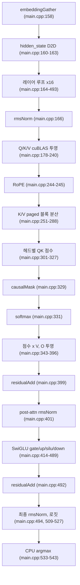
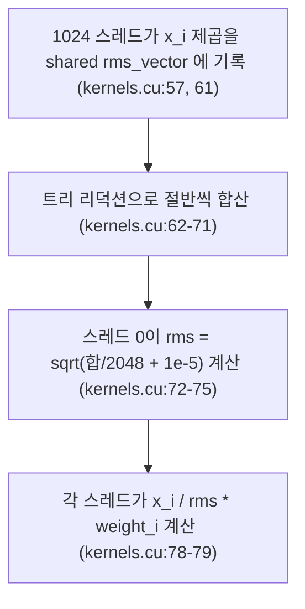

# 3. 프롬프트 전체를 한 번에 흘리는 prefill 경로

이 글의 모든 경로와 줄 번호는 고정 revision
`e25bf1994efa90bc98b721ba7c527402f86fbeaf` 의 트리를 가리킨다(`guide.md:6`). 표기는
`파일:시작-끝` 형식이며, 실행 결과가 아니라 소스 인용이다.

## 이 장의 질문

프롬프트 토큰이 임베딩부터 다음 토큰 선택까지 어떤 커널 순서로 흐르는가
(`series.yaml:53-55`). prefill 과 decode 의 구분, attention 수식, KV cache 의 존재
이유는 이 시리즈의 전제이며 여기서 다시 설명하지 않는다(`guide.md:14-16`).

이 장이 소유하는 것은 **prefill 한 번의 커널 순서**와 **블록 내 병렬 리덕션**
설명이다(`guide.md:195-196`). decode 와의 대비는 5편, cuBLAS 의 전치 레이아웃은
4편, KV 저장 구조는 6편, 슬롯·큐는 7편이 맡는다(`guide.md:144-146`,
`195-200`).

## prefill 함수 하나에 담긴 모델 forward

제품의 호스트 함수는 `checkGPUStatus`, `loadWeights`, `prefill`, `main` 네 개뿐이고,
모델 forward 전체가 `prefill`(`src/main.cpp:150-553`) 안에 들어 있다
(`guide.md:103-105`). `main` 은 초기화 단계에서 빈 슬롯마다 `prefill` 을 호출하고
(`src/main.cpp:695-708`), decode 루프에서도 슬롯이 비면 같은 `prefill` 을 다시
호출한다(`src/main.cpp:724-737`). 즉 prefill 은 별도 실행 파일이나 서버가 아니라
같은 실행 파일 안의 함수 호출이다(`trace.md:75-77`, `122-126`).

한 번의 `prefill` 호출은 프롬프트의 **모든 토큰을 함께** 처리한다(Claim 6,
`claims.md:110-127`). 이것이 decode 가 슬롯당 토큰 하나를 다루는 방식과 갈리는
지점이며, 그 차이는 5편에서 다룬다.

## 커널 호출 순서

`prefill` 이 큐에서 프롬프트를 꺼내 `is_slot_free[slot]` 을 `false` 로 바꾼 뒤
(`src/main.cpp:152-155`), 임베딩부터 다음 토큰 선택까지 다음 순서로 커널과 cuBLAS
를 호출한다(Claim 6, `claims.md:110-127`; `trace.md:79-116`).

<!-- visual: prefill-kernel-sequence supports: [prefill-kernel-sequence] -->

단계별로 근거를 붙이면 다음과 같다.

1. 토큰 H2D 복사 후 `embeddingGather` 로 임베딩을 모으고
   (`src/main.cpp:157-158`), 커널 구현은 `embeddingGatherKernel`
   (`src/kernels.cu:32-53`)이다.
2. `hidden_state` 에 임베딩을 D2D 복사한다(`src/main.cpp:160-163`).
3. 16개 레이어를 순회하며(`src/main.cpp:164-493`) 레이어마다 RMSNorm →
   Q/K/V 투영 → RoPE → K/V 블록 분산 → 어텐션 점수 → causalMask → softmax →
   점수×V → O 투영 → 잔차 → post-attn RMSNorm → SwiGLU → 잔차를 반복한다.
4. 레이어 밖에서 최종 RMSNorm(`src/main.cpp:494`)과 로짓 cuBLAS
   (`src/main.cpp:509-527`)를 거쳐, `embed_proj` 를 D2H 복사하고
   (`src/main.cpp:529`) CPU 에서 마지막 토큰 행만 argmax 한다
   (`src/main.cpp:533-543`).
5. 선택된 토큰을 상태에 기록하고(`src/main.cpp:546-548`), `block_table` 전체를
   `block_table_gpu` 로 H2D 동기화한다(`src/main.cpp:552`).

디바이스 구현 전체는 prefill 계열 커널 `src/kernels.cu:32-344` 에 모여 있다
(`trace.md:251-255`). 이름을 짝지으면 `rmsNormKernel`(`src/kernels.cu:55-94`),
`ropeKernel_llama3`(`src/kernels.cu:173-222`), `causalMaskKernel`
(`src/kernels.cu:224-255`), `softmaxKernel`(`src/kernels.cu:257-309`), 잔차 커널
`residualKernel`(`src/kernels.cu:311-329`), `siluKernel`(`src/kernels.cu:331-344`)
이다. 호스트에서는 잔차 덧셈이 `residualAdd` 라는 호출로 나타난다
(`src/main.cpp:399`, `492`; Claim 9 `claims.md:167-185`).

K/V 투영은 cuBLAS 로 계산되지만, 행 우선 데이터를 열 우선으로 다루는 전치
플래그와 `lda`·`ldb`·`ldc` 선택은 이 장의 범위가 아니며 4편이 소유한다
(`guide.md:197`, Claim 9). 이 장은 "어떤 순서로 호출되는가"까지만 다룬다.

## RMSNorm: 블록 내 병렬 리덕션

`rmsNormKernel` 은 정규화 대상 벡터의 제곱 평균을 **블록 안에서** 구한다(Claim 7,
`claims.md:129-145`). 1024 스레드가 shared memory 배열 `rms_vector[1024]` 를
공유하고(`src/kernels.cu:57`), 각 스레드가 자기 요소의 제곱을 누적한다
(`src/kernels.cu:61`). 이어서 트리 리덕션으로 합을 절반씩 줄여 나가고
(`src/kernels.cu:62-71`), 마지막에 스레드 0 이 `sqrt(합/2048 + 1e-5)` 로 rms 를
계산한다(`src/kernels.cu:72-75`). 계산된 값으로 각 요소를 나누고 가중치를 곱한다
(`src/kernels.cu:78-79`). 런치 구성은 `src/kernels.cu:84-86` 에 있다.

<!-- visual: rmsnorm-reduction supports: [rmsnorm-reduction] -->

여기서 `2048` 은 이 모델의 hidden 차원이고, `1e-5` 는 0 나눗셈을 막는 엡실론이다
(Claim 7, `claims.md:133-135`). 블록 하나가 벡터 하나를 끝까지 처리하므로 별도의
전역 동기화나 두 번째 커널 없이 정규화가 끝난다. softmax 도 같은 종류의 블록 내
리덕션을 쓰지만, 그 설명은 이 장의 소유이며 이후 편에서 재설명하지 않는다
(`guide.md:196`).

## GQA 어텐션과 causal mask

어텐션 점수는 Q 헤드 32개 각각에 대해 cuBLAS 로 계산한다(Claim 8,
`claims.md:147-163`). 이때 K 헤드는 Q 헤드 인덱스 `i` 에 대해 `i/4` 로 매핑되어
GQA 를 이룬다(`src/main.cpp:303`; `k_head_idx = i / GQA_Q_TO_K_RATIO`). Q 헤드가
32개이고 비율이 4이므로 K/V 헤드는 8개다. 점수는 `attn_alpha = 1/sqrt(64)` 로
스케일되며(`src/main.cpp:649-650`, 상수는 `src/main.cpp:19-24`), 헤드 하나의 차원
`HEAD_DIM` 이 64이므로 `1.0f/8.0f` 와 같다.

점수를 구한 뒤에는 `causalMask` 로 미래 위치를 가리고(`src/main.cpp:329`), 행별
`softmax` 를 적용한다(`src/main.cpp:331`). 커널 구현은 각각
`src/kernels.cu:224-255` 와 `src/kernels.cu:257-309` 에 있다. 그 다음 점수×V 와
O 투영이 이어진다(`src/main.cpp:343-396`). 점수 버퍼의 크기와 재사용 규칙은
버퍼 설계를 소유한 2편의 몫이며, 이 장은 순서만 확인한다(`guide.md:194`).

## 이 장이 다루지 않는 것

- cuBLAS 호출의 전치 플래그와 레이아웃 해석: 4편(`guide.md:197`).
- decode 계열 커널 변형과 `pagedAttentionKernel`: 5편·6편(`guide.md:198-199`).
- KV cache 블록 레이아웃과 block table 인덱싱: 6편(`guide.md:199`).
- 슬롯·큐를 통한 동시 요청 겹치기: 7편(`guide.md:200`).
- 버퍼 크기 산정과 별칭: 2편(`guide.md:194`).

## 이 장의 한계

- 이 시리즈는 NVIDIA GPU 와 CUDA 툴체인이 없는 환경에서 작성되어 커널을 실행하지
  않는다. 커널 호출 순서를 포함한 모든 기술 주장은 소스 순서 인용이며 실행
  검증이 없다(`guide.md:75-87`; Claim 6 한계 `claims.md:126-127`).
- Claim 7 의 수치 교차검증 대상인 `python/rms_norm_crosscheck.txt` 는 저장소에
  커밋돼 있으나 이 작업에 첨부되지 않았고 실행도 하지 않았다
  (`claims.md:144-145`).
- Claim 8 의 참조 출력으로 선언된 `python/reference.py` 역시 실행되지 않았고
  수치 일치 검증도 없다(`claims.md:162-163`).
- `tests/test_softmax.cu` 는 `series.yaml` 의 code_scope 이지만 이를 직접 다루는
  claim 이 없다. 이 장의 검증은 커밋된 참조 출력 인용으로 대체한다
  (`briefs.md:94`).
- `src/kernels.cuh`(선언)와 `src/cuda_to_hip.h`(bf16·BLAS shim)는 첨부에 없어
  시그니처 수준의 대조는 하지 못했다(`trace.md:219-221`).
- `rope`, `causalMask`, `softmax` 커널은 스레드 수가 1024를 넘으면 런치를
  생략하는 가드가 있다(`src/kernels.cu:205-209`, `241-245`, `295-299`;
  `trace.md:203-206`). 이 가드가 실제 실행에서 발동하는지는 검증되지 않았다.

## 출처

- `src/main.cpp:150-553` — `prefill`; 커널 순서 `157-158`, `166`, `178-240`,
  `244-245`, `251-288`, `301-327`, `329`, `331`, `343-396`, `399`, `401`,
  `414-489`, `492`; 마무리 `494`, `509-527`, `529`, `533-543`, `546-548`, `552`.
- `src/kernels.cu:32-344` — prefill 계열 커널; RMSNorm `55-94`, RoPE `173-222`,
  causalMask `224-255`, softmax `257-309`, residual `311-329`, silu `331-344`.
- `src/main.cpp:695-708`, `724-737` — 초기 및 decode 루프에서의 `prefill` 호출.
- `series.yaml:53-55` — 이 장의 질문과 범위.
- `guide.md:75-87`, `144-146`, `194-200` — 실행 제약과 편별 경계.
