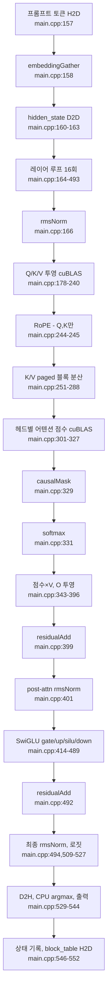
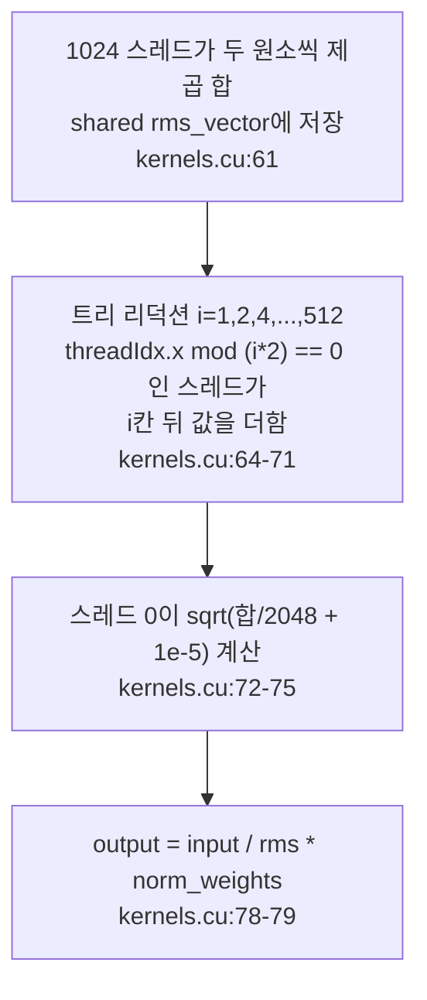

# 3. 프롬프트 전체를 한 번에 흘리는 prefill 경로

이 글의 모든 경로와 줄 번호는 고정 revision
`e25bf1994efa90bc98b721ba7c527402f86fbeaf` 의 트리를 가리킨다. 표기는
`파일:시작-끝` 형식이며, 실행 결과가 아니라 소스 인용이다.

## 이 장의 질문

프롬프트 토큰이 임베딩부터 다음 토큰 선택까지 어떤 커널 순서로 흐르는가. 코드
범위는 `src/main.cpp`, `src/kernels.cu`, `src/kernels.cuh`,
`tests/test_softmax.cu` 네 파일이다. 이 장의 최소 근거는 코드 인용 6건, 테스트
1건, 실행 0건이다.

이 장은 prefill 경로와 병렬 리덕션 설명을 소유한다. 빌드 경계와 진입점은 1편,
가중치 적재와 버퍼 크기·별칭은 2편이 맡는다. cuBLAS 의 전치 플래그와 열 우선
레이아웃은 4편, decode 계열 커널 변형은 5편, paged attention 과 block table 은
6편, 슬롯·큐 수명주기는 7편이 소유한다. 여기서는 커널이 어떤 순서로 호출되고
각 커널이 무엇을 계산하는지에 집중하고, cuBLAS 호출의 레이아웃 세부는 4편으로
넘긴다.

이 시리즈는 NVIDIA GPU 와 CUDA 툴체인이 없는 환경에서 작성되어 어떤 커널도
실행하지 않았다. 아래의 모든 순서·인덱스·리덕션 주장은 소스 인용이며, 커널 실행
시간·처리량·메모리 사용량은 측정하지 않는다.

## prefill 이 호출되는 자리

호스트 함수는 `checkGPUStatus`(`src/main.cpp:40-62`), `loadWeights`
(`src/main.cpp:79-147`), `prefill`(`src/main.cpp:150-553`), `main`
(`src/main.cpp:555-1044`) 네 개뿐이고, 모델 forward 전체가 `prefill` 안에 들어
있다. `main` 은 초기 prefill 루프에서 빈 슬롯을 큐의 프롬프트로 채우고
(`src/main.cpp:695-708`), decode 루프의 매 반복에서도 빈 슬롯마다 `prefill` 을
다시 호출한다(`src/main.cpp:724-737`). 즉 prefill 은 한 번만 도는 초기화가
아니라, 새 프롬프트가 슬롯에 들어올 때마다 실행되는 경로다. 슬롯이 언제 비고 다시
채워지는지는 7편이 소유한다.

`prefill` 은 큐에서 프롬프트를 꺼내 `prompt`/`prompt_len` 을 세우고 슬롯을 점유
상태로 표시한다(`src/main.cpp:152-155`). 그런 다음 프롬프트 토큰 ID 를 H2D 로
올리고(`src/main.cpp:157`), `prompt_len` 개 토큰 전체를 한 번에 흘린다. 이
"전체를 한 번에"가 prefill 과 decode 를 가르는 지점이며, decode 는 슬롯당 토큰
하나만 다룬다. 그 대비는 5편이 다룬다.

## prefill 커널 순서

`prefill` 은 큐에서 꺼낸 프롬프트 길이를 그대로 커널 런치의 토큰 수로 쓴다.
임베딩부터 다음 토큰 선택까지의 호출 순서는 다음과 같다.

<!-- visual: prefill-kernel-sequence supports: [prefill-kernel-sequence] -->


이 순서는 16개 레이어 각각에서 반복된다. 레이어 루프는
`src/main.cpp:164-493` 이고, 그 안에서 어텐션 블록과 SwiGLU 블록이 한 번씩 돈다.
마지막 레이어 뒤에만 최종 RMSNorm 과 로짓이 온다(`src/main.cpp:494`,
`509-527`). 아래에서 각 구간을 순서대로 본다.

## 임베딩과 hidden_state 초기화

프롬프트 토큰 ID 를 올린 뒤(`src/main.cpp:157`), `embeddingGather` 가 토큰 ID 를
임베딩 행으로 바꾼다(`src/main.cpp:158`). 커널은 블록 하나가 토큰 하나를 맡고,
1024 스레드가 2048 폭 임베딩을 두 번에 나눠 읽는다(`src/kernels.cu:32-40`). 런치
구성은 `<<<num_input_tokens, 1024>>>` 이고(`src/kernels.cu:45`), 토큰당 스레드
수를 2048 로 잡지 않는 이유는 주석이 밝히듯 블록당 최대 스레드가 1024 이기
때문이다(`src/kernels.cu:44`).

그다음 `input_embeddings` 를 `hidden_state` 로 D2D 복사한다
(`src/main.cpp:160-163`). 이 복사가 레이어 루프가 누적할 잔차의 시작점이다.

## RMSNorm과 블록 내 병렬 리덕션

레이어 루프의 첫 연산은 입력 RMSNorm 이다(`src/main.cpp:166`). `rmsNormKernel` 은
한 블록이 토큰 하나를 맡고 1024 스레드로 2048 폭 벡터를 처리한다
(`src/kernels.cu:55-81`, 런치 `src/kernels.cu:84-86`). 각 스레드는 자기 위치와
1024 칸 뒤 위치, 두 원소의 제곱을 더해 shared memory `rms_vector` 에 넣는다
(`src/kernels.cu:57`, `61`). 그런 다음 트리 리덕션으로 1024개 값을 하나로 모은다
(`src/kernels.cu:62-71`). 스레드 0 이 `sqrt(합/2048 + 1e-5)` 로 rms 를 계산하고
(`src/kernels.cu:72-75`), 모든 스레드가 자기 원소를 rms 로 나눈 뒤 정규화
가중치를 곱해 출력한다(`src/kernels.cu:78-79`).

```cpp
rms_vector[threadIdx.x] = (float)input[workIndex] * (float)input[workIndex]
                        + (float)input[workIndex + 1024] * (float)input[workIndex + 1024];
for (int i = 1; i < 1024; i = i * 2)
{
    if (threadIdx.x % (i * 2) == 0)
        rms_vector[threadIdx.x] = rms_vector[threadIdx.x] + rms_vector[threadIdx.x + i];
    __syncthreads();
}
if (threadIdx.x == 0)
    rms_vector[0] = sqrt(rms_vector[0] / 2048.0 + 1.0e-5);
```

인용: [`src/kernels.cu:61-75`](https://github.com/jmaczan/tiny-vllm/blob/e25bf1994efa90bc98b721ba7c527402f86fbeaf/src/kernels.cu#L61-L75)

이 구조가 이 장이 소유하는 병렬 리덕션 설명이다. softmax 도 같은 방식의
리덕션을 쓰지만, 여기서 한 번 설명하고 이후 편에서는 반복하지 않는다.

<!-- visual: rmsnorm-reduction supports: [rmsnorm-reduction] -->


수치 검증 근거는 이 장 끝의 "테스트와 커밋된 참조 출력" 절에서 다룬다.

## Q/K/V 투영과 RoPE

RMSNorm 출력으로 Q, K, V 를 cuBLAS 로 투영한다. Q 는
`EMBEDDING_LENGTH × EMBEDDING_LENGTH`(`src/main.cpp:178-196`), K 와 V 는
`KV_DIM × EMBEDDING_LENGTH` 가중치를 쓴다(`src/main.cpp:201-219`,
`222-240`). 세 호출의 n 인자는 모두 `prompt_len` 이다. 프롬프트 전체를 행렬의
열로 넣는다는 뜻이며, 이것이 한 번의 호출로 모든 토큰을 처리하는 구조다. 전치
플래그와 leading dimension 이 왜 이렇게 되는지는 4편이 소유한다.

투영 직후 RoPE 를 적용한다(`src/main.cpp:244-245`). 주목할 점은 회전 대상이 Q 와
K 뿐이라는 것이다. `rope(q_proj, prompt_len, EMBEDDING_LENGTH)` 와
`rope(k_proj_temp_buf, prompt_len, KV_DIM)` 두 호출만 있고, V 에 해당하는
`v_proj_temp_buf` 는 넘기지 않는다. V 는 위치 정보를 회전하지 않은 채 다음
단계의 paged 블록에 기록된다.

RoPE 커널은 토큰당 블록 하나, 스레드 수 `proj_dim/2` 로 런치된다
(`src/kernels.cu:202-212`). 각 스레드는 헤드 안에서 `pair_idx` 와
`pair_idx + head_dim/2` 위치의 두 원소를 회전하고, 각도는 미리 계산된 테이블에서
`cos_table[token_idx * head_dim + pair_idx * 2]` 로 읽는다
(`src/kernels.cu:184-199`). 이 테이블은 `main` 이 시작할 때
`init_rope_frequencies` 로 한 번 만들어 GPU 에 올린 것이다(`src/main.cpp:572`,
`src/kernels.cu:96-152`). 테이블은 `max_seq_len × head_dim` 크기의
`d_cos_table`/`d_sin_table` 이다(`src/kernels.cu:146-151`).

## K/V를 paged 블록으로 흩뿌린다

RoPE 를 마친 K 와 RoPE 대상이 아닌 V 를 `BLOCK_SIZE=16` 토큰 단위의 블록으로
잘라 paged KV cache 에 기록한다(`src/main.cpp:251-288`). `BLOCK_SIZE` 는 16 이고
(`src/main.cpp:32`), 블록 하나는 K 와 V 를 각각 `16 × KV_DIM` 만큼 담는다
(`src/main.cpp:33-34`).

토큰 구간마다 논리 블록 인덱스 `token_idx / BLOCK_SIZE` 를 계산하고,
`block_table` 에서 물리 블록을 읽는다(`src/main.cpp:264-265`). 값이 `-1` 이면
`free_blocks` 의 뒤에서 물리 블록을 하나 꺼내 그 자리에 적고
(`src/main.cpp:266-272`), 이미 값이 있으면 prefill 에서는 있을 수 없는 상태로
보고 `assert(false)` 한다(`src/main.cpp:273-277`). K 는 블록 시작 주소에, V 는
블록 시작에서 `V_OFFSET` 만큼 뒤에 `cudaMemcpy` D2D 로 기록한다
(`src/main.cpp:280-287`). 이 인덱스 산술과 블록 레이아웃의 의미는 6편이 소유한다.

## 어텐션 점수와 GQA

점수 계산은 Q 헤드 32개를 도는 루프다(`src/main.cpp:301-327`). Q 헤드 i 는 K
헤드 `i / GQA_Q_TO_K_RATIO` 를 공유한다(`src/main.cpp:303`). 이 비율은 4 이고
(`src/main.cpp:23`), Q 헤드 32개(`src/main.cpp:20`)가 K 헤드 8개
(`src/main.cpp:21`)를 4:1 로 재사용한다는 뜻이다. K 헤드 8개는 `KV_DIM(512)`
(`src/main.cpp:18`)을 `HEAD_DIM(64)`(`src/main.cpp:19`)으로 나눈 값과 같다.

점수는 Q 헤드와 K 헤드의 내적을 `attn_alpha = 1.0f / 8.0f` 로 스케일해 cuBLAS 로
계산한다(`src/main.cpp:308-326`, `src/main.cpp:649-650`). HEAD_DIM 이 64 이므로
1/8 은 `1/sqrt(64)` 다. 결과는 `prefill_attn_scores` 버퍼에 헤드별로 나뉘어
쌓이며, 이 버퍼는 `MAX_PROMPT_LEN × MAX_PROMPT_LEN × NUM_Q_HEADS` 크기로 잡힌다
(`src/main.cpp:306`, `647-648`). 버퍼 크기 산정 자체는 2편이 소유한다.

점수 다음에 `causalMask` 가 미래 위치를 `-HUGE_VALF` 로 덮고(`src/main.cpp:329`,
`src/kernels.cu:224-237`), `softmax` 가 행마다 확률을 만든다(`src/main.cpp:331`).
두 커널 모두 한 블록이 (헤드, 행) 하나를 맡는 구조이며,
`<<<num_tokens * NUM_Q_HEADS, num_tokens>>>` 로 런치된다(`src/kernels.cu:247`,
`301`). softmax 커널은 러닝 맥스와 러닝 분모를 트리 리덕션으로 합치는 온라인
소프트맥스를 쓴다(`src/kernels.cu:257-290`). causalMask·softmax·RoPE 세 커널은
토큰 수가 1024 를 넘으면 런치를 건너뛰고 경고만 출력한다
(`src/kernels.cu:241-245`, `295-299`, `205-209`).

## 점수×V, O 투영, 잔차, SwiGLU

softmax 를 마친 점수에 V 를 곱한다. Q 헤드 i 는 V 헤드
`i / GQA_ATTN_SCORES_TO_V_RATIO` 를 공유하고(`src/main.cpp:346`), 이 비율도 4 다
(`src/main.cpp:24`). Q 헤드 32개가 V 헤드 8개(`src/main.cpp:22`)를 4:1 로
재사용한다. 32개
헤드의 출력을 이어 붙여 `(num_tok, 2048)` 을 만든다(`src/main.cpp:343-371`). 그
결과를 O 투영에 넣고(`src/main.cpp:378-396`), `residualAdd` 로 `hidden_state` 에
더한다(`src/main.cpp:399`). 이 잔차는 GEMM 의 beta 인자가 아니라 별도 커널이
담당한다. 그 이유와 `beta = 0` 설계는 4편이 다룬다.

이어서 post-attention RMSNorm 을 한 번 더 적용하고(`src/main.cpp:401`), SwiGLU 를
계산한다. gate 와 up 을 각각 cuBLAS 로 투영하고(`src/main.cpp:414-432`,
`435-453`), `silu` 커널이 gate 를 제자리에서 `gate * sigmoid(gate) * up` 으로
덮은 뒤(`src/main.cpp:459`, `src/kernels.cu:331-338`), down 투영을 거쳐
(`src/main.cpp:470-489`) 다시 `residualAdd` 로 `hidden_state` 에 더한다
(`src/main.cpp:492`). 이로써 레이어 하나가 끝난다.

## 최종 로짓과 다음 토큰

16개 레이어를 모두 지나면 최종 RMSNorm 을 적용하고(`src/main.cpp:494`),
`embed_tokens` 가중치로 로짓을 계산한다(`src/main.cpp:509-527`). 로짓은 D2H 로
내려온 뒤(`src/main.cpp:529`), CPU 에서 마지막 토큰 행만 훑어 최대값 인덱스를
찾는다(`src/main.cpp:533-543`). 이 인덱스가 다음 토큰이고, 값과 인덱스가 표준
출력으로 나온다(`src/main.cpp:544`). 마지막으로 슬롯의 생성 토큰·마지막
토큰·프롬프트 길이를 기록하고(`src/main.cpp:546-548`), `block_table` 전체를
`block_table_gpu` 로 H2D 동기화한다(`src/main.cpp:552`). 생성된 토큰 ID 를 사람이
읽는 텍스트로 바꾸는 일은 런타임 밖이다.

## 테스트와 커밋된 참조 출력

이 장의 최소 근거 중 테스트 1건은 실행이 아니라 저장소에 커밋된 산출물로
채운다.

첫째, `tests/test_softmax.cu` 는 prefill softmax 커널을 검증하는 커밋된
테스트다. 이 파일은 `void softmax(__nv_bfloat16 *, int)` 를 선언하고
(`tests/test_softmax.cu:63`), 서로 다른 행 길이와 값 분포를 가진 다섯 케이스를
`run_case` 로 돌린다(`tests/test_softmax.cu:65-108`, 케이스
`tests/test_softmax.cu:114-119`). 각 케이스는 행 합이 1.0 에서 0.01 이내인지,
NaN/Inf 가 없는지를 확인한다(`tests/test_softmax.cu:87-104`). 파일 서두 주석은 이
융합 리덕션이 두 패스 버전과 bfloat16 마지막 비트까지 같았다고 적는다
(`tests/test_softmax.cu:1-52`). 이는 파일이 스스로 적은 내용이며, 이 시리즈는 이
테스트를 실행하지 않았다.

둘째, `reference.txt` 와 `python/rms_norm_crosscheck.txt` 는 저장소에 커밋된 참조
출력이다. 두 파일의 앞 151줄은 같고(`reference.txt:1-151`,
`python/rms_norm_crosscheck.txt:1-151`), 여섯 토큰 프롬프트의 layer 0
`input_layernorm` RMSNorm 출력 첫 10개 값이 들어 있다(`reference.txt:78-150`,
`python/rms_norm_crosscheck.txt:78-150`). 예를 들어 토큰 0(id=128000)의 RMSNorm
값은 `[0] = 0.021240234375`, `[1] = 0.0289306640625` 로 시작한다
(`python/rms_norm_crosscheck.txt:80-90`). 이 출력이 layer 0 `input_layernorm` 의
것이라는 사실은 그것을 만든 스크립트가 밝힌다(`python/rms_norm.py:43-44`,
`python/reference.py:43-44`). RMSNorm 가중치 첫 10개 값도 함께 커밋돼 있다
(`python/rms_norm_crosscheck.txt:152-162`).

`rmsNormKernel` 이 하는 일은 정확히 이 입력 레이어 RMSNorm 이다. 따라서 이
값들은 커널이 재현해야 할 기대값으로 쓰인다. 다만 이 시리즈에는 GPU 가 없어
커널 출력과 실제로 대조하지는 못했다.

## 이 장이 다루지 않는 것

- 빌드 경계와 실행 진입점: 1편.
- 가중치 적재, 버퍼 크기 산정과 별칭: 2편. `prefill_attn_scores` 와
  `buf_2048_1`/`buf_2048_2` 의 크기·공유 관계는 여기서 재정의하지 않는다.
- cuBLAS 의 전치 플래그, leading dimension, 열 우선 레이아웃: 4편. 이 장은 어느
  호출이 언제 일어나는지만 다룬다.
- decode 계열 커널(`...Decode`)과 `pagedAttentionKernel`: 5·6편.
- block table 인덱싱과 paged KV cache 레이아웃: 6편.
- 슬롯·큐의 수명주기와 종료 조건: 7편.

## 이 장의 한계

- 이 시리즈는 NVIDIA GPU 와 CUDA 툴체인이 없는 환경에서 작성되어 커널을 하나도
  실행하지 않았다. 커널 순서·인덱스·리덕션에 대한 모든 주장은 소스 인용이며 실행
  검증이 없다.
- 이 장의 최소 근거는 코드 인용 6건, 테스트 1건, 실행 0건이다. 커널 실행
  시간·처리량·메모리 사용량은 측정하지 않으며, 이 장에는 측정값으로 읽힐 수 있는
  성능 수치가 없다.
- `tests/test_softmax.cu` 는 커밋돼 있지만 실행할 수 없다. 이 파일이 주장하는
  "두 패스 버전과 동일" 결과도 이 시리즈가 재현한 것이 아니다.
- `reference.txt` 와 `python/rms_norm_crosscheck.txt` 는 저장소에 커밋된 참조
  출력이며, 이 시리즈가 만든 산출물이 아니다. RMSNorm 커널 출력과의 대조는
  수행하지 않았다.
- RoPE, causalMask, softmax 커널은 토큰 수가 1024 를 넘으면 런치를 건너뛴다
  (`src/kernels.cu:205-209`, `241-245`, `295-299`). 이 장이 설명하는 순서는 런치
  가드가 걸리지 않았다는 전제 위에 있다.
- prefill 경로는 `MAX_PROMPT_LEN = 512`(`src/main.cpp:30`)를 넘는 프롬프트를
  상정하지 않는다. 이 값이 바뀌면 점수 버퍼와 K/V 임시 버퍼 크기가 함께 바뀐다.
- `ropeKernel_llama3` 는 `proj_dim/2` 스레드로 런치되므로 Q(2048)는 1024 스레드,
  K(512)는 256 스레드를 쓴다(`src/kernels.cu:204`, `211`). 스레드 수 가드
  (`src/kernels.cu:205-209`)는 이 값에 걸린다.
- 버퍼 별칭(`q_proj`/`attn_scores_v` 가 `buf_2048_1`, `o_proj`/`down` 이
  `buf_2048_2`)의 안전성은 소비 순서에 대한 정적 주장이며, 실행 검증은 없다
  (`src/main.cpp:177`, `343`, `377`, `470`). 크기와 소유는 2편에 있다.
- 가중치 파일은 gated 모델 `meta-llama/Llama-3.2-1B-Instruct` 의
  `model.safetensors` 라서, prefill 을 실제로 돌려보는 검증은 후속 과제로 남는다.

## 출처

- `src/main.cpp:40-62`, `79-147`, `150-553`, `555-1044` — 호스트 함수 네 개와
  `prefill`/`main` 전체.
- `src/main.cpp:152-158` — 프롬프트 큐 소비, 슬롯 점유, 토큰 H2D,
  `embeddingGather`.
- `src/main.cpp:160-166` — `hidden_state` D2D, 레이어 루프 시작, 입력 RMSNorm.
- `src/main.cpp:177-240` — Q/K/V 투영과 `buf_2048_1` 별칭.
- `src/main.cpp:244-245` — RoPE 호출(Q·K만).
- `src/main.cpp:251-288` — K/V paged 블록 분산과 블록 할당.
- `src/main.cpp:301-331` — 헤드별 점수, causalMask, softmax.
- `src/main.cpp:343-401` — 점수×V, O 투영, residualAdd, post-attn RMSNorm.
- `src/main.cpp:414-492` — SwiGLU와 residualAdd.
- `src/main.cpp:494-552` — 최종 RMSNorm, 로짓, argmax, 상태 기록, block_table
  H2D.
- `src/main.cpp:18-34`, `572`, `647-650` — 차원·블록 상수와 어텐션 스케일.
- `src/kernels.cu:32-53` — `embeddingGatherKernel`과 런치.
- `src/kernels.cu:55-94` — `rmsNormKernel`과 런치.
- `src/kernels.cu:96-152` — RoPE 주파수 테이블 생성·H2D.
- `src/kernels.cu:173-222` — `ropeKernel_llama3`와 런치.
- `src/kernels.cu:224-309` — `causalMaskKernel`, `softmaxKernel`과 런치.
- `src/kernels.cu:311-344` — `residualKernel`, `siluKernel`.
- `src/kernels.cuh:11-20` — prefill 커널 선언.
- `tests/test_softmax.cu:1-52`, `63-119` — softmax 테스트.
- `reference.txt:1-151`, `78-150` — 커밋된 참조 출력.
- `python/rms_norm_crosscheck.txt:1-151`, `78-162` — 커밋된 RMSNorm 참조 출력.
- `python/rms_norm.py:43-44`, `python/reference.py:43-44` — 참조 출력이 layer 0
  `input_layernorm` 임을 밝히는 코드.
