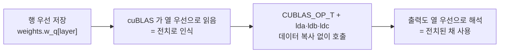

# 4. cuBLAS 행렬곱과 열-행 우선 전치 트릭

이 글의 모든 경로와 줄 번호는 고정 revision
`e25bf1994efa90bc98b721ba7c527402f86fbeaf` 의 트리를 가리킨다(`guide.md:6`). 표기는
`파일:시작-끝` 형식이며, 실행 결과가 아니라 소스 인용이다.

## 이 장의 질문

3편에서 prefill 경로가 레이어마다 Q/K/V 투영, 어텐션 점수, O 투영, SwiGLU, 로짓을
cuBLAS 로 계산하는 것을 봤다. 이 장은 그 호출들 중 하나를 붙잡고 **왜 가중치
행렬곱을 cuBLAS 에 전치된 형태로 넘기는가**를 묻는다(`series.yaml:77`). 코드 범위는
`src/main.cpp` 하나이며(`series.yaml:78-79`), `required_evidence` 는 code 3 / tests 0 /
runtime 0 이다(`series.yaml:82-85`).

이 장은 3편에서 처음 등장한 cuBLAS 호출을 되짚는 편이므로 3편에 의존한다
(`guide.md:144-146`). 행렬곱이 prefill 의 어느 지점에 놓이는지, 그 출력이 어디로
흐르는지는 3편이 소유하고(`guide.md:195-196`), 여기서는 레이아웃 문제에만 분량을
쓴다. 열 우선 레이아웃 설명의 소유 편도 이 장이다(`guide.md:197`). runtime 이 0
이므로 아래 모든 주장은 실행 없이 소스 인용으로만 뒷받침된다(결정 003,
`guide.md:75-87`).

## 문제: 행 우선 데이터, 열 우선 라이브러리

cuBLAS 는 행렬을 열 우선(column-major)으로 가정한다. 반면 이 저장소의 가중치와
활성은 행 우선(row-major)이다. 같은 바이트를 열 우선으로 읽으면 행과 열이 뒤바뀐
행렬이 된다. 소스 주석이 이 상황을 그대로 적는다.

```cpp
// Q = inputs * wq^T; my matrices are row-major, cublas expects column-major
// it perceives my matrices as transposed
// there's a trick where C = A * B == C^T = B^T * A^T
```

인용: [`src/main.cpp:168-170`](https://github.com/jmaczan/tiny-vllm/blob/e25bf1994efa90bc98b721ba7c527402f86fbeaf/src/main.cpp#L168-L170)

cuBLAS 가 이 저장소의 행렬을 전치된 것으로 본다는 것이 주석의 요점이다(Claim 9,
`claims.md:169-171`). 문제는 "행 우선 데이터를 열 우선 라이브러리에 어떻게 맞추는가"
다(`guide.md:177`).

## 해법: 데이터는 그대로, 플래그만 전치

데이터를 실제로 전치하지 않는다. 대신 전치 플래그와 leading dimension 인자만
바꿔서 호출하고, 결과를 전치된 채로 해석한다(Claim 9, `claims.md:169-178`). 주석은
행렬 항등식 `C = A·B == Cᵀ = Bᵀ·Aᵀ` 를 이용해 연산 방향을 뒤집는다고 적는다
(`src/main.cpp:170-175`). 그래서 결과를 원래 방향으로 되돌리는 전치도 필요 없다.
출력도 열 우선으로 해석되므로 이미 전치된 채로 쓰인다(`src/main.cpp:173-175`).

<!-- visual: column-row-major-trick supports: [column-row-major-trick] -->


## Q 투영 호출의 인자

Q 투영 호출은 `src/main.cpp:178-196` 에 있다. 전치 플래그 두 개는 각각
`CUBLAS_OP_T`(`src/main.cpp:179`)와 `CUBLAS_OP_N`(`src/main.cpp:180`)이고, 행렬
차원은 m = `EMBEDDING_LENGTH`(`181`), n = `prompt_len`(`182`), k =
`EMBEDDING_LENGTH`(`183`)다. leading dimension 세 개는 `src/main.cpp:187`(lda),
`190`(ldb), `194`(ldc)에 있다(Claim 9, `claims.md:175-176`).

첫 번째 인자를 `CUBLAS_OP_T` 로 두는 것이 트릭의 핵심이다. 행 우선으로 저장된
가중치를 열 우선 라이브러리가 전치로 읽으므로, 연산 방향을 한 번 더 뒤집어 원하는
결과를 얻는다. 실제 데이터 이동은 없다. 세 leading dimension 이 모두
`EMBEDDING_LENGTH` 인 것은 입력·가중치·출력이 같은 행 길이를 쓴다는 뜻이다.

여기서 `n = prompt_len` 인 점을 짚어 둔다. 이 인자는 "몇 개의 토큰을 한 번에
처리하는가"를 담는다. prefill 은 프롬프트 전체를 함께 처리하므로 `prompt_len`
이다. decode 는 이 값이 활성 슬롯 수로 바뀌며, 그 대비는 5편이 다룬다
(`guide.md:198`).

## 같은 패턴이 반복되는 곳

`CUBLAS_OP_T`/`CUBLAS_OP_N` 조합은 Q 투영에만 있지 않다. prefill 의 거의 모든
cuBLAS 호출이 같은 트릭을 쓴다.

| 호출 | 줄 범위 | m | n | k |
| --- | --- | --- | --- | --- |
| Q 투영 | `src/main.cpp:178-196` | `EMBEDDING_LENGTH` | `prompt_len` | `EMBEDDING_LENGTH` |
| K 투영 | `src/main.cpp:201-219` | `KV_DIM` | `prompt_len` | `EMBEDDING_LENGTH` |
| V 투영 | `src/main.cpp:222-240` | `KV_DIM` | `prompt_len` | `EMBEDDING_LENGTH` |
| 어텐션 점수 | `src/main.cpp:308-326` | `prompt_len` | `prompt_len` | `HEAD_DIM` |
| O 투영 | `src/main.cpp:378-396` | `EMBEDDING_LENGTH` | `prompt_len` | `EMBEDDING_LENGTH` |
| gate 투영 | `src/main.cpp:414-432` | `HIDDEN_DIM` | `prompt_len` | `EMBEDDING_LENGTH` |
| up 투영 | `src/main.cpp:435-453` | `HIDDEN_DIM` | `prompt_len` | `EMBEDDING_LENGTH` |
| down 투영 | `src/main.cpp:471-489` | `EMBEDDING_LENGTH` | `prompt_len` | `HIDDEN_DIM` |
| 로짓 | `src/main.cpp:509-527` | `VOCAB_SIZE` | `prompt_len` | `EMBEDDING_LENGTH` |

Q·K·O·gate·로짓은 `claims.md:176-178` 이 같은 패턴으로 인용하는 호출들이고,
V·up·down 과 어텐션 점수는 `trace.md:88-89`·`96-97`·`105-107` 이 실행 순서에 넣은
호출들이다. 전치 플래그는 모든 행에서 `CUBLAS_OP_T`/`CUBLAS_OP_N` 이고, m 과 k 만
출력·입력 차원에 따라 바뀐다. n 은 항상 `prompt_len` 이다.

출력 차원에 따라 leading dimension 이 달라진다는 점은 소스 주석이 직접 적는다.
K 투영 주석은 `lda: EMBEDDING_LENGTH, ldb: EMBEDDING_LENGTH, ldc: KV_DIM`
(`src/main.cpp:200`)이라고 밝힌다. 로짓 주석은 전치 트릭 때문에 m 과 n 을 바꿔
써야 한다고 적는다(`src/main.cpp:500-501`). 트릭이 출력의 행·열을 뒤바꾸기
때문이다.

## alpha 와 beta 는 잔차 누적을 처리하지 않는다

이 장의 시각 자료가 답해야 할 필수 주장 중 "alpha 와 beta 인자가 잔차 누적을
별도 커널 없이 처리한다"는 항목이 있다. 이 항목의 출처는 `claims.md:180-185`
이며, 해당 문구는 `series.yaml` 어디에도 없다. 그리고 고정 revision 의 코드는 이
주장을 뒷받침하지 않는다(Claim 9 한계, `claims.md:180-185`).

먼저 모든 GEMM 호출의 `beta` 가 0.0 이다. Q 투영은 `q_proj_alpha = 1.0f`,
`q_proj_beta = 0.0f`(`src/main.cpp:631-632`)이고, K·V(`src/main.cpp:641-645`),
O(`src/main.cpp:659-660`), gate(`src/main.cpp:664-665`),
up(`src/main.cpp:669-670`), down(`src/main.cpp:673-674`),
로짓(`src/main.cpp:678-679`)도 모두 같다. beta 가 0.0 이라는 것은 GEMM 이 기존
출력 위에 누적하지 않고 결과를 덮어쓴다는 뜻이다. 잔차를 누적할 자리가 없다.

잔차 누적은 GEMM 인자가 아니라 별도 커널이 담당한다. prefill 은 레이어 안에서
두 번 `residualAdd` 를 호출한다. 어텐션 뒤에 한 번(`src/main.cpp:399`),
SwiGLU 뒤에 한 번(`src/main.cpp:492`)이다. 이 커널은 prefill 커널 순서의
일부이므로 3편이 소유하고, 이 장은 호출 위치만 인용한다(`guide.md:195-196`,
`204`). 이 장의 코드 범위는 `src/main.cpp` 이므로 커널 내부는 다루지 않는다.

alpha 가 1.0 이 아닌 유일한 곳은 어텐션 점수의 스케일이다. `attn_alpha = 1.0f /
8.0f`(`src/main.cpp:649`)이고, 이는 `1/sqrt(64)`(HEAD_DIM = 64)에 해당한다.
어텐션 점수 호출(`src/main.cpp:308-326`)이 이 값을 쓰지만, 이는 잔차 누적과
무관하게 점수를 줄이는 데 쓰인다.

따라서 이 장은 "alpha 와 beta 가 잔차 누적을 처리한다"는 필수 주장을 기각한다.
설계는 beta = 0 으로 GEMM 을 끝낸 뒤 잔차를 별도 커널로 더하는 쪽이다.

## 이 장이 다루지 않는 것

- prefill 의 커널 호출 순서와 잔차 커널 구현: 3편(`guide.md:195-196`, `204`).
- decode 의 cuBLAS 호출(`n = num_active_slots`)과 커널 변형: 5편(`guide.md:198`).
- 버퍼 별칭(`buf_2048_1` = q_proj·attn_scores_v, `buf_2048_2` = o_proj·down):
  2편이 크기 산정과 함께 소유한다(`guide.md:194`).
- paged attention 과 block table: 6편(`guide.md:199`).

## 이 장의 한계

- 이 시리즈는 NVIDIA GPU 와 CUDA 툴체인이 없는 환경에서 작성되어 행렬곱을
  실행하지 않는다. 위 레이아웃·인자 주장 전부는 소스 인용이며 실행 검증이 없다
  (`guide.md:75-87`; Claim 9 한계 `claims.md:180-185`).
- 시각 자료 `column-row-major-trick` 의 필수 주장 중 "alpha 와 beta 인자가 잔차
  누적을 별도 커널 없이 처리한다"는 고정 revision 의 코드로 뒷받침되지 않아 이
  장에서 기각했다. 모든 beta 는 0.0 이고(예: `src/main.cpp:631-632`), 잔차는
  `src/main.cpp:399`·`492` 의 `residualAdd` 가 담당한다(Claim 9 한계,
  `claims.md:180-185`).
- 이 장의 코드 범위는 `src/main.cpp` 하나이므로, 잔차 커널의 구현은 인용하지
  않고 3편 소유로 링크만 한다(`guide.md:158`, `195-196`, `204`).
- `guide.md:177` 은 `column-row-major-trick` 의 형식을 "블록 다이어그램"으로,
  `series.yaml:87-88` 은 `kind: mermaid` 로 기록한다. 이 장은 `series.yaml` 을
  따라 mermaid 로 작성했다. 게시 전에 두 근거 문서의 형식 표기를 일치시킬 필요가
  있다.
- 어텐션 점수 호출의 leading dimension(`src/main.cpp:317`·`320`·`324`)은 다른
  호출과 값이 다르지만, 이 장은 m·n·k 수준까지만 인용하고 레이아웃 전체를
  재구성하지 않는다. 그 호출이 속한 어텐션 흐름은 3편이 소유한다
  (`guide.md:195-196`).

## 출처

- `src/main.cpp:168-176` — 전치 트릭을 설명하는 소스 주석.
- `src/main.cpp:178-196` — Q 투영 `cublasGemmEx`(`CUBLAS_OP_T` 179,
  `CUBLAS_OP_N` 180, m·n·k 181-183, lda·ldb·ldc 187·190·194).
- `src/main.cpp:200` — K 투영 leading dimension 주석.
- `src/main.cpp:201-219`, `222-240` — K·V 투영.
- `src/main.cpp:308-326` — 어텐션 점수 `cublasGemmEx`(`attn_alpha` 314).
- `src/main.cpp:378-396` — O 투영.
- `src/main.cpp:414-432`, `435-453`, `471-489` — gate·up·down 투영.
- `src/main.cpp:500-501`, `509-527` — 로짓과 m·n 교환 주석.
- `src/main.cpp:631-632`, `641-645`, `649-650`, `659-660`, `664-665`, `669-670`,
  `673-674`, `678-679` — alpha·beta 상수.
- `src/main.cpp:399`, `492` — `residualAdd` 호출.
- `series.yaml:73-85` — 이 장의 id·순서·질문·범위·근거 최소값.
- `claims.md:165-185` — Claim 9 와 그 한계.
- `trace.md:88-89`, `96-97`, `105-107` — cuBLAS 호출 순서.
- `guide.md:75-87`, `144-146`, `158`, `177`, `194-204` — 실행 제약과 편별 경계.
