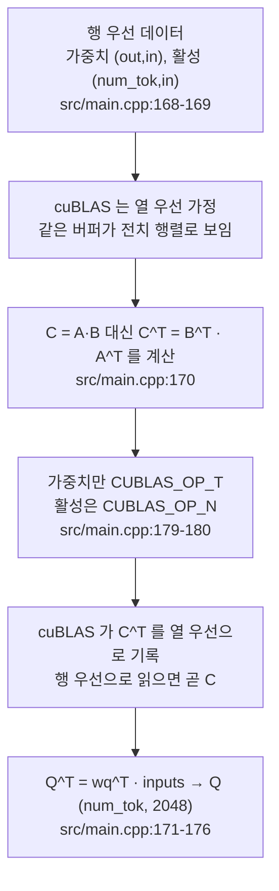

# 4. cuBLAS 행렬곱과 열-행 우선 전치 트릭

이 글의 모든 경로와 줄 번호는 고정 revision
`e25bf1994efa90bc98b721ba7c527402f86fbeaf` 의 트리를 가리킨다. 표기는
`파일:시작-끝` 형식이며, 실행 결과가 아니라 소스 인용이다.

## 이 장의 질문

왜 가중치 행렬곱을 cuBLAS 에 전치된 형태로 넘기는가. 코드 범위는 `src/main.cpp`
하나다. 이 장의 최소 근거는 코드 인용 3건, 테스트 0건, 실행 0건이다. 테스트가
없으므로 모든 검증은 소스 인용으로만 이뤄진다.

이 장은 3편에서 처음 등장한 cuBLAS 호출을 되짚는 편이며 3편에 의존한다. 3편이
"언제 어떤 커널이 호출되는가"를 다룬다면, 이 장은 각 호출이 **왜
`CUBLAS_OP_T` 와 특정 leading dimension 을 쓰는가**를 다룬다. 열 우선(column-
major) 레이아웃 설명은 이 시리즈에서 이 장이 소유하며, 다른 편의 행렬곱 언급은
여기로 연결된다. decode 경로도 같은 cuBLAS 패턴을 쓰지만 그 대비는 5편이
소유한다.

이 시리즈는 NVIDIA GPU 와 CUDA 툴체인이 없는 환경에서 작성되어 어떤 cuBLAS 호출도
실행하지 않았다. 아래 모든 인자·차원 주장은 소스 인용이며, 커널 실행 시간·
처리량·메모리 사용량은 측정하지 않는다.

## 문제: 행 우선 데이터와 열 우선 가정

`cublasGemmEx` 는 A·B·C 세 행렬 모두 열 우선(column-major) 저장을 가정한다.
반면 이 코드베이스의 가중치와 활성은 모두 행 우선(row-major)이다. 소스 주석이
바로 이 불일치에서 시작한다.

```cpp
// Q = inputs * wq^T; my matrices are row-major, cublas expects column-major
// it perceives my matrices as transposed
```

인용: [`src/main.cpp:168-169`](https://github.com/jmaczan/tiny-vllm/blob/e25bf1994efa90bc98b721ba7c527402f86fbeaf/src/main.cpp#L168-L169)

같은 메모리 블록이 두 관례에서 서로 다른 행렬이다. `(m, n)` 행 우선 행렬을 열
우선으로 읽으면 `(n, m)` 전치 행렬이 된다. cuBLAS 는 호출자가 넘긴 포인터를
전치된 행렬로 본다. 여기에 더해 op 플래그(`CUBLAS_OP_T` / `CUBLAS_OP_N`)가 각
인자를 한 번 더 전치할지를 정한다.

## 전치 트릭: C^T = B^T · A^T

데이터를 전부 전치해 저장하는 대신, 코드는 트릭 하나를 쓴다. 주석이 그 식을
명시한다.

```text
there's a trick where C = A * B == C^T = B^T * A^T
```

인용: [`src/main.cpp:170`](https://github.com/jmaczan/tiny-vllm/blob/e25bf1994efa90bc98b721ba7c527402f86fbeaf/src/main.cpp#L170)

원하는 곱 `C` 대신 `C^T` 를 cuBLAS 로 계산한다. cuBLAS 는 출력을 열 우선으로
기록하므로, 그 메모리를 행 우선으로 읽으면 곧바로 `C` 다. 즉 데이터 바이트는
건드리지 않고, 계산할 곱의 순서와 전치만 바꾼다. 주석은 이 점을 "the beauty is
that we don't need to transpose Q^T back to Q, because cublas sees the output as
column-major, so it's in fact transposed" 라고 적는다
([`src/main.cpp:173-175`](https://github.com/jmaczan/tiny-vllm/blob/e25bf1994efa90bc98b721ba7c527402f86fbeaf/src/main.cpp#L173-L175)).

## 첫 예: Q 투영

원하는 곱은 `Q = rms_norms · w_q^T` 이다. `rms_norms` 는 `(num_tok, 2048)`,
가중치 `w_q` 는 `(2048, 2048)` 이다. 코드는 대신 `Q^T = w_q^T · rms_norms` 를
cuBLAS 에 시킨다.

```cpp
cublasGemmEx(cublas_handle,
             CUBLAS_OP_T,                    // A = w_q[layer]^T
             CUBLAS_OP_N,                    // B = rms_norms, 그대로
             EMBEDDING_LENGTH,               // m = 2048
             prompt_len,                     // n = 토큰 수
             EMBEDDING_LENGTH,               // k = 2048
             &q_proj_alpha,
             weights.w_q[layer], CUDA_R_16BF, EMBEDDING_LENGTH, // A,   lda
             rms_norms,           CUDA_R_16BF, EMBEDDING_LENGTH, // B,   ldb
             &q_proj_beta,
             q_proj,              CUDA_R_16BF, EMBEDDING_LENGTH, // C,   ldc
             CUBLAS_COMPUTE_32F,
             CUBLAS_GEMM_DEFAULT);
```

인용: [`src/main.cpp:178-196`](https://github.com/jmaczan/tiny-vllm/blob/e25bf1994efa90bc98b721ba7c527402f86fbeaf/src/main.cpp#L178-L196)

각 인자를 코드의 관점에서 읽으면 다음과 같다.

- `opA = CUBLAS_OP_T`(`src/main.cpp:179`): `w_q` 를 전치한 행렬로 읽는다.
  `w_q` 는 `(2048, 2048)` 정방이라 전치해도 차원이 같고, 이 전치가 가중치를
  "출력×입력"에서 "입력×출력" 모양으로 바꿔 활성과 곱할 수 있게 한다.
- `opB = CUBLAS_OP_N`(`src/main.cpp:180`): `rms_norms` 를 그대로 읽는다.
  `(num_tok, 2048)` 행 우선 버퍼는 cuBLAS 에게는 `(2048, num_tok)` 으로
  보이며, 이것이 곧 우리가 곱하려는 `rms_norms^T` 의 열 우선 표현이다.
- `m = 2048`, `n = prompt_len`, `k = 2048`(`src/main.cpp:181-183`): cuBLAS
  결과는 `(m, n) = (2048, prompt_len)`.
- `lda = 2048`(`src/main.cpp:187`), `ldb = 2048`(`src/main.cpp:190`),
  `ldc = 2048`(`src/main.cpp:194`): 각 행렬에서 연속 원소의 단위가 되는
  차원(leading dimension)이다.

cuBLAS 는 `w_q^T(2048, 2048) · (2048, num_tok)` 을 열 우선으로 기록하고, 그
메모리를 행 우선으로 읽으면 `(num_tok, 2048)` 이 된다. 주석이 결론을 미리 적어
둔다. "final dim (num_tok, EMBEDDING_LENGTH)"
([`src/main.cpp:176`](https://github.com/jmaczan/tiny-vllm/blob/e25bf1994efa90bc98b721ba7c527402f86fbeaf/src/main.cpp#L176)).

여기서 한 가지를 짚자. 전치 플래그는 "가중치를 전치한다"가 아니라 "cuBLAS 가
이미 전치된 것으로 보는 버퍼를 우리가 원하는 곱의 순서로 읽기 위한" 선택이다.
K 투영 주석이 같은 트릭을 차원만 바꿔 반복한다
([`src/main.cpp:198-200`](https://github.com/jmaczan/tiny-vllm/blob/e25bf1994efa90bc98b721ba7c527402f86fbeaf/src/main.cpp#L198-L200)).

## 나머지 투영은 같은 패턴, 차원만 다르다

Q 투영을 이해하면 이 코드베이스의 모든 가중치 행렬곱이 같은 골격이다. 차원
상수만 바뀐다.

- K 투영(`src/main.cpp:201-219`)과 V 투영(`src/main.cpp:222-240`): `m = KV_DIM
  (512)`, `ldc = KV_DIM`(`src/main.cpp:204`, `217`, `238`). 가중치는
  `(KV_DIM, EMBEDDING_LENGTH)` 이고, 결과를 행 우선으로 읽으면 `(num_tok, 512)`
  즉 K/V 다. 주석이 "which really is (num_tok, KV_DIM)" 로 해석을 적어 둔다
  (`src/main.cpp:199`).
- O 투영(`src/main.cpp:378-396`): Q 와 동일, `(num_tok, 2048)`.
- gate 투영(`src/main.cpp:414-432`)과 up 투영(`src/main.cpp:435-453`):
  `m = HIDDEN_DIM (8192)`, `ldc = HIDDEN_DIM`(`src/main.cpp:417`, `430`,
  `451`). 결과는 `(num_tok, 8192)` 다. gate 주석이 이 호출의 차원을 주석으로
  적는다(`src/main.cpp:406-413`).
- down 투영(`src/main.cpp:471-489`): `m = EMBEDDING_LENGTH`, `k = HIDDEN_DIM`,
  `lda = HIDDEN_DIM`, `ldb = HIDDEN_DIM`, `ldc = EMBEDDING_LENGTH`
  (`src/main.cpp:474`, `476`, `480`, `483`, `487`). 결과는 `(num_tok, 2048)`.
  주석(`src/main.cpp:461-469`)이 "dims = (2048, 8192) * (8192, num_tok) =
  (2048, num_tok)" 로 이 산술을 서술한다.
- 로짓(`src/main.cpp:509-527`): `m = VOCAB_SIZE (128256)`, `ldc = VOCAB_SIZE`
  (`src/main.cpp:512`, `525`). 결과는 `(prompt_len, VOCAB_SIZE)` 이고, D2H 로
  내려가 CPU argmax 의 입력이 된다. 로짓 주석(`src/main.cpp:496-507`)은 처음
  `(num_tok, 128256)` 으로 생각한 것이 "a bug in my thinking" 이었고 트릭에선
  m·n 을 바꿔야 한다고 적는다.

공통 구조는 셋이다. 첫째, 가중치 인자에만 `CUBLAS_OP_T` 가 붙고 활성 인자는
`CUBLAS_OP_N` 이다. 둘째, `ldc` 는 항상 출력을 행 우선으로 읽었을 때의 행 수,
즉 cuBLAS 입장에서 열 수다. 셋째, 출력 버퍼는 전치된 채로 해석된다.

## 두 인자가 모두 그대로인 호출: 점수×V

트릭이 항상 `CUBLAS_OP_T` 를 쓰는 것은 아니다. 헤드별 점수×V 호출
(`src/main.cpp:352-370`)은 `opA = CUBLAS_OP_N`(`src/main.cpp:353`),
`opB = CUBLAS_OP_N`(`src/main.cpp:354`)으로 두 인자를 모두 그대로 읽는다. 점수
행렬 `attn_scores_head` 는 `(num_tok, num_tok)` 정방이라 전치해도 차원이 같고,
V 헤드 `(num_tok, 64)` 는 cuBLAS 에게 `(64, num_tok)` 으로 보이는데 이 모양이
곧 곱하려는 `V_head^T` 의 열 우선 표현이기 때문이다. `m = HEAD_DIM (64)`
(`src/main.cpp:355`), `lda = KV_DIM`(`src/main.cpp:361`), `ldb = prompt_len`
(`src/main.cpp:364`), `ldc = EMBEDDING_LENGTH`(`src/main.cpp:368`). 출력
`(64, num_tok)` 열 우선을 행 우선으로 읽으면 `(num_tok, 64)` 인 한 헤드의
결과이고, Q 헤드 32개를 도는 루프가 이 출력을 `i * HEAD_DIM` 간격으로 이어
붙여 `(num_tok, 2048)` 을 만든다(`src/main.cpp:343-371`, 특히 `350`).

점수 자체를 만드는 호출(`src/main.cpp:308-326`)은 K 헤드에 `CUBLAS_OP_T` 를
건다(`src/main.cpp:309`). K 헤드 `(num_tok, 64)` 를 전치한 인자와 Q 헤드
`(num_tok, 64)` 를 곱해 `(num_tok, num_tok)` 점수를 만들고,
`ldc = prompt_len`(`src/main.cpp:324`)을 행 간격으로 `prefill_attn_scores` 에
헤드별로 쌓는다. op 플래그는 "가중치냐 아니냐"가 아니라 **각 인자가 원하는 곱의
어느 변인가**로 정해진다.

## alpha 와 beta 인자

모든 호출이 `&alpha` 와 `&beta` 포인터를 넘긴다. 그 값은 `main` 의 초기화
구간에 정의돼 있다. 거의 전부 `alpha = 1.0f`, `beta = 0.0f` 다
([`src/main.cpp:631-679`](https://github.com/jmaczan/tiny-vllm/blob/e25bf1994efa90bc98b721ba7c527402f86fbeaf/src/main.cpp#L631-L679):
q `631-632`, k `641-642`, v `644-645`, 점수×V `653-654`, o `659-660`, gate
`664-665`, up `669-670`, down `673-674`, embed `678-679`).

유일한 비-1.0 alpha 는 어텐션 스케일이다. `attn_alpha = 1.0f / 8.0f`
([`src/main.cpp:649`](https://github.com/jmaczan/tiny-vllm/blob/e25bf1994efa90bc98b721ba7c527402f86fbeaf/src/main.cpp#L649)).
`HEAD_DIM` 이 64 이므로 1/8 은 `1/sqrt(64)` 이고, 이 값은 점수 호출의 alpha
(`src/main.cpp:314`)로만 쓰인다. `attn_beta` 는 역시 `0.0f` 다
(`src/main.cpp:650`).

beta 가 전부 0 이라는 것은 이 코드의 GEMM 이 "C = alpha·op(A)·op(B) +
beta·C" 공식에서 누적 항을 전혀 쓰지 않는다는 뜻이다. 따라서 **GEMM 의 beta
인자가 잔차 누적을 처리한다는 해석은 성립하지 않는다.** 이 코드베이스에서 잔차
덧셈은 별도 커널 `residualAdd` 가 담당하며, prefill 에서 어텐션 후
(`src/main.cpp:399`)와 SwiGLU 후(`src/main.cpp:492`) 두 번 호출된다. 이 잔차
커널의 구현은 3편이 소유한다.

이 장의 시각 자료가 답해야 할 필수 주장 가운데 하나였던 "alpha 와 beta 인자가
잔차 누적을 별도 커널 없이 처리한다"는 고정 revision 의 코드로 뒷받침되지
않으므로 기각한다. 그 자리에 위 내용 — 모든 beta 는 0 이고 잔차는 `residualAdd`
커널이 담당한다 — 을 이 장의 결론으로 둔다.

## 시각 자료: column-row-major-trick

이 장의 시각 자료는 트릭의 전 과정이다. 행 우선 데이터가 전치 플래그를 거쳐
원하는 곱의 결과가 되는 흐름을 답한다.

<!-- visual: column-row-major-trick supports: [column-row-major-trick] -->


첫 줄에서 마지막 줄로의 흐름이 "행 우선 데이터를 전치 플래그로 맞춘다"는 필수
주장을 뒷받침한다. 각 마디는 `Q = rms_norms · w_q^T` 하나를 예로 든 것이다. K/V
투영은 `m·ldc` 가 `KV_DIM` 인 것만 다르고, O·gate·up·down·로짓도 같은 흐름이다.
"alpha 와 beta 인자가 잔차를 누적한다"는 주장은 이 다이어그램에 포함하지
않는다. 앞 절에서 밝힌 대로 이 코드의 모든 beta 는 0 이기 때문이다.

## 이 장이 다루지 않는 것

- prefill 의 커널 호출 순서와 병렬 리덕션: 3편. 이 장은 커널의 존재를 전제로
  cuBLAS 호출부만 다룬다.
- 가중치 적재와 버퍼 크기·별칭: 2편.
- decode 계열 cuBLAS 호출과 커널 변형: 5편. decode 의 Q/K/V/O/gate/up/down/
  로짓 호출(`src/main.cpp:765-994`)도 같은 `CUBLAS_OP_T` 패턴을 쓰지만,
  `n = num_active_slots` 로 바뀌는 대비는 여기서 다루지 않는다.
- paged attention 과 block table 인덱싱: 6편.
- 슬롯·큐의 수명주기: 7편.

## 이 장의 한계

- 이 시리즈는 NVIDIA GPU 와 CUDA 툴체인이 없는 환경에서 작성되어 어떤 cuBLAS
  호출도 실행하지 않았다. 모든 인자·차원·해석 주장은 소스 인용이며 실행 검증이
  없다.
- 이 장의 코드 범위는 `src/main.cpp` 하나다. `residualAdd` 처럼 3·5편이 소유하는
  커널 구현은 이 장에서 다시 다루지 않는다.
- 전치 트릭의 정합성은 "모든 소비자가 버퍼를 전치된 채로 해석한다"는 관례에
  의존한다. 이 관례는 소스 주석(`src/main.cpp:168-176`)이 밝히는 것일 뿐
  실행으로 확인된 것이 아니다. 헤드별 점수×V 처럼 인자 두 개를 모두 그대로
  읽는 호출이 같은 코드베이스에 있어, 트릭을 "항상 OP_T"로 외우면 오독한다.
- m·n·k·lda·ldb·ldc 는 컴파일 타임 상수(`EMBEDDING_LENGTH`,
  `HIDDEN_DIM`, `KV_DIM`, `HEAD_DIM`, `VOCAB_SIZE`, `src/main.cpp:16-25`)에
  박혀 있다. 모델 크기가 바뀌면 모든 호출의 차원이 함께 바뀌어야 한다.
- Q·O·점수처럼 정방 행렬곱은 전치해도 차원이 같아, 전치를 빼먹어도 오류로
  드러나지 않을 수 있다. 트릭이 맞는지의 최종 판단은 실행 수치가 아니라 소스
  주석의 해석이다.
- 시각 자료의 필수 주장이었던 "alpha·beta 가 잔차 누적을 처리한다"는 고정
  revision 코드로 뒷받침되지 않아 기각했다. 이 장은 대신 "모든 beta = 0, 잔차는
  `residualAdd` 커널"을 결론으로 둔다(`src/main.cpp:631-679`, `399`, `492`).
- 로짓의 D2H→CPU argmax(`src/main.cpp:529-543`)처럼 cuBLAS 밖의 연산은 이
  장의 트릭과 무관하게 동작하며, 그 성능은 측정하지 않는다.

## 출처

- `src/main.cpp:16-25` — 차원 상수(`EMBEDDING_LENGTH`, `HIDDEN_DIM`, `KV_DIM`,
  `HEAD_DIM`, `VOCAB_SIZE`).
- `src/main.cpp:168-196` — Q 투영과 전치 트릭 주석.
- `src/main.cpp:198-240` — K/V 투영과 레이아웃 주석.
- `src/main.cpp:308-326` — 헤드별 어텐션 점수 호출.
- `src/main.cpp:343-371` — 점수×V 루프(`352-370` 호출부).
- `src/main.cpp:378-396` — O 투영.
- `src/main.cpp:414-453` — gate/up 투영.
- `src/main.cpp:471-489` — down 투영.
- `src/main.cpp:496-527` — 로짓 투영과 주석.
- `src/main.cpp:631-679` — alpha/beta 값 정의.
- `src/main.cpp:399`, `492` — `residualAdd` 호출(잔차 커널은 3편 소유).
- `src/main.cpp:765-994` — decode 의 동일 패턴(5편 소유).