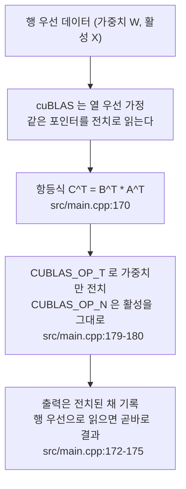

# cuBLAS 행렬곱과 열-행 우선 전치 트릭

3편(`prefill-path`)에서 프롬프트가 Q/K/V 투영, 어텐션 점수, O 투영, SwiGLU, 로그잇을
거칠 때마다 `cublasGemmEx` 가 호출된다. 그 호출 전부가 같은 모양새를 가진다. 첫
두 인자(operation 플래그)는 항상 `CUBLAS_OP_T`, `CUBLAS_OP_N` 이고, 연산자가
"입력×가중치"의 순서와는 반대로 보이는 연산이 수행된다. 이 편이 답하는 질문은
시리즈 4편의 핵심 질문, "왜 가중치 행렬곱을 cuBLAS 에 전치된 형태로 넘기는가"
(`series.yaml:80-81`)다. 코드 범위는 `src/main.cpp` 하나다(`series.yaml:82-83`).

열 우선 레이아웃 설명의 소유 편은 이 편이며, 다른 편의 행렬곱 언급은 이 편을
링크한다(`guide.md:197`). `prefill` 함수는 3편이 커널 순서를, 4편이 cuBLAS 호출부를
담당한다(`guide.md:204`). 모든 인용은 고정 revision
`e25bf1994efa90bc98b721ba7c527402f86fbeaf` 의 `src/main.cpp` 기준이다. 이 시리즈는
GPU·CUDA 툴체인 없이 정적 근거만을 쓰므로(결정 003, `guide.md:75-87`) 아래 모든
주장은 소스 인용으로만 뒷받침된다.

## cuBLAS 는 열 우선, 데이터는 행 우선

Q 투영 앞에 붙은 주석이 트릭 전체를 선언한다(`src/main.cpp:168-170`).

```text
// Q = inputs * wq^T; my matrices are row-major, cublas expects column-major
// it perceives my matrices as transposed
// there's a trick where C = A * B == C^T = B^T * A^T
```

C++ 의 다차원 배열은 행 우선(row-major)이다. 같은 바이트열을 열 우선으로 읽으면
원래 행렬의 전치로 보인다. cuBLAS 는 BLAS 규약을 따라 모든 행렬을 열 우선으로
가정한다. 따라서 "행 우선 데이터를 그대로 가리키는 포인터"를 cuBLAS 에 넘기면,
cuBLAS 는 그 메모리를 전치된 행렬로 읽는다. 데이터를 옮기지 않았는데 레이아웃이
한 번 뒤집힌 셈이다.

여기에 행렬곱 항등식 `C = A·B ⟺ C^T = B^T·A^T`(`src/main.cpp:170`)를 결합한다.
원래 하고 싶은 연산이 `Q = inputs · wq^T` 라면, 그 전치인 `Q^T = wq · inputs^T` 를
구한다. `inputs`(활성)는 그대로 읽혀 전치로 보이고, `wq` 만 `CUBLAS_OP_T` 로
"전치하겠다"고 알려주면 연산이 맞아떨어진다. 주석이 이를 정리한다(`src/main.cpp:171-175`).

```text
// so in my scenario cublas sees now: Q = inputs^T * wq^T^T = inputs ^T * wq
// so I need to do: Q^T = wq ^T * inputs
// the beauty is that we don't need to transpose Q^T back to Q
// because cublas sees the output as column-major
// so it's in fact transposed
```

핵심은 결과를 되돌리지 않는 것이다. cuBLAS 가 열 우선으로 기록한 출력 `Q^T` 는,
행 우선으로 읽으면 곧바로 `Q` 다. 즉 전치 플래그(`CUBLAS_OP_T`)와 lda·ldb·ldc 만
조정하면 데이터 이동 없이 원하는 행 우선 결과를 얻는다. 소스가 "my matrices are
row-major"라고 직접 적은 대로, 이 트릭은 주석에 명시된 의도적 설계다
(`src/main.cpp:168-175`).

## Q 투영 한 호출의 해부

Q 투영 호출은 이 패턴의 원형이다(`src/main.cpp:178-196`).

```cpp
cublasStatus_t q_proj_status = cublasGemmEx(cublas_handle,
                                            CUBLAS_OP_T,          // src/main.cpp:179
                                            CUBLAS_OP_N,          // src/main.cpp:180
                                            EMBEDDING_LENGTH,     // m, src/main.cpp:181
                                            prompt_len,           // n, src/main.cpp:182
                                            EMBEDDING_LENGTH,     // k, src/main.cpp:183
                                            &q_proj_alpha,
                                            weights.w_q[layer],   // src/main.cpp:185
                                            CUDA_R_16BF,
                                            EMBEDDING_LENGTH,     // lda, src/main.cpp:187
                                            rms_norms,            // src/main.cpp:188
                                            CUDA_R_16BF,
                                            EMBEDDING_LENGTH,     // ldb, src/main.cpp:190
                                            &q_proj_beta,
                                            q_proj,               // src/main.cpp:192
                                            CUDA_R_16BF,
                                            EMBEDDING_LENGTH,     // ldc, src/main.cpp:194
                                            CUBLAS_COMPUTE_32F,
                                            CUBLAS_GEMM_DEFAULT);
```

cuBLAS 가 수행하는 연산은 `C = alpha·op(A)·op(B) + beta·C` 이며 `op` 는
`CUBLAS_OP_T` 면 `A^T`, `CUBLAS_OP_N` 이면 `A` 를 쓴다. 여기서는
`A = w_q`(행 우선 2048×2048), `B = rms_norms`(행 우선 `prompt_len`×2048),
`C = q_proj` 다. `op(A) = w_q` 가 되도록 `CUBLAS_OP_T` 를, `op(B) = rms_norms^T`
가 되도록 `CUBLAS_OP_N` 을 건다. 결과는 `w_q · rms_norms^T = Q^T` 로 기록되고,
행 우선으로 읽으면 `(num_tok, EMBEDDING_LENGTH)` 의 Q 다. 인자 배치를 보면
`m = EMBEDDING_LENGTH`(`src/main.cpp:181`), `n = prompt_len`(`src/main.cpp:182`),
`k = EMBEDDING_LENGTH`(`src/main.cpp:183`) 로, 트릭이 없는 직관적인 순서
`m = prompt_len` 과는 m/n 이 뒤바뀐 형태다. lda·ldb·ldc 는 전부
`EMBEDDING_LENGTH`(`src/main.cpp:187,190,194`) 로, 데이터를 옮기지 않으므로
전치 전후의 leading dimension 이 같다.

`q_proj` 는 `buf_2048_1` 을 가리킨다(`src/main.cpp:177`). 이 버퍼 별칭 설계는
2편(`weights-and-memory`)의 소유이며, 이 편에서는 전치된 출력이 별도 메모리를
필요로 하지 않고 기존 버퍼에 바로 쓰인다는 점만 짚는다.

## K·O·gate·로그잇에 반복되는 패턴

Q 이후의 모든 행렬곱은 같은 항등식을 반복한다. 차이는 출력 행(열 우선 기준 `m`)
의 크기다.

- **K 투영**(`src/main.cpp:201-219`): 출력이 `(num_tok, KV_DIM)` 이므로
  `m = KV_DIM`(`src/main.cpp:204`), `ldc = KV_DIM`(`src/main.cpp:217`) 로 둔다.
  주석이 `(KV_DIM, num_tokens), which really is (num_tok, KV_DIM)` 이라고 쓴 대로,
  열 우선 출력을 행 우선으로 읽으면 곧바로 K 다(`src/main.cpp:199-200`).
- **O 투영**(`src/main.cpp:378-396`): "same as Q projection, so copy paste"
  (`src/main.cpp:376`). Q 와 동일하게 `CUBLAS_OP_T`/`CUBLAS_OP_N` 이고
  `m = n = k = EMBEDDING_LENGTH` 이다. 출력 버퍼는 `buf_2048_2`
  (`src/main.cpp:377`).
- **gate**(`src/main.cpp:414-432`): 출력이 `(num_tok, HIDDEN_DIM)` 이므로
  `m = HIDDEN_DIM`(`src/main.cpp:417`), `ldc = HIDDEN_DIM`(`src/main.cpp:430`).
  SwiGLU 의 up 도 같은 크기(`src/main.cpp:434-453`)로 동일 패턴이며, down 은
  `m = EMBEDDING_LENGTH` 로 되돌아간다(`src/main.cpp:471-489`).
- **로그잇**(`src/main.cpp:509-527`): `m = VOCAB_SIZE`(`src/main.cpp:512`),
  `ldc = VOCAB_SIZE`(`src/main.cpp:525`). 이 호출의 주석(`src/main.cpp:498-507`)은
  트릭의 실제 이득을 보여준다. 저자는 처음에 "logits dim = (num_tok, 2048) *
  (2048, 128256) = (num_tok, 128256) => m = num_tok" 로 적었다가, 트릭 때문에
  출력이 전치되므로 m 과 n 을 뒤집어야 한다는 고침을 주석에 남겼다("I leave this
  comment above because it shows a bug in my thinking"). 결과적으로
  `CUBLAS_OP_T` 하나로 128256×2048 가중치 전체를 전치하지 않고도 로그잇을 얻는다.

어텐션 점수 GEMM(`src/main.cpp:301-327`)도 같은 원리다. `Q_head·K_head^T` 를 구할
때 K 헤드를 `CUBLAS_OP_T` 로 넘겨 `k_head` 를 전치로 읽는다(`src/main.cpp:310-311`).
다만 그 호출의 GQA 인덱싱과 스케일링(`attn_alpha = 1.0f / 8.0f`)은 3편 소유의
주제이므로, 이 편에서는 패턴이 그대로 반복된다는 점만 링크로 남긴다.

## alpha 와 beta 가 실제로 하는 일 — 기각된 주장

시리즈 초안 단계에서 이 편의 시각 자료 필수 주장으로 "alpha 와 beta 인자가 잔차
누적을 별도 커널 없이 처리한다"가 잡혀 있었다(`series.yaml:95`). 이 주장은 고정
revision 의 코드로 뒷받침되지 않으므로 기각한다.

실제로 모든 beta 인자는 0.0 으로 초기화된다. `q_proj_beta = 0.0f`
(`src/main.cpp:632`)를 비롯해 k·v(`src/main.cpp:641-645`), attn(`src/main.cpp:650`),
attn_scores_v(`src/main.cpp:653-654`), o(`src/main.cpp:659-660`),
gate·up(`src/main.cpp:664-670`), down(`src/main.cpp:673-674`),
embed(`src/main.cpp:678-679`) 전부다. alpha 는 유일한 예외 하나를 빼고 전부
1.0f 이다. 예외는 어텐션 스케일 `attn_alpha = 1.0f / 8.0f`
(`src/main.cpp:649`, `= 1/sqrt(HEAD_DIM)`)이며, 이는 잔차와 무관한 어텐션 정규화
상수다. cuBLAS 의 `C = alpha·op(A)·op(B) + beta·C` 에서 beta=0 은 이전 C 값을
더하지 않는다는 뜻이므로, 모든 호출은 순수한 새 값 쓰기(out-of-place)다.

잔차 누적은 전혀 다른 지점에서 일어난다. 어텐션 블록 끝과 SwiGLU 블록 끝에서
별도 커널 `residualAdd(hidden_state, o_proj, ...)`(`src/main.cpp:399`)와
`residualAdd(hidden_state, down, ...)`(`src/main.cpp:492`)가 호출되며, 그 커널
구현은 `src/kernels.cu:311-329` 이다. 즉 잔차는 GEMM 인자가 아니라 전용 커널이
담당한다. 따라서 "alpha·beta 가 잔차 누적을 처리한다"는 주장은 이 편에서 제거하고,
대신 잔차의 소유 편(3편)으로 링크한다.

## 전치 트릭 한눈에 보기

<!-- visual: column-row-major-trick supports: [column-row-major-trick] -->


이 도식은 "cuBLAS 는 열 우선 레이아웃을 가정하므로 행 우선 데이터를 전치
플래그로 맞춘다"는 주장을 답한다. 반대편 필수 주장(alpha·beta 잔차 누적)은 앞
절에서 기각했으므로 이 도식에도 담지 않는다. 도식의 각 화살표는 `src/main.cpp`
의 주석·인자 인용으로 이어진다: 레이아웃 인식(`src/main.cpp:168-170`), 항등식
(`src/main.cpp:170`), 플래그(`src/main.cpp:179-180`), 전치된 채 읽기
(`src/main.cpp:172-175`).

## 한계

- **실행 검증 부재.** 이 시리즈를 쓰는 환경에는 NVIDIA GPU 와 CUDA 툴체인이 없어
  결정 003(`guide.md:75-87`)에 따라 모든 기술 주장을 고정 revision 의 소스 인용으로
  뒷받침한다. 전치 플래그와 lda·ldb·ldc 조합이 실제 레이아웃 트릭대로 동작한다는
  것은 커널 실행으로 검증되지 않았다.
- **소스 주석 의존.** "cuBLAS 가 전치로 본다"는 주장의 상당 부분이 `src/main.cpp:168-175`
  의 주석 서술에 의존한다. 주석은 저자의 의도를 기록하지만 실행 결과와 같은 무게의
  근거가 아니다.
- **범위 한정.** 이 편은 `src/main.cpp` 만을 code scope 로 하며(`series.yaml:82-83`),
  커널 구현(`residualAdd` 등)은 3편·5편이 소유한다. decode 계열 cuBLAS 호출
  (`src/main.cpp:765-783` 등)은 같은 트릭을 쓰지만 5편(`decode-path`)이 다룬다.
- **기각된 주장.** `series.yaml:95` 의 "alpha 와 beta 인자가 잔차 누적을 별도 커널
  없이 처리한다"는 Claim 9 의 한계(`claims.md:180-185`)대로 뒷받침 근거가 없어 이
  편에서 제거했다. 잔차는 `residualAdd` 커널이 담당한다(`src/main.cpp:399,492`).

## 근거 경로

- `src/main.cpp:168-175` — 레이아웃 불일치와 전치 트릭 주석
- `src/main.cpp:178-196` — Q 투영 `cublasGemmEx`(`CUBLAS_OP_T` 179, `CUBLAS_OP_N` 180, lda·ldb·ldc 187·190·194)
- `src/main.cpp:201-219` — K 투영(`m = KV_DIM` 204, `ldc = KV_DIM` 217)
- `src/main.cpp:378-396` — O 투영(376, `buf_2048_2` 377)
- `src/main.cpp:414-432` — gate(`m = HIDDEN_DIM` 417, `ldc = HIDDEN_DIM` 430)
- `src/main.cpp:509-527` — 로그잇(`m = VOCAB_SIZE` 512, `ldc = VOCAB_SIZE` 525)
- `src/main.cpp:498-507` — 로그잇 m/n 수정 주석
- `src/main.cpp:631-679` — alpha/beta 초기화(전부 beta=0, alpha=1, `attn_alpha=1/8` 649)
- `src/main.cpp:399,492` — `residualAdd` 호출(잔차 소유는 3편)
- `src/kernels.cu:311-329` — `residualKernel` 구현(소유는 3편)