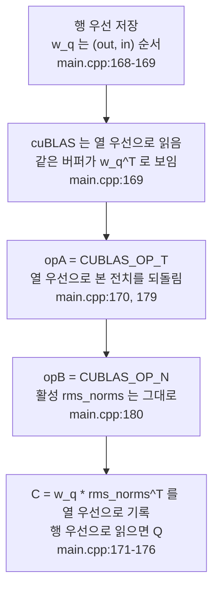

# 4. cuBLAS 행렬곱과 열-행 우선 전치 트릭

이 글의 모든 경로와 줄 번호는 고정 revision
`e25bf1994efa90bc98b721ba7c527402f86fbeaf` 의 트리를 가리킨다. 표기는
`파일:시작-끝` 형식이며, 실행 결과가 아니라 소스 인용이다.

## 이 장의 질문

왜 가중치 행렬곱을 cuBLAS 에 전치된 형태로 넘기는가. 코드 범위는
`src/main.cpp` 하나이고, 이 장의 최소 근거는 코드 인용 3건, 테스트 0건, 실행
0건이다. 이 장은 3편 prefill 경로에 의존한다. 3편이 어느 커널과 cuBLAS 호출이
어떤 순서로 일어나는지를 다뤘다면, 여기서는 그 호출들의
`m`·`n`·`k`·`lda`·`ldb`·`ldc` 와 전치 플래그가 왜 그렇게 되는지를 다룬다.

이 장은 열 우선 레이아웃과 leading dimension 설명을 소유한다. 3편은 prefill
커널 순서와 병렬 리덕션을, 2편은 버퍼 크기 산정과 별칭을 소유한다. decode 계열
커널과 `n = num_active_slots` 로 바뀌는 호출은 5편, block table 과 paged
attention 은 6편, 슬롯·큐는 7편이 맡는다. 잔차를 담당하는 커널도 여기서
재정의하지 않고 3편을 링크한다.

이 시리즈는 NVIDIA GPU 와 CUDA 툴체인이 없는 환경에서 작성되어 어떤 커널도
실행하지 않았다. 아래의 모든 인자·차원·레이아웃 주장은 소스 인용이며, 커널 실행
시간·처리량·메모리 사용량은 측정하지 않는다.

## 행 우선 데이터와 열 우선 cuBLAS

`src/main.cpp` 의 모든 활성과 가중치는 행 우선(row-major)으로 메모리에 놓인다.
예를 들어 Q 가중치 `weights.w_q[layer]` 는 `(out=2048, in=2048)` 모양이고,
연속한 두 행의 시작은 `EMBEDDING_LENGTH`(2048)만큼 떨어져 있다
(`src/main.cpp:16`, `185`). K/V 가중치는 `(KV_DIM=512, EMBEDDING_LENGTH=2048)`
이다(`src/main.cpp:18`, `208`, `229`).

반면 cuBLAS 의 `cublasGemmEx` 는 A·B·C 를 모두 열 우선(column-major)으로
가정한다. 소스 주석도 이 불일치를 그대로 적는다.

```cpp
// Q = inputs * wq^T; my matrices are row-major, cublas expects column-major
// it perceives my matrices as transposed
```

(`src/main.cpp:168-169`)

열 우선 행렬에서 leading dimension `ld` 는 연속한 두 열의 시작 사이의 거리, 곧
행 수다. 행 우선 행렬에서는 같은 역할을 하는 값이 연속한 두 행의 시작 사이의
거리, 곧 열 수다. 그래서 같은 버퍼를 cuBLAS 에게 넘기면, cuBLAS 는 그것을 전치된
행렬로 본다. 행 우선 `(m, n)` 은 열 우선 해석에서 `(n, m)` 이다.

이 문제를 넘기는 항등식이 소스 주석에 적혀 있다.

```cpp
// there's a trick where C = A * B == C^T = B^T * A^T
```

(`src/main.cpp:170`)

곱을 전치하면 두 피연산자의 순서가 뒤바뀌고 각각이 전치된다. 그래서 코드는
데이터를 실제로 전치하지 않고, cuBLAS 가 이미 전치된 것으로 보는 성질을 전치
플래그로 되돌린 뒤, 결과도 전치된 채로 받아 그대로 다음 단계에 쓴다. 출력 C 도
열 우선으로 기록되므로, 같은 버퍼를 행 우선으로 읽으면 원하는 행렬이 된다. 소스
주석이 "Q^T 를 다시 Q 로 되돌릴 필요가 없다"고 적는 이유다(`src/main.cpp:171-175`).

## 전치 플래그 한 쌍이 만드는 공통 구조

여덟 개의 가중치 투영 — Q, K, V, O, gate, up, down, 로짓 — 은 모두 같은 골격을
쓴다. 가중치는 A 자리에 `CUBLAS_OP_T`, 활성은 B 자리에 `CUBLAS_OP_N`, 출력은 C
자리에 놓는다. `n` 은 언제나 `prompt_len` 이다. 프롬프트 전체가 행렬의 열로
들어간다는 뜻이며, 이것이 prefill 한 번이 모든 토큰을 함께 처리하는 구조다.

`ldc` 는 cuBLAS 가 열 우선으로 보는 출력 C 의 leading dimension 이다. 이 여덟
호출과 어텐션 점수 호출에서 `ldc` 는 `m` 과 같다. cuBLAS 의 열 우선 C 는
`(m, n)` 이므로 `ldc` 는 그 행 수이고, 같은 버퍼를 행 우선으로 읽은 출력의 열
수이기도 하다. 예를 들어 Q 호출에서 `m = 2048`, `ldc = 2048` 이고, 열 우선 C 는
`(2048, prompt_len)`, 행 우선으로 읽은 출력은 `(prompt_len, 2048)` 이다
(`src/main.cpp:181`, `194`). K/V 는 512(`src/main.cpp:204`, `217`), gate/up 은
8192(`src/main.cpp:417`, `430`), down 은 2048(`src/main.cpp:474`, `487`), 로짓은
128256(`src/main.cpp:512`, `525`)이 같은 관계를 이룬다. 어텐션 점수×V 호출만 이
규칙에서 벗어나며, 그 이유는 아래에서 따로 다룬다.

## Q 투영

Q 투영 호출은 이 구조의 원형이다(`src/main.cpp:178-196`).

```cpp
cublasStatus_t q_proj_status = cublasGemmEx(cublas_handle,
                                            CUBLAS_OP_T,
                                            CUBLAS_OP_N,
                                            EMBEDDING_LENGTH,
                                            prompt_len,
                                            EMBEDDING_LENGTH,
                                            &q_proj_alpha,
                                            weights.w_q[layer],
                                            CUDA_R_16BF,
                                            EMBEDDING_LENGTH,
                                            rms_norms,
                                            CUDA_R_16BF,
                                            EMBEDDING_LENGTH,
                                            &q_proj_beta,
                                            q_proj,
                                            CUDA_R_16BF,
                                            EMBEDDING_LENGTH,
                                            CUBLAS_COMPUTE_32F,
                                            CUBLAS_GEMM_DEFAULT);
```

인자 순서대로 `opA = CUBLAS_OP_T`(`src/main.cpp:179`), `opB = CUBLAS_OP_N`
(`src/main.cpp:180`), `m = EMBEDDING_LENGTH`(2048, `src/main.cpp:181`), `n =
prompt_len`(`src/main.cpp:182`), `k = EMBEDDING_LENGTH`(2048,
`src/main.cpp:183`), `lda = ldb = ldc = 2048`(`src/main.cpp:187`, `190`, `194`)
이다. alpha 는 `q_proj_alpha`, beta 는 `q_proj_beta` 다(`src/main.cpp:184`,
`191`).

이 호출이 cuBLAS 안에서 계산하는 것은 `C = op(A)·op(B)` 이다. A 자리의
`weights.w_q[layer]` 는 행 우선 `(out, in)` 이지만 cuBLAS 는 열 우선으로 읽어
`w_q^T` 로 본다. `CUBLAS_OP_T` 가 그 전치를 되돌리므로 `op(A) = w_q` 다. B 자리의
`rms_norms` 는 행 우선 `(prompt_len, 2048)` 이고 cuBLAS 는 이를 `rms_norms^T` 로
본다. `CUBLAS_OP_N` 이므로 `op(B) = rms_norms^T` 다. 따라서 열 우선 C 는
`w_q · rms_norms^T` 이고, 이 버퍼를 행 우선으로 읽으면 `Q = rms_norms · w_q^T`
가 된다. 이것이 의도한 Q 다.

소스 주석은 같은 사실을 `Q^T = wq^T * inputs` 라는 축약으로 적는다
(`src/main.cpp:170-172`). 정확한 기준은 `op(A)` 와 `op(B)` 이며, 위 유도가
그것이다.

## K/V 투영

K 와 V 는 같은 골격에 `m` 과 `ldc` 만 `KV_DIM`(512)으로 바꾼다
(`src/main.cpp:201-219`, `222-240`). 가중치는 `weights.w_k[layer]`
(`src/main.cpp:208`), `weights.w_v[layer]`(`src/main.cpp:229`)이고, 활성은 둘 다
`rms_norms` 다. 출력은 `k_proj_temp_buf`(`src/main.cpp:215`),
`v_proj_temp_buf`(`src/main.cpp:236`)로 가며, `ldc = KV_DIM`(`src/main.cpp:217`,
`238`)이다. 주석은 이 호출이 `(KV_DIM, EMBEDDING_LENGTH) * (EMBEDDING_LENGTH,
num_tokens)` 를 계산하고, 그 결과가 행 우선으로 읽으면 `(num_tok, KV_DIM)` 이
된다고 적는다(`src/main.cpp:198-200`). 이 두 버퍼가 RoPE 와 paged 블록 분산의
입력이 된다는 사실은 3편이 소유한다.

## 어텐션 점수

어텐션 점수도 cuBLAS 로 계산한다(`src/main.cpp:301-327`). Q 헤드 32개를 도는
루프 안에서, K 헤드 `i / GQA_Q_TO_K_RATIO` 를 A 자리에 `CUBLAS_OP_T` 로, Q 헤드를
B 자리에 `CUBLAS_OP_N` 으로 넣는다(`src/main.cpp:303`, `309-310`). `m = n =
prompt_len`, `k = HEAD_DIM` 이고(`src/main.cpp:311-313`), `lda = KV_DIM`
(`src/main.cpp:317`), `ldb = EMBEDDING_LENGTH`(`src/main.cpp:320`), `ldc =
prompt_len`(`src/main.cpp:324`)이다. 출력 버퍼를 행 우선으로 읽으면
`(prompt_len, prompt_len)` 점수 행렬이 된다. alpha 는 `attn_alpha = 1.0f / 8.0f`
로, `HEAD_DIM = 64` 의 `1/sqrt(64)` 다(`src/main.cpp:649`, `src/main.cpp:19`).
GQA 비율과 점수의 의미는 3편이 다룬다. 여기서는 `ldc` 가 `m` 과 같은 전치
트릭의 골격을 그대로 쓴다는 점만 확인한다.

## 점수×V: 전치 플래그가 사라지는 예외

점수×V 호출은 `CUBLAS_OP_N` 을 두 번 쓴다(`src/main.cpp:352-370`, `353-354`).
`m = HEAD_DIM`(64), `n = prompt_len`, `k = prompt_len` 이고(`src/main.cpp:355-357`),
`lda = KV_DIM`(512, `src/main.cpp:361`), `ldb = prompt_len`(`src/main.cpp:364`),
`ldc = EMBEDDING_LENGTH`(2048, `src/main.cpp:368`)이다.

A 자리의 `v_head` 는 `v_proj_temp_buf` 에서 V 헤드 하나를 가리킨다
(`src/main.cpp:349`). 이 슬라이스는 행 우선 `(num_tok, 64)` 이지만 `lda = KV_DIM
= 512` 로 읽으면 cuBLAS 에게 `(64, num_tok)` 으로 보인다. `CUBLAS_OP_N` 이므로
그대로 `op(A)` 가 되고, `(m, k) = (64, prompt_len)` 과 맞는다. B 자리의
`attn_scores_head` 도 `ldb = prompt_len` 으로 읽혀 전치된 `(prompt_len,
prompt_len)` 이 되고, `CUBLAS_OP_N` 이므로 그대로 `op(B)` 다. 결과 C 는 `(64,
prompt_len)` 이다.

출력은 `attn_scores_v + i * HEAD_DIM` 에 쓰인다(`src/main.cpp:350`). `ldc =
EMBEDDING_LENGTH = 2048` 이므로 각 토큰 행의 폭은 2048 이고, 헤드 i 의 64칸이
그 안에서 `[i*64, (i+1)*64)` 구간을 차지한다. 32개 헤드가 이어 붙어 `(num_tok,
2048)` 버퍼를 채운다. 이 호출만 `ldc` 가 `m` 과 다른 이유가 여기에 있다. 두
피연산자가 이미 cuBLAS 가 필요로 하는 방향으로 보이므로 전치 플래그가 필요
없고, 출력 폭은 헤드들을 이어 붙일 버퍼의 폭으로 정해지기 때문이다. 이 결과가
곧바로 O 투영의 입력이 된다(`src/main.cpp:343`, `388`). V 헤드를 4개 Q 헤드가
공유하는 GQA 비율은 3편이 소유한다.

## O 투영과 SwiGLU, 로짓

나머지 가중치 투영은 Q 와 같은 골격을 반복한다.

- O 투영은 `weights.w_o[layer]` 를 A 자리에, 점수×V 결과 `attn_scores_v` 를 B
  자리에 두고, `m = ldc = EMBEDDING_LENGTH` 로 호출한다(`src/main.cpp:378-396`,
  `381`, `394`). 주석은 "same as Q projection, so copy paste" 라고 적는다
  (`src/main.cpp:376`).
- gate 와 up 은 각각 `weights.mlp_gate_proj[layer]`, `weights.mlp_up_proj[layer]`
  를 A 자리에 두고 `rms_norms` 를 B 자리에 둔다(`src/main.cpp:414-432`,
  `435-453`). `m = ldc = HIDDEN_DIM`(8192)이고 `k = EMBEDDING_LENGTH` 다
  (`src/main.cpp:417`, `430`).
- down 은 `weights.mlp_down_proj[layer]` 를 A 자리에, `silu` 를 마친 `gate` 를 B
  자리에 둔다(`src/main.cpp:471-489`). `m = ldc = EMBEDDING_LENGTH`(2048), `k =
  HIDDEN_DIM`(8192)이고, `lda = ldb = HIDDEN_DIM` 이다(`src/main.cpp:474`, `480`,
  `483`, `487`). 주석은 "cublas sees them already as transposed so only down_proj
  I need to transpose" 라고 적는다(`src/main.cpp:466`).
- 로짓은 `weights.embed_tokens` 를 A 자리에, `rms_norms` 를 B 자리에 둔다
  (`src/main.cpp:509-527`). `m = ldc = VOCAB_SIZE`(128256), `k = EMBEDDING_LENGTH`
  다(`src/main.cpp:512`, `525`). 주석은 처음에 `m` 과 `n` 을 바꿔 생각했다가
  트릭 때문에 바로잡는 과정을 그대로 남긴다(`src/main.cpp:498-501`).

## alpha 와 beta: 잔차는 GEMM 이 아니라 커널이 한다

GEMM 의 alpha·beta 인자가 잔차 누적까지 처리한다는 설명이 있지만, 고정 revision
의 코드는 이를 뒷받침하지 않는다. 열 개의 alpha/beta 선언을 보면 beta 는 모두
`0.0f` 다(`src/main.cpp:632`, `642`, `645`, `650`, `654`, `660`, `665`, `670`,
`674`, `679`). alpha 도 어텐션 점수의 `1.0f / 8.0f` 하나를 빼면 모두 `1.0f`
다(`src/main.cpp:631`, `641`, `644`, `649`, `653`, `659`, `664`, `669`, `673`,
`678`). beta 가 0 이라는 것은 GEMM 이 기존 C 를 읽지 않고 덮어쓴다는 뜻이므로,
잔차를 누적할 자리가 없다.

잔차 누적은 별도의 호출이 담당한다. 어텐션 뒤에는 `residualAdd(hidden_state,
o_proj, prompt_len)`(`src/main.cpp:399`), SwiGLU 뒤에는
`residualAdd(hidden_state, down, prompt_len)`(`src/main.cpp:492`)가 있다. 이
커널의 구현은 3편이 소유하며, 여기서는 beta 인자와 무관하다는 점만 짚는다.

## 시각 자료: 전치 트릭의 흐름

행 우선 데이터가 전치 플래그를 거쳐 결과가 되는 흐름을 정리하면 다음과 같다.

<!-- visual: column-row-major-trick supports: [column-row-major-trick] -->


이 다이어그램은 가중치 투영 여덟 곳에 공통인 골격을 보여 준다. alpha·beta 로
잔차를 누적한다는 주장은 위에서 기각했으므로 다이어그램에 넣지 않는다.

## 이 장이 다루지 않는 것

- prefill 커널 순서와 병렬 리덕션: 3편. 이 장은 cuBLAS 호출의 인자만 다룬다.
- 버퍼 크기 산정과 별칭(`buf_2048_1`/`buf_2048_2`): 2편.
- `residualAdd` 커널 구현: 3편.
- decode 계열 호출. decode 에서는 `n` 이 `prompt_len` 대신 `num_active_slots` 가
  된다(`src/main.cpp:765-783` 등). 이 대비는 5편이 소유한다.
- block table 인덱싱과 paged attention: 6편.
- 슬롯·큐 수명주기: 7편.

## 이 장의 한계

- 이 시리즈는 NVIDIA GPU 와 CUDA 툴체인이 없는 환경에서 작성되어 커널을 하나도
  실행하지 않았다. `m`·`n`·`k`·`lda`·`ldb`·`ldc` 와 전치 플래그에 대한 모든
  주장은 소스 인용이며 실행 검증이 없다.
- 이 장의 최소 근거는 코드 인용 3건, 테스트 0건, 실행 0건이다. 커널 실행
  시간·처리량·메모리 사용량은 측정하지 않으며, 이 장에는 측정값으로 읽힐 수 있는
  성능 수치가 없다.
- `m`·`n`·`k`·`lda`·`ldb`·`ldc` 는 `EMBEDDING_LENGTH`, `KV_DIM`, `HIDDEN_DIM`,
  `VOCAB_SIZE` 같은 컴파일 타임 상수에서 온다(`src/main.cpp:16-25`). 이 값이
  바뀌면 각 호출의 leading dimension 도 함께 바뀐다.
- 소스 주석의 `Q^T = wq^T * inputs` 표현은 저자의 축약이다. 이 장이 제시한
  `op(A)`/`op(B)` 기준이 `cublasGemmEx` 의 실제 계산과 맞는다.
- 어텐션 점수×V 호출만 `ldc` 가 `m` 과 다르다(`src/main.cpp:355`, `368`). 이
  예외의 인과는 위에서 설명했지만, 실행으로 확인하지는 않았다.
- 모든 cuBLAS 호출의 반환 상태(`*_status`)는 선언만 되고 검사되지 않는다
  (`src/main.cpp:178`, `201`, `222`, `308`, `352`, `378`, `414`, `435`, `471`,
  `509`). 이 장은 이 호출들이 성공했다는 전제 위에 있다.
- 가중치 파일은 gated 모델 `meta-llama/Llama-3.2-1B-Instruct` 의
  `model.safetensors` 라서, 실제 투영을 돌려 수치를 대조하는 검증은 후속 과제로
  남는다.

## 출처

- `src/main.cpp:16-25` — `EMBEDDING_LENGTH`, `KV_DIM`, `HEAD_DIM`, `HIDDEN_DIM`,
  `VOCAB_SIZE` 차원 상수.
- `src/main.cpp:168-176` — Q 투영 전치 트릭 주석과 `C = A·B == C^T = B^T·A^T`.
- `src/main.cpp:178-196` — Q 투영 cuBLAS 호출과 인자(`179`, `180`, `181-183`,
  `187`, `190`, `194`).
- `src/main.cpp:198-219` — K 투영 주석과 호출(`204`, `208`, `215`, `217`).
- `src/main.cpp:222-240` — V 투영 호출(`225`, `229`, `236`, `238`).
- `src/main.cpp:301-327` — 헤드별 어텐션 점수 cuBLAS 호출(`303`, `309-313`,
  `317`, `320`, `324`).
- `src/main.cpp:343-371` — 점수×V 호출(`349`, `350`, `353-357`, `361`, `364`,
  `368`).
- `src/main.cpp:373-396` — O 투영 주석과 호출(`376`, `381`, `388`, `394`).
- `src/main.cpp:404-432` — gate 투영 주석과 호출(`417`, `430`).
- `src/main.cpp:434-453` — up 투영 호출(`438`, `451`).
- `src/main.cpp:461-489` — down 투영 주석과 호출(`466`, `474`, `480`, `483`,
  `487`).
- `src/main.cpp:496-527` — 로짓 주석과 호출(`498-501`, `512`, `525`).
- `src/main.cpp:631-679` — 열 개 alpha/beta 선언(`632`, `642`, `645`, `650`,
  `654`, `660`, `665`, `670`, `674`, `679`).
- `src/main.cpp:399`, `492` — `residualAdd` 호출(잔차 누적이 beta 와 무관함).