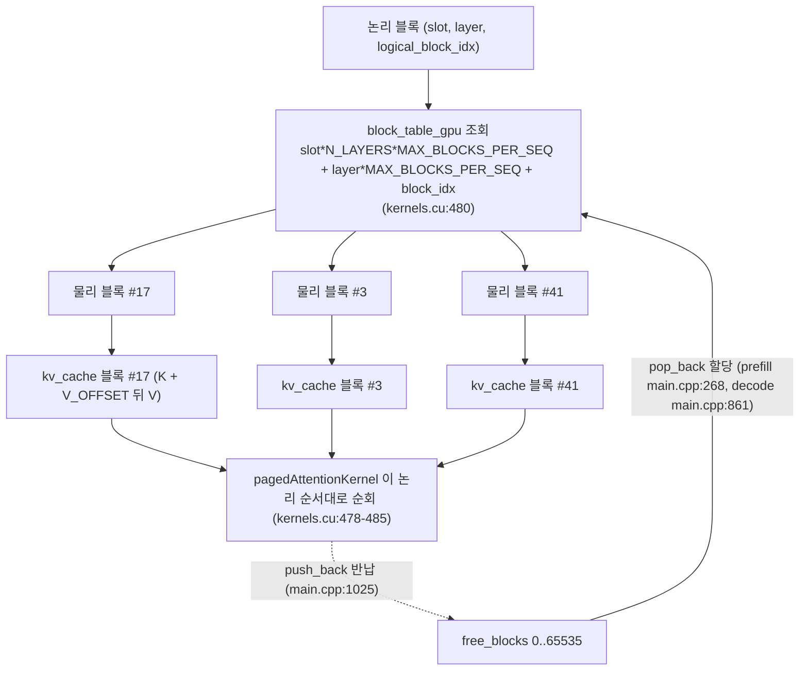

# 6. 블록 단위로 인덱싱되는 paged KV cache

이 글의 모든 경로와 줄 번호는 고정 revision
`e25bf1994efa90bc98b721ba7c527402f86fbeaf` 의 트리를 가리킨다(`guide.md:6`). 표기는
`파일:시작-끝` 형식이며, 실행 결과가 아니라 소스 인용이다.

## 이 장의 질문

KV cache 를 블록으로 나누고 block table 로 참조하면 어텐션 커널은 무엇을 어떻게
읽는가(`series.yaml:120-122`). prefill 과 decode 의 구분, KV cache 가 존재하는
이유, attention 수식은 이 시리즈의 전제이며 여기서 다시 설명하지 않는다
(`guide.md:14-16`).

block table 과 paged attention 은 **KV 저장 구조의 유일한 소유 편**이다
(`guide.md:199`). 이 장은 5편의 decode 경로에 의존하며(`series.yaml:125`), 5편이
"슬롯별 K/V 를 배치 버퍼에 모아 캐시에 기록한다"는 쓰기 경로까지 본 것을 이어받아
(`guide.md:198`), 이 장에서는 블록이 어떤 모양으로 담기고 커널이 그 블록을 어떻게
읽는지에 집중한다. 슬롯이 큐로 어떻게 채워지고 비는지는 7편이 맡는다
(`guide.md:200`).

## paged KV cache 할당자와 블록 레이아웃

`main` 은 초기화 단계에서 KV cache 를 세 조각으로 준비한다(`src/main.cpp:574-581`).

```cpp
__nv_bfloat16 *kv_cache;
cudaMalloc(&kv_cache, KV_CACHE_SIZE_BYTES);
std::vector<int> free_blocks(NUM_BLOCKS);
std::iota(free_blocks.begin(), free_blocks.end(), 0);
std::vector<int> block_table(MAX_SEQUENCES * N_LAYERS * MAX_BLOCKS_PER_SEQ, -1);
int *block_table_gpu;
cudaMalloc(&block_table_gpu, MAX_SEQUENCES * N_LAYERS * MAX_BLOCKS_PER_SEQ * sizeof(int));
```

인용: [`src/main.cpp:574-581`](https://github.com/jmaczan/tiny-vllm/blob/e25bf1994efa90bc98b721ba7c527402f86fbeaf/src/main.cpp#L574-L581)

셋의 역할이 다르다(Claim 14, `claims.md:269-280`).

- `kv_cache` — 2GB 의 원시 바이트. 실제 K/V 값이 담기는 저장소다
  (`src/main.cpp:575-576`).
- `free_blocks` — 아직 할당되지 않은 물리 블록 번호 목록. `0..NUM_BLOCKS-1` 로
  채워진다(`src/main.cpp:577-578`).
- `block_table` / `block_table_gpu` — CPU 사본과 GPU 사본으로 나뉜
  논리→물리 매핑 테이블. 모든 항목이 `-1` 로 시작한다(`src/main.cpp:579-581`).

블록 하나의 크기는 컴파일 타임 상수로 정해진다(Claim 15, `claims.md:282-295`).
`main.cpp` 와 `kernels.cu` 가 같은 값을 중복 정의한다.

<!-- visual: kv-block-layout supports: [kv-block-layout] -->
| 상수 | 값 | 근거 |
| --- | --- | --- |
| `BLOCK_SIZE` | 16 (토큰) | `src/main.cpp:32`, `src/kernels.cu:16` |
| `KV_DIM` | 512 | `src/main.cpp:18`, `src/kernels.cu:10` |
| `V_OFFSET = BLOCK_SIZE × KV_DIM × 2` | 16,384 바이트 | `src/main.cpp:33`, `src/kernels.cu:17` |
| `BLOCK_BYTES = V_OFFSET × 2` | 32,768 바이트 | `src/main.cpp:34`, `src/kernels.cu:18` |
| `MAX_BLOCKS_PER_SEQ = 2048/16` | 128 | `src/main.cpp:36`, `src/kernels.cu:19` |
| `NUM_BLOCKS = 2GB / BLOCK_BYTES` | 65,536 | `src/main.cpp:35,37` |

레이아웃 규칙은 간단하다. 블록 하나는 **16 토큰 × 512 차원**의 bf16 요소를 담고,
K 는 블록 시작(`kv_cache + block × BLOCK_BYTES`)에, V 는 `V_OFFSET` 바이트 뒤에
배치된다. bf16 요소가 2바이트이므로 `V_OFFSET = 16×512×2` 이고, 블록 전체는
`BLOCK_BYTES = V_OFFSET×2` 여서 2GB 캐시는 정확히 65,536 블록으로 나뉜다. K/V 를
블록에 기록하는 두 지점이 이 레이아웃을 사용한다. prefill 의 K 는
`kv_cache + block × BLOCK_BYTES` 에, V 는 거기에 `V_OFFSET` 을 더한 곳에
`cudaMemcpy`(D2D)로 쓰고(`src/main.cpp:280-287`), decode 의 K/V 도 같은 오프셋
산술로 블록 안 위치를 잡는다(`src/main.cpp:866-872`). 커널 쪽에서 블록을 읽을 때도
이 동일한 상수를 그대로 쓰므로(`src/kernels.cu:484-485`) 쓰기와 읽기가 한 레이아웃을
공유한다.

## block table: 논리 블록을 물리 블록으로

KV cache 는 시퀀스가 길어지면 블록을 **필요할 때마다** 하나씩 받아 쓴다. 블록
할당은 `free_blocks` 의 `pop_back`, 반납은 `push_back` 으로 관리된다(Claim 14,
`claims.md:269-280`). prefill 에서는 프롬프트를 16 토큰 단위로 잘라 블록 테이블이
`-1` 인 자리만 할당하고(`src/main.cpp:264-277`), decode 에서는 토큰이 블록 경계에
걸릴 때(`token_in_block_idx == 0`)만 새 블록을 꺼낸다(`src/main.cpp:859-865`).
슬롯이 끝나면 소유 블록 전부를 돌려준다(`src/main.cpp:1018-1029`).

논리 블록을 물리 블록으로 바꾸는 인덱스 산술은 `main.cpp` 와 커널이 공유하는
하나의 식이다.

```cpp
slot * N_LAYERS * MAX_BLOCKS_PER_SEQ + layer * MAX_BLOCKS_PER_SEQ + block_idx
```

이 식은 prefill 의 할당(`src/main.cpp:265`, `271`), decode 의 할당
(`src/main.cpp:858`, `864`), 슬롯 종료 시 반납(`src/main.cpp:1022-1026`)에서
`block_table` 을 다루고, 커널에서는 `block_table_gpu` 를 읽는 곳(`src/kernels.cu:480`)
에서 똑같이 등장한다. 시퀀스 2개 × 레이어 16개 × 시퀀스당 최대 128 블록이므로
테이블 크기는 4,096 항목이다(`src/main.cpp:579`).

<!-- visual: block-table-indexing supports: [block-table-indexing] -->


핵심은 블록이 **물리적으로 연속일 필요가 없다**는 것이다. `block_table_gpu` 가
논리 블록을 물리 블록에 매핑하므로, 커널은 논리 블록 인덱스를 그대로 순회하면서
테이블을 거쳐 실제 주소를 얻는다. 같은 시퀀스라도 물리 블록 17, 3, 41 처럼 흩어져
있어도 읽기에 지장이 없다. 이것이 2GB 연속 버퍼를 "페이지"처럼 쪼개 쓰는
paged attention 의 골격이다.

## pagedAttentionKernel 이 받는 상태

decode 계열 커널 넷 중에서 `pagedAttentionKernel` 만이 `kv_cache`,
`block_table_gpu`, `gpu_seq_lens`, `gpu_active_slots` 를 함께 받는다
(`guide.md:107-110`). 시그니처는 한 줄에 담겨 있다(Claim 16, `claims.md:297-314`).

```cpp
__global__ void pagedAttentionKernel(int layer, int num_active_slots,
    __nv_bfloat16 *q_proj, __nv_bfloat16 *kv_cache,
    int *block_table_gpu, int *gpu_seq_lens,
    int *gpu_active_slots, __nv_bfloat16 *output)
```

인용: [`src/kernels.cu:461`](https://github.com/jmaczan/tiny-vllm/blob/e25bf1994efa90bc98b721ba7c527402f86fbeaf/src/kernels.cu#L461)

호출부는 decode 레이어 루프 안에서 레이어마다 한 번씩 온다(`src/main.cpp:878`).
런치는 `<<<dim3(num_active_slots, NUM_Q_HEADS), HEAD_DIM>>>` 이다
(`src/kernels.cu:525-527`).

<!-- visual: paged-attention-inputs supports: [paged-attention-inputs] -->
| 인자 | 커널 안에서 쓰임 | 준비 주체 |
| --- | --- | --- |
| `kv_cache` | 물리 블록의 K/V 를 읽는 저장소 (`src/kernels.cu:484-485`) | `cudaMalloc` 2GB — `src/main.cpp:575-576` |
| `block_table_gpu` | 논리→물리 블록 매핑 (`src/kernels.cu:480`) | prefill 후·decode 레이어마다 H2D — `src/main.cpp:552`, `876` |
| `gpu_seq_lens` | 슬롯의 현재 길이, 블록 수 계산 (`src/kernels.cu:470-471`) | decode 반복마다 H2D — `src/main.cpp:751-757` |
| `gpu_active_slots` | 활성 슬롯 목록, 진짜 슬롯 번호 획득 (`src/kernels.cu:464-465`) | decode 반복마다 H2D — `src/main.cpp:749-750` |
| `q_proj` / `output` | 같은 버퍼 `buf_2048_1` (in-place) | `src/main.cpp:878`, `892` |

커널은 그리드를 세 축으로 나눈다. `blockIdx.x` 가 활성 슬롯의 위치이고,
`blockIdx.y` 가 Q 헤드이고, `threadIdx.x` 가 헤드 내부의 64 차원이다
(`src/kernels.cu:464-467`). 활성 슬롯 위치에서 진짜 슬롯 번호는
`gpu_active_slots[active_slot]` 으로 얻는다(`src/kernels.cu:465`). 이 값들이
7편의 슬롯·큐 관리에서 매 스텝 갱신되어 들어온다.

## 블록 순회와 K/V 주소 계산

커널의 읽기 루프는 두 겹이다. 바깥 루프가 논리 블록을 돌고
(`src/kernels.cu:478`), 안쪽 루프가 블록 안의 토큰을 돈다(`src/kernels.cu:482`).
블록 수는 시퀀스 길이에서 구한다.

```cpp
int num_blocks = (seq_len + BLOCK_SIZE - 1) / BLOCK_SIZE;

for (int logical_block_idx = 0; logical_block_idx < num_blocks; ++logical_block_idx)
{
    int physical_block = block_table_gpu[slot * N_LAYERS * MAX_BLOCKS_PER_SEQ
                                       + layer * MAX_BLOCKS_PER_SEQ + logical_block_idx];
    int tokens_in_block = min(seq_len - logical_block_idx * BLOCK_SIZE, BLOCK_SIZE);
    for (int token = 0; token < tokens_in_block; ++token)
    {
        __nv_bfloat16 *k = (__nv_bfloat16 *)((char *)kv_cache
            + physical_block * BLOCK_BYTES
            + token * KV_DIM * sizeof(__nv_bfloat16)
            + kv_head_idx * HEAD_DIM * sizeof(__nv_bfloat16)
            + thread_id * sizeof(__nv_bfloat16));
        __nv_bfloat16 *v = (__nv_bfloat16 *)((char *)kv_cache
            + physical_block * BLOCK_BYTES + V_OFFSET
            + token * KV_DIM * sizeof(__nv_bfloat16)
            + kv_head_idx * HEAD_DIM * sizeof(__nv_bfloat16)
            + thread_id * sizeof(__nv_bfloat16));
```

인용: [`src/kernels.cu:471-485`](https://github.com/jmaczan/tiny-vllm/blob/e25bf1994efa90bc98b721ba7c527402f86fbeaf/src/kernels.cu#L471-L485)

주소 계산은 앞서 본 레이아웃 상수를 그대로 조합한다. `physical_block × BLOCK_BYTES`
로 블록 시작을 잡고, `token × KV_DIM × 2` 로 블록 안의 토큰 행을, 거기에
`kv_head_idx × HEAD_DIM × 2 + thread_id × 2` 로 GQA 헤드와 차원 위치를 더한다. V 는
`V_OFFSET` 만 더해진다(Claim 15, `claims.md:282-295`). `kv_head_idx` 는
`q_head_id / GQA_Q_TO_K_RATIO` 로 구하며(`src/kernels.cu:468`), Q 헤드 4개가
K/V 헤드 1개를 공유한다. 블록이 물리적으로 흩어져 있어도 `physical_block` 이
테이블에서 오므로, 이 주소 산술은 연속 메모리를 가정하지 않는다(Claim 14,
`claims.md:269-280`).

## 워프 리덕션과 온라인 softmax

각 토큰 위치의 K 값을 읽은 스레드는 내적 하나에 기여한다. `q × k` 를 계산한 뒤
(`src/kernels.cu:486`), 이 값은 워프 내부의 `__shfl_down_sync` 5단계 리덕션으로
32개 스레드의 합이 된다(`src/kernels.cu:489-493`). 헤드 차원이 64 이므로 두 워프가
한 헤드를 담당하고, 두 워프의 결과는 shared memory `dot_products[2]` 를 거쳐
스레드 0 이 합한 뒤 `sqrt(HEAD_DIM)`(=8) 로 나눈다(`src/kernels.cu:463`,
`494-506`). 이것이 `q·k / sqrt(64)` 스케일의 어텐션 점수다(Claim 17,
`claims.md:316-332`).

```cpp
// online softmax
float new_max = current_max;
if (dot_product > current_max)
{
    new_max = dot_product;
}
float correction_factor = expf(current_max - new_max);
current_max = new_max;
float exp_score = expf(dot_product - current_max);
d = d * correction_factor + exp_score;
acc = acc * correction_factor + exp_score * (float)*v;
```

인용: [`src/kernels.cu:509-519`](https://github.com/jmaczan/tiny-vllm/blob/e25bf1994efa90bc98b721ba7c527402f86fbeaf/src/kernels.cu#L509-L519)

이후의 누적은 **온라인 softmax**(FlashAttention 방식)다. 블록을 하나씩 읽으면서
`current_max` 를 갱신하고, 점수가 갱신 전 최댓값과 달라진 만큼 기존 누적
`d`(분모)와 `acc`(가중 평균)에 보정 계수 `expf(current_max - new_max)` 를 곱한다
(`src/kernels.cu:474-476`, `510-519`). 이렇게 하면 전체 시퀀스를 한 번에 맞추지
않아도, 즉 블록을 순회하면서도 수치적으로 올바른 softmax 분모와 가중 평균을
누적할 수 있다. 블록 순회가 끝나면 `output[...] = acc / d` 로 평균을 쓴다
(`src/kernels.cu:522`). 소스 주석이 이 알고리즘을
`https://courses.cs.washington.edu/courses/cse599m/23sp/notes/flashattn.pdf` 로
밝힌다(`src/kernels.cu:473`).

## in-place: q 를 읽은 버퍼에 출력을 쓴다

`pagedAttention` 호출의 `q_proj` 와 `output` 은 같은 버퍼 `buf_2048_1` 이다
(`src/main.cpp:878`). 이 별칭이 안전한 이유는 읽기와 쓰기의 인덱스가 같기
때문이다(Claim 18, `claims.md:334-350`). q 를 읽는 곳은

```cpp
__nv_bfloat16 q = q_proj[active_slot * EMBEDDING_LENGTH + q_head_id * HEAD_DIM + thread_id];
```

인용: [`src/kernels.cu:469`](https://github.com/jmaczan/tiny-vllm/blob/e25bf1994efa90bc98b721ba7c527402f86fbeaf/src/kernels.cu#L469)

출력을 쓰는 곳은

```cpp
output[active_slot * EMBEDDING_LENGTH + q_head_id * HEAD_DIM + thread_id] = acc / d;
```

인용: [`src/kernels.cu:522`](https://github.com/jmaczan/tiny-vllm/blob/e25bf1994efa90bc98b721ba7c527402f86fbeaf/src/kernels.cu#L522)

`active_slot × 2048 + q_head_id × 64 + thread_id` 가 양쪽에서 같으므로, 각 스레드는
자기가 읽은 위치에만 쓴다. 어텐션 누적이 끝나기 전에 이 버퍼를 다시 읽을 일이
없다는 정적 순서를 전제로, O 투영은 이 출력을 곧바로 입력으로 받는다
(`src/main.cpp:892`). `buf_2048_1` 이 q 프로젝션과 어텐션 출력을 공유한다는 별칭
설계는 2편이 소유한다(`guide.md:194`).

## 이 장이 다루지 않는 것

- decode 계열 커널이 시퀀스 길이 1 을 가정하는 방식과 `ropeKernelDecode`·`softmaxKernelDecode`:
  5편(`guide.md:198`).
- 슬롯별 K/V 를 배치 버퍼에 모아 블록에 기록하는 decode 쓰기 경로의 순서: 5편
  (Claim 12, `claims.md:227-244`).
- 슬롯 종료 조건과 큐에서 다음 프롬프트로 채우는 흐름, 슬롯 해제가 free_blocks
  반납으로 이어지는 절차: 7편 (Claim 13, `claims.md:246-261`; `guide.md:200`).
- cuBLAS 전치 레이아웃과 alpha·beta 인자: 4편(`guide.md:197`).
- prefill 의 커널 호출 순서와 병렬 리덕션: 3편(`guide.md:195-196`).

이 장은 block table 읽기와 블록 레이아웃만 소유한다. 블록 반납(`push_back`) 자체는
7편의 슬롯 종료에서 설명되는데, 이 장의 `block-table-indexing` 시각 자료에서는
`free_blocks` 목록이 할당·반납을 관리한다는 사실까지만 근거로 쓴다
(`briefs.md:186`).

## 이 장의 한계

- 이 시리즈는 NVIDIA GPU 와 CUDA 툴체인이 없는 환경에서 작성되어 커널을 실행하지
  않는다. `pagedAttentionKernel` 의 모든 순회·리덕션·주소 주장은 소스 인용이며
  실행 검증이 없다(`guide.md:75-87`; Claim 14·15·16·17·18 한계
  `claims.md:278-280`, `295`, `312-314`, `331-332`, `349-350`).
- 논리 인덱스 산술(`slot*N_LAYERS*MAX_BLOCKS_PER_SEQ +
  layer*MAX_BLOCKS_PER_SEQ + block_idx`)의 실행 정합성은 GPU 없이 검증되지 않았다
  (`claims.md:278-280`). 블록 크기·오프셋도 상수이며 실행 시 레이아웃 검증은 없다
  (`claims.md:295`).
- `pagedAttentionKernel` 은 `HEAD_DIM=64` 전제에 묶여 있다. `dot_products[2]` 와
  스레드 0·32 의 협력(`src/kernels.cu:463`, `494-506`)은 헤드가 두 워프로 나뉘어야
  성립하므로, `HEAD_DIM` 이 64 가 아니면 깨진다(`trace.md:225-227`; `claims.md:331-332`).
- decode 계열에서 `pagedAttentionKernel` 만 네 상태를 함께 받는 비대칭은
  `guide.md:107-110` 의 서술과 일치하나, 다른 커널의 시그니처는 첨부에 없어 직접
  비교되지 않았다(`claims.md:312-314`). `src/kernels.cuh` 와 `src/cuda_to_hip.h`
  본문도 첨부에 없다(`trace.md:219-221`).
- in-place 안전성은 읽기·쓰기 인덱스가 같다는 정적 주장이며, 동시성·경합의 실행
  검증은 없다(`claims.md:349-350`).
- decode 는 매 레이어마다 `block_table` 전체를 `block_table_gpu` 로 H2D 동기화한
  뒤 paged attention 을 부른다(`src/main.cpp:876`, TODO `src/main.cpp:551`). 이
  비용은 측정되지 않았다(`trace.md:234-235`).
- `tests` 근거가 0 인 장이므로 이 장은 실행 테스트 없이 정적 인용으로만 구성한다
  (`series.yaml:128`; `briefs.md:187`).

## 출처

- `src/kernels.cu:461` — `pagedAttentionKernel` 시그니처; 활성 슬롯·길이 소비
  `464-471`; GQA 헤드 매핑 `468`; q 읽기 `469`; 블록 순회·주소 계산 `471-485`;
  워프 리덕션·두 워프 결합 `463`, `486-507`; 온라인 softmax `509-519`; 출력
  `522`; 런치 `525-527`.
- `src/main.cpp:574-581` — KV cache 할당자(`kv_cache`, `free_blocks`, `block_table`,
  `block_table_gpu`); 상수 `32-37`; prefill 블록 할당·기록 `264-277`, `280-287`;
  decode 블록 할당·기록 `858-872`; H2D 동기화 `552`, `876`; 호출 `878`; O 투영
  입력 `892`; 슬롯 종료·블록 반납 `1015-1031`.
- `src/kernels.cu:16-19` — 블록 레이아웃 상수(중복 정의).
- `series.yaml:120-122`, `125` — 이 장의 질문과 의존성.
- `guide.md:107-110`, `194-200` — decode 계열 비대칭과 편별 소유권.
- `evidence/trace.md:225-227`, `234-235` — `HEAD_DIM=64` 전제와 H2D 동기화 비용.