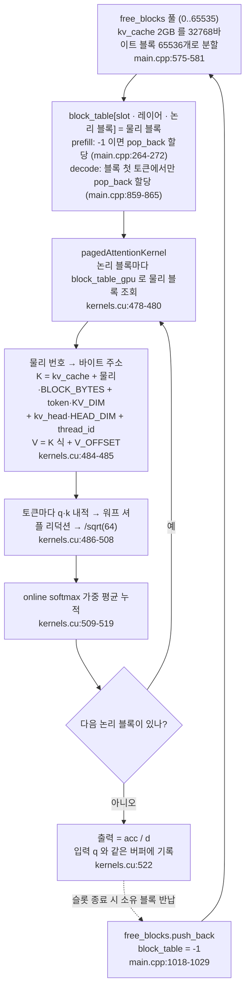

# 6. KV cache 를 16토큰 블록으로 쪼개기 — block table 로 비연속 블록을 읽는 법

decode 가 토큰을 하나 만들 때마다 어텐션은 그 시퀀스가 지금까지 쌓은 **모든** K/V 를 다시 읽는다. 이 K/V 를 시퀀스마다 연속된 큰 버퍼 하나로 잡으면, 시퀀스들이 저마다 다른 시점에 끝나면서 안 쓰는 구간이 생겨 메모리가 낭비된다. vLLM 을 유명하게 만든 PagedAttention 의 답은 KV cache 를 운영체제의 페이지처럼 **작은 블록으로 쪼개** 필요할 때만 할당하고, block table 이라는 배열이 "어느 시퀀스의 어느 묶음이 어느 블록인지"를 추적하게 하는 것이다([Kwon et al., SOSP 2023](https://arxiv.org/pdf/2309.06180)). 이 저장소는 `BLOCK_SIZE = 16` 토큰짜리 블록, block table, 그리고 `pagedAttentionKernel` 커널 하나로 그 아이디어를 구현했다.

1편에서 2GB 캐시를 통째로 잡고 `free_blocks`·`block_table` 을 준비하는 모습을, 3편과 5편에서 그 블록에 K/V 를 **쓰는** 쪽을 보았다. 이 편은 반대 방향이다. `pagedAttentionKernel` 이 block table 을 거쳐 블록을 **읽는** 쪽, 다시 말해 "KV cache 가 블록으로 나뉘어 있다"는 사실이 어텐션 커널의 주소 계산과 리덕션을 어떻게 정하는지를 본다. 블록의 생김새, 그걸 가리키는 block table 의 인덱스, 그걸 바이트 주소로 펼치는 커널 순서다.

> 이 시리즈의 모든 인용은 커밋 [`e25bf19`](https://github.com/jmaczan/tiny-vllm/tree/e25bf1994efa90bc98b721ba7c527402f86fbeaf) 기준이다. 필자에게 NVIDIA GPU 가 없어 빌드도 실행도 하지 않았고, 아래 모든 설명은 소스를 읽어 얻은 것이다.

## 블록 하나가 담는 것: K 는 앞, V 는 V_OFFSET 뒤

어텐션 커널이 읽는 단위는 블록이다. 블록 하나에는 토큰 16개의 K 와 V 가 들어 있고, K 와 V 는 한 블록 안에 나란히 두 구간으로 배치된다. 이 구간 나눔이 전제가 되어야 커널의 주소 계산이 성립하므로, 먼저 그 크기 상수를 본다.

```cpp
constexpr int BLOCK_SIZE = 16; // TODO: tunable as well, defined the size of a single page in pagedattn
constexpr int V_OFFSET = BLOCK_SIZE * KV_DIM * sizeof(__nv_bfloat16);
constexpr int BLOCK_BYTES = V_OFFSET * 2;                         // * 2 because K and V
constexpr size_t KV_CACHE_SIZE_BYTES = 2ULL * 1024 * 1024 * 1024; // TODO: 2GB
constexpr int MAX_BLOCKS_PER_SEQ = MAX_SEQ_LEN / BLOCK_SIZE;      // 2048 / 16 = 128
constexpr int NUM_BLOCKS = KV_CACHE_SIZE_BYTES / BLOCK_BYTES;     // 2*1024*1024*1024/(16*512*2*2) = 65536
```
— [`src/main.cpp:32-37`](https://github.com/jmaczan/tiny-vllm/blob/e25bf1994efa90bc98b721ba7c527402f86fbeaf/src/main.cpp#L32-L37)

`KV_DIM = 512` 는 K/V 헤드 8개(`NUM_K_HEADS`)에 헤드 차원 64(`HEAD_DIM`)를 곱한 값이고, bf16 은 요소당 2바이트다. 계산하면 `V_OFFSET = 16 × 512 × 2 = 16384` 바이트, `BLOCK_BYTES = 16384 × 2 = 32768` 바이트다. K 는 블록 시작부터, V 는 `V_OFFSET` 뒤부터 시작한다. 2GB 캐시를 32768 바이트로 나누면 블록은 65536 개다.

같은 상수가 `src/kernels.cu:16-19` 에 다시 정의되어 있다. 파일 맨 위의 TODO 주석(`src/kernels.cu:6`)이 "main.cpp 과 kernels.cu 사이에 공유하지 말까"라고 이 중복을 지적한다. 커널과 호스트가 같은 값을 쓰지 않으면 주소가 어긋나므로, 이 중복은 "같아야만 하는" 중복이다.

이 레이아웃을 전제로 기록하는 쪽은 5편에서 봤다. 새 토큰의 K 는 `kv_cache + block·BLOCK_BYTES + token_in_block_idx·KV_DIM·sizeof(...)` 위치에, V 는 그 식에 `V_OFFSET` 을 더해 쓴다(`src/main.cpp:866-872`). 이 편이 볼 것은 같은 상수를 읽는 쪽이 어떻게 쓰는지다.

## block table: slot·레이어·논리 블록 세 항목의 배열

block table 은 논리 블록을 물리 블록으로 바꿔 주는 배열이다. 논리 블록은 "시퀀스의 몇 번째 16토큰 묶음"이고, 물리 블록은 "2GB 캐시의 몇 번째 32768바이트 조각"이다. 논리적으로 이어지는 KV 가 물리적으로 흩어져 있어도, 이 배열 하나가 그 매핑을 기억한다. `main` 은 이 매핑을 위한 세 조각을 함께 준비한다.

```cpp
    __nv_bfloat16 *kv_cache;
    cudaMalloc(&kv_cache, KV_CACHE_SIZE_BYTES);
    std::vector<int> free_blocks(NUM_BLOCKS);
    std::iota(free_blocks.begin(), free_blocks.end(), 0);
    std::vector<int> block_table(MAX_SEQUENCES * N_LAYERS * MAX_BLOCKS_PER_SEQ, -1);
    int *block_table_gpu;
    cudaMalloc(&block_table_gpu, MAX_SEQUENCES * N_LAYERS * MAX_BLOCKS_PER_SEQ * sizeof(int));
```
— [`src/main.cpp:575-581`](https://github.com/jmaczan/tiny-vllm/blob/e25bf1994efa90bc98b721ba7c527402f86fbeaf/src/main.cpp#L575-L581)

세 조각은 각각 역할이 다르다. `kv_cache` 는 2GB 통짜 버퍼, `free_blocks` 는 0부터 65535까지 채운 "지금 쓸 수 있는 물리 블록" 목록, `block_table` 은 전부 `-1` 로 시작하는 매핑 배열이다. `-1` 은 "이 자리에 아직 물리 블록이 배정되지 않았다"는 표시다. 크기를 채워 보면 `MAX_SEQUENCES = BATCH_SIZE = 2`, `N_LAYERS = 16`, `MAX_BLOCKS_PER_SEQ = 128` 이므로(`src/main.cpp:15,29,36,38`) block table 은 2 × 16 × 128 = 4096 항목이다.

왜 시퀀스당 행 하나가 아니라 세 차원일까. 시퀀스가 레이어마다 **각자 다른** 블록을 써야 하기 때문이다. 이 모델은 16 레이어인데, 레이어 0 의 "논리 블록 3"과 레이어 5 의 "논리 블록 3"은 서로 다른 KV 다. 그래서 매핑은 슬롯·레이어·논리 블록 세 항목으로 인덱스된다.

```cpp
            int block = block_table[slot * N_LAYERS * MAX_BLOCKS_PER_SEQ + layer * MAX_BLOCKS_PER_SEQ + block_idx];
```
— [`src/main.cpp:265`](https://github.com/jmaczan/tiny-vllm/blob/e25bf1994efa90bc98b721ba7c527402f86fbeaf/src/main.cpp#L265)

이 인덱스는 prefill 의 분산(`src/main.cpp:265`), decode 의 분산(`src/main.cpp:858`), 어텐션 커널(`src/kernels.cu:480`), 슬롯 반납(`src/main.cpp:1022`) 네 곳에 같은 모양으로 등장한다. 첫 항이 슬롯, 둘째가 레이어, 셋째가 그 레이어 안의 논리 블록이다. 같은 물리 블록 번호라도 어느 슬롯·어느 레이어의 것이냐에 따라 이 인덱스로 구분된다.

## pagedAttentionKernel: 네 상태를 함께 받는 유일한 커널

어텐션 커널이 블록을 읽으려면 네 가지가 함께 필요하다. 블록들이 들어 있는 버퍼(`kv_cache`), 논리→물리 매핑(`block_table_gpu`), 누구를 계산할지(활성 슬롯), 각 슬롯을 얼마나 읽을지(길이). 그래서 이 커널은 decode 계열에서 유일하게 이 네 상태를 한꺼번에 받는다. 시그니처를 보자.

```cpp
__global__ void pagedAttentionKernel(int layer, int num_active_slots, __nv_bfloat16 *q_proj, __nv_bfloat16 *kv_cache, int *block_table_gpu, int *gpu_seq_lens, int *gpu_active_slots, __nv_bfloat16 *output)
```
— [`src/kernels.cu:461`](https://github.com/jmaczan/tiny-vllm/blob/e25bf1994efa90bc98b721ba7c527402f86fbeaf/src/kernels.cu#L461)

커널은 세 인덱스로 병렬화된다. `blockIdx.x` 가 활성 슬롯, `blockIdx.y` 가 Q 헤드, `threadIdx.x` 가 헤드의 64차원이다.

```cpp
    int active_slot = blockIdx.x; // active_slot == seq_id
    int slot = gpu_active_slots[active_slot];
    int q_head_id = blockIdx.y;
    int thread_id = threadIdx.x;
    int kv_head_idx = q_head_id / GQA_Q_TO_K_RATIO;
    __nv_bfloat16 q = q_proj[active_slot * EMBEDDING_LENGTH + q_head_id * HEAD_DIM + thread_id];
```
— [`src/kernels.cu:464-469`](https://github.com/jmaczan/tiny-vllm/blob/e25bf1994efa90bc98b721ba7c527402f86fbeaf/src/kernels.cu#L464-L469)

런치는 `pagedAttentionKernel<<<dim3(num_active_slots, NUM_Q_HEADS), HEAD_DIM>>>`(`src/kernels.cu:527`)다. 블록 하나가 64 스레드, 곧 워프 2개다. 시그니처의 `num_active_slots` 는 커널 본문에서 참조되지 않는다. 그리드의 x 크기가 곧 블록 수를 정하기 때문이다.

`kv_head_idx = q_head_id / 4` 는 3편에서 본 GQA 다. Q 헤드 4개가 K/V 헤드 1개를 공유하므로, KV cache 는 K/V 헤드 8개 단위로 저장되어 있고(`KV_DIM = 512 = 8 × 64`), Q 헤드 32개가 그중 하나를 골라 쓴다.

네 인자의 역할을 표로 보자.

<!-- visual: paged-attention-inputs supports: [paged-attention-inputs] -->
| 인자 | 역할 | 근거 |
| --- | --- | --- |
| `kv_cache` | 2GB 를 블록으로 쪼갠 KV 저장소. 물리 블록 주소의 기준 | `src/kernels.cu:461`, `src/main.cpp:576` |
| `block_table_gpu` | 논리 블록 → 물리 블록 매핑. slot·레이어·논리 블록 세 항목 인덱스 | `src/kernels.cu:480`, `src/main.cpp:878` |
| `gpu_seq_lens` | 활성 슬롯별 현재 길이. 읽을 토큰·블록 수를 정한다 | `src/kernels.cu:470`, `src/main.cpp:751-757` |
| `gpu_active_slots` | 이번 스텝에 계산할 실제 슬롯 목록. `active_slot` → `slot` 변환 | `src/kernels.cu:465`, `src/main.cpp:750` |
| `q_proj` | 입력 Q. 활성 슬롯 순서로 압축된 `buf_2048_1` | `src/kernels.cu:469`, `src/main.cpp:763` |
| `output` | 출력. `q_proj` 와 같은 버퍼에 쓰인다 | `src/kernels.cu:522`, `src/main.cpp:878` |

다른 decode 커널과 대비하면 이 조합이 왜 어텐션에만 있는지가 분명하다. `embeddingGatherKernelDecode` 는 `gpu_last_tokens`·임베딩·출력만 받고(`src/kernels.cu:347`), `ropeKernelDecode` 는 입력·위치·차원만 받으며(`src/kernels.cu:371`), `softmaxKernelDecode` 는 입력과 길이만 받는다(`src/kernels.cu:408`). KV 저장소와 그 매핑, 그리고 이번 스텝에 계산할 슬롯과 길이를 한꺼번에 알아야 하는 커널은 어텐션뿐이다.

여기 두 인덱스 공간이 갈린다는 점을 짚자. `gpu_active_slots[active_slot]`(`src/kernels.cu:465`)과 `gpu_seq_lens[active_slot]`(`src/kernels.cu:470`)은 압축된 인덱스 `active_slot` 으로 읽는다. 반면 `block_table_gpu` 는 실제 슬롯 `slot` 으로 인덱스한다(`src/kernels.cu:480`). q 입력과 출력도 `active_slot` 기준이다(`src/kernels.cu:469`, `522`). block table 은 시퀀스별로 블록을 할당받으니 실제 슬롯 번호로, 계산 중인 데이터는 이번 배치 안의 순서로 인덱스되는 것이다. 활성 슬롯 목록이 그 두 공간을 잇는 다리다.

## 논리 블록 → 물리 블록 → 바이트 주소

커널이 하는 일을 한 문장으로 줄이면 "몇 블록을 읽을지 세고, 논리 번호를 물리 번호로 바꾸고, 물리 번호를 바이트 주소로 펼치는" 일이다. 이 세 번의 치환이 paged attention 의 읽기 전부다.

```cpp
    int seq_len = gpu_seq_lens[active_slot];
    int num_blocks = (seq_len + BLOCK_SIZE - 1) / BLOCK_SIZE;

    // for online softmax https://courses.cs.washington.edu/courses/cse599m/23sp/notes/flashattn.pdf
    float current_max = -INFINITY;
    float acc = 0.0f;
    float d = 0.0f; // denominator, same name as in paper above

    for (int logical_block_idx = 0; logical_block_idx < num_blocks; ++logical_block_idx)
    {
        int physical_block = block_table_gpu[slot * N_LAYERS * MAX_BLOCKS_PER_SEQ + layer * MAX_BLOCKS_PER_SEQ + logical_block_idx];
        int tokens_in_block = min(seq_len - logical_block_idx * BLOCK_SIZE, BLOCK_SIZE);
        for (int token = 0; token < tokens_in_block; ++token)
        {
            __nv_bfloat16 *k = (__nv_bfloat16 *)((char *)kv_cache + physical_block * BLOCK_BYTES + token * KV_DIM * sizeof(__nv_bfloat16) + kv_head_idx * HEAD_DIM * sizeof(__nv_bfloat16) + thread_id * sizeof(__nv_bfloat16));
            __nv_bfloat16 *v = (__nv_bfloat16 *)((char *)kv_cache + physical_block * BLOCK_BYTES + V_OFFSET + token * KV_DIM * sizeof(__nv_bfloat16) + kv_head_idx * HEAD_DIM * sizeof(__nv_bfloat16) + thread_id * sizeof(__nv_bfloat16));
```
— [`src/kernels.cu:470-485`](https://github.com/jmaczan/tiny-vllm/blob/e25bf1994efa90bc98b721ba7c527402f86fbeaf/src/kernels.cu#L470-L485)

첫 단계는 길이에서 블록 수를 세는 것이다. `gpu_seq_lens[active_slot]` 은 이 슬롯이 지금까지 쌓은 토큰 수고, `(seq_len + BLOCK_SIZE - 1) / BLOCK_SIZE` 는 올림 나눗셈으로 필요한 블록 수를 낸다. 5편에서 `seq_lens` 를 `current_prompt_len + 1` 로 올린 이유가 여기서 소비된다. scatter 가 이번 토큰의 K/V 를 먼저 기록한 뒤 어텐션이 읽으므로, 길이에는 이번 토큰까지 들어 있어야 블록 수도 맞다.

둘째, 논리 블록마다 `block_table_gpu` 를 읽는다. 이 한 줄이 block table 의 핵심이다. 논리적으로 이어지는 KV 가 물리적으로 몇 바이트 떨어져 있는지 커널은 모른다. 그냥 물리 번호를 따라 읽을 뿐이다. 블록들이 흩어져 있든 붙어 있든 커널에는 차이가 없다.

셋째, 블록 안에서 유효한 토큰 수를 `min` 으로 끊는다(`src/kernels.cu:481`). 마지막 블록은 16개를 못 채울 수 있으므로, 시퀀스 길이에서 지나온 블록 수×16 을 뺀 만큼만 읽는다.

이 순회에서 prefill 의 `causalMask` 가 사라진 이유도 보인다. 이 커널은 **시퀀스 길이까지만** 토큰을 읽는다. prefill 이 점수 행렬을 만들고 미래 자리를 `-HUGE_VALF` 로 가렸던 이유가, 여기서는 "미래를 아예 읽지 않음"으로 대체된다.

마지막으로 각 토큰의 K·V 주소는 같은 골격을 가진다. `physical_block × BLOCK_BYTES` 로 블록 시작을, `token × KV_DIM` 으로 토큰 위치를, `kv_head_idx × HEAD_DIM` 으로 헤드 구간을, `thread_id` 로 차원 원소를 잡는다. V 주소는 K 주소 식에 `V_OFFSET` 하나가 더 붙는다.

<!-- visual: block-table-indexing supports: [block-table-indexing] -->


이 다이어그램은 두 사실을 담는다. 한쪽은 "커널이 block table 을 거쳐 비연속 블록을 읽는다"는 읽기 경로다. 논리 블록 번호가 물리 블록 번호가 되고, 그 번호가 `BLOCK_BYTES` 와 `V_OFFSET` 을 지나 바이트 주소가 된다. 다른 쪽은 "free_blocks 목록이 할당과 반납을 관리한다"는 블록 수명이다. `pop_back` 으로 꺼내 쓰고 `push_back` 으로 돌려받는다. 점수와 가중 평균을 만드는 두 칸은 다음 절에서 본다.

## 점수 하나: 워프 셔플 리덕션

토큰 하나의 기여는 q·k 내적 하나다. 그 64개 내적을 한 점수로 합치는 것이 리덕션이다. 3편의 rmsNorm·softmax 는 블록 내 shared memory 트리였다. 여기서는 블록이 64 스레드(워프 2개)뿐이라, 워프 셔플로 끝낸다. 워프(warp)는 32개 스레드가 함께 움직이는 실행 단위이고, 셔플(shuffle)은 그 스레드들끼리 레지스터 값을 직접 주고받는 명령이다.

```cpp
            float qk = (float)q * (float)*k;
            // tree reduction within current warp, thread 0 gets sum of all 32 elements within warp
            // could be done with __syncthreads but accessing memory of other threads in warp is op
            qk += __shfl_down_sync(WARP_FULL_MASK, qk, 16);
            qk += __shfl_down_sync(WARP_FULL_MASK, qk, 8);
            qk += __shfl_down_sync(WARP_FULL_MASK, qk, 4);
            qk += __shfl_down_sync(WARP_FULL_MASK, qk, 2);
            qk += __shfl_down_sync(WARP_FULL_MASK, qk, 1);
            if (thread_id == 0)
            {
                dot_products[0] = qk;
            }
            if (thread_id == 32)
            {
                dot_products[1] = qk;
            }
            __syncthreads();
            if (thread_id == 0)
            {
                dot_products[0] = (dot_products[0] + dot_products[1]) / SQRT_HEAD_DIM;
            }
            __syncthreads();
            float dot_product = dot_products[0];
```
— [`src/kernels.cu:486-508`](https://github.com/jmaczan/tiny-vllm/blob/e25bf1994efa90bc98b721ba7c527402f86fbeaf/src/kernels.cu#L486-L508)

`__shfl_down_sync(WARP_FULL_MASK, qk, 16)` 은 "같은 워프의 16 란 아래 스레드가 가진 값을 자기 것으로 더하라"는 명령이다. 워프는 32 란이니 오프셋 16, 8, 4, 2, 1 다섯 번이면 32개 값의 합이 란 0 에 모인다 — 트리 리덕션의 셔플 버전이다. `WARP_FULL_MASK` 는 1편에서 본 shim 의 상수다. CUDA 에서는 32 비트 전부 켠 마스크(`0xffffffff`)이고, HIP 에서는 64 비트다.

블록은 64 스레드, 곧 워프 2개이므로 한 번 더 합쳐야 한다. 워프 1 의 란 0(스레드 0)은 `dot_products[0]` 에, 워프 2 의 란 0(스레드 32)은 `dot_products[1]` 에 자기 워프 합을 남기고, `__syncthreads()` 뒤 스레드 0 이 둘을 더해 `SQRT_HEAD_DIM = 8` 로 나눈다. 이게 `1/sqrt(64)` 스케일이다. 이 두 워프 협력은 `HEAD_DIM = 64` 전제다. 헤드 차원이 64 가 아니면 `dot_products[2]` 와 스레드 0·32 의 짝은 성립하지 않는다.

## online softmax: 블록을 훑으며 가중 평균

어텐션 출력은 "각 토큰 점수의 softmax 가중 평균"이다. 이 커널은 점수 행렬을 먼저 다 만들지 않고, 블록을 훑으며 최대값·분모·가중 합을 함께 갱신한다. 이게 online softmax 다([FlashAttention 강의노트](https://courses.cs.washington.edu/courses/cse599m/23sp/notes/flashattn.pdf)). prefill 의 softmax 가 이미 만들어진 점수 행렬의 한 행을 트리로 합쳤다면, 여기는 블록이 하나씩 들어오는 대로 누적한다.

```cpp
            // online softmax
            float new_max = current_max;
            if (dot_product > current_max)
            {
                new_max = dot_product;
            }
            float correction_factor = expf(current_max - new_max);
            current_max = new_max;
            float exp_score = expf(dot_product - current_max);
            d = d * correction_factor + exp_score;
            acc = acc * correction_factor + exp_score * (float)*v;
        }
    }
    output[active_slot * EMBEDDING_LENGTH + q_head_id * HEAD_DIM + thread_id] = acc / d;
```
— [`src/kernels.cu:509-522`](https://github.com/jmaczan/tiny-vllm/blob/e25bf1994efa90bc98b721ba7c527402f86fbeaf/src/kernels.cu#L509-L522)

누적의 핵심은 보정 인자다. 지금까지의 `d`·`acc` 가 이전 최대값 기준으로 계산돼 있으므로, 더 큰 점수를 만나면 `current_max` 를 올리고 기존 누적에 `expf(이전 최대 − 새 최대)` 를 곱해 새 기준에 맞춘다. 3편의 prefill softmax 가 두 부분을 합칠 때 쓴 것과 같은 보정이다. 모든 블록을 읽고 나면 출력은 `acc / d` 이다. 이 값이 곧 이 슬롯·이 헤드의 어텐션 결과다.

## 출력은 입력 자리에: in-place

커널의 출력은 입력 q 와 같은 버퍼에 쓰인다. 어텐션 결과는 곧바로 O 투영의 입력이 되므로, 별도 버퍼를 만들 필요가 없어서다. 읽는 인덱스와 쓰는 인덱스가 같기 때문에 이 in-place 는 안전하다.

```cpp
    __nv_bfloat16 q = q_proj[active_slot * EMBEDDING_LENGTH + q_head_id * HEAD_DIM + thread_id];
```
— [`src/kernels.cu:469`](https://github.com/jmaczan/tiny-vllm/blob/e25bf1994efa90bc98b721ba7c527402f86fbeaf/src/kernels.cu#L469)

```cpp
    output[active_slot * EMBEDDING_LENGTH + q_head_id * HEAD_DIM + thread_id] = acc / d;
```
— [`src/kernels.cu:522`](https://github.com/jmaczan/tiny-vllm/blob/e25bf1994efa90bc98b721ba7c527402f86fbeaf/src/kernels.cu#L522)

두 인덱스가 같으므로 각 스레드는 자기 원소 하나를 읽어 루프를 돈 뒤 같은 자리에 쓴다. 블록 차원이 Q 헤드(`blockIdx.y`)라서 다른 헤드의 구간과도 겹치지 않는다. 호스트 쪽에서도 그대로 보인다. `q_proj` 는 `buf_2048_1` 을 가리키고(`src/main.cpp:763`), `pagedAttention` 호출은 같은 `buf_2048_1` 을 입력이자 출력으로 넘긴다(`src/main.cpp:878`). 그 결과가 곧바로 O 투영의 입력이 된다(`src/main.cpp:892`).

## 물리 블록의 수명: free_blocks 가 관리한다

블록을 어디서 가져오고 어디로 돌려주는지는 `free_blocks` 목록 하나로 정리된다. 할당은 `pop_back`, 반납은 `push_back` 이다. 반납은 슬롯이 종료될 때 그 슬롯이 소유한 블록을 전부 돌려주는 루프로 일어난다.

```cpp
                for (int layer = 0; layer < N_LAYERS; ++layer)
                {
                    for (int logical_block_idx = 0; logical_block_idx < MAX_BLOCKS_PER_SEQ; ++logical_block_idx)
                    {
                        int block_idx = active_slot * N_LAYERS * MAX_BLOCKS_PER_SEQ + layer * MAX_BLOCKS_PER_SEQ + logical_block_idx;
                        if (block_table[block_idx] != -1)
                        {
                            free_blocks.push_back(block_table[block_idx]);
                            block_table[block_idx] = -1;
                        }
                    }
                }
```
— [`src/main.cpp:1018-1029`](https://github.com/jmaczan/tiny-vllm/blob/e25bf1994efa90bc98b721ba7c527402f86fbeaf/src/main.cpp#L1018-L1029)

`free_blocks` 는 0부터 65535까지로 시작한다(`src/main.cpp:577-578`). prefill 은 논리 블록 위치가 `-1` 일 때만, decode 는 `token_in_block_idx == 0` 일 때만 `pop_back` 으로 새 물리 블록을 꺼낸다(`src/main.cpp:266-272`, `859-865`). 슬롯이 종료되면 세 차원 순회로 그 슬롯이 소유한 블록을 찾아, `-1` 이 아닌 것만 `push_back` 하고 다시 `-1` 로 되돌린다. 반납된 블록은 이후 다른 슬롯의 할당이 다시 쓸 수 있다. 슬롯 종료가 어떤 조건에서 일어나는지는 7편이 다룬다.

block table 의 변경은 디바이스 사본과 세 번 통째로 맞춘다. prefill 후(`src/main.cpp:552`), decode 레이어마다(`src/main.cpp:876`), 반납 후(`src/main.cpp:1030`)다. 매번 4096 항목을 H2D 로 복사하는 이 동기화에는 "전체 테이블을 불필요하게 복사하지 않게" 하는 TODO 주석이 달려 있다(`src/main.cpp:551`).

## 더 읽을거리

이 저장소가 이 주제의 배경으로 건 자료다.

- [PagedAttention 논문 (Kwon et al., SOSP 2023)](https://arxiv.org/pdf/2309.06180) — KV cache 를 블록으로 쪼개는 원 아이디어
- [FlashAttention / online softmax 강의노트](https://courses.cs.washington.edu/courses/cse599m/23sp/notes/flashattn.pdf) — 커널 주석이 직접 연결하는, `acc/d` 누적의 근거
- [CUDA 병렬 리덕션 (NVIDIA)](https://developer.download.nvidia.com/assets/cuda/files/reduction.pdf) — `__shfl_down_sync` 트리 리덕션의 배경
- [GQA (Ainslie et al., 2023)](https://arxiv.org/pdf/2305.13245) — `kv_head_idx = q_head_id / 4` 가 가정하는 헤드 공유

## 이 글의 한계

빌드도 실행도 하지 않았고, 위 모든 설명은 커밋 `e25bf19` 의 소스를 읽어 얻은 정적 인용이다. 특히 네 지점은 실행 검증 없이 남는다. 첫째, block table 의 세 항목 인덱스 산술(`slot·N_LAYERS·MAX_BLOCKS_PER_SEQ + layer·MAX_BLOCKS_PER_SEQ + block_idx`)의 실행 정합성은 GPU 없이 검증되지 않았다. 4096 항목과 65536 블록은 상수 산술이다. 둘째, `dot_products[2]` 와 스레드 0·32 의 협력은 `HEAD_DIM = 64` 전제이며 그 외 크기에서는 성립하지 않는다. 셋째, in-place 출력의 안전성은 읽기·쓰기 인덱스 동일성이라는 정적 주장이며, 동시성·경합은 실행 검증되지 않았다. 넷째, 레이어마다 block table 4096 항목을 통째로 H2D 복사하는 비용(`src/main.cpp:876`, TODO `src/main.cpp:551`)은 측정하지 않았다. 가중치 파일은 gated 모델 `meta-llama/Llama-3.2-1B-Instruct` 의 `model.safetensors` 라, paged attention 을 실제로 돌려 보는 검증은 후속 과제로 남는다.