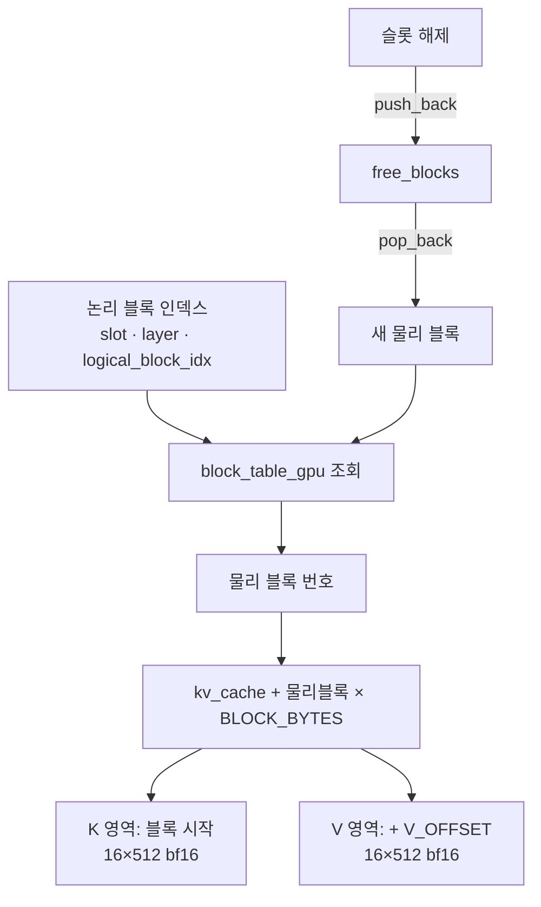

# 6. 블록 단위로 인덱싱되는 paged KV cache

이 글의 모든 경로와 줄 번호는 고정 revision
`e25bf1994efa90bc98b721ba7c527402f86fbeaf` 의 트리를 가리킨다(`guide.md:6`). 표기는
`파일:시작-끝` 형식이며, 실행 결과가 아니라 소스 인용이다.

## 이 장의 질문

KV cache 를 블록으로 나누고 block table 로 참조하면 어텐션 커널은 무엇을 어떻게
읽는가(`series.yaml:114-115`). prefill 과 decode 의 구분, attention 수식, KV cache
의 존재 이유, continuous batching 의 목적은 이 시리즈의 전제이며 여기서 다시
설명하지 않는다(`guide.md:14-16`).

이 장은 block table 과 paged attention, 즉 KV 저장 구조의 유일한 소유 편이다
(`guide.md:199`). 5편에서 decode 가 슬롯마다 K/V 를 블록에 흩어 넣는 것을 봤다면,
여기서는 그렇게 쪼개 담긴 KV 를 어텐션 커널이 어떻게 다시 읽는지를 다룬다. 이
장은 5편 `decode-path` 에 의존한다(`series.yaml:119-120`). 슬롯·큐와 종료 조건,
블록 반납 절차는 7편이 맡는다(`guide.md:200`).

코드 범위는 `src/kernels.cu`, `src/main.cpp` 다(`series.yaml:116-118`).
`required_evidence` 는 code 5 / tests 0 / runtime 0 이며(`series.yaml:121-124`),
runtime 은 0 이므로 아래 모든 주장은 실행 없이 소스 인용으로만 뒷받침된다
(결정 003, `guide.md:75-87`).

## KV cache 는 고정 크기 블록의 배열이다

paged KV cache 의 할당자는 세 조각이다. 2GB `kv_cache` 를 `cudaMalloc` 하고
(`src/main.cpp:575-576`), 사용 가능한 물리 블록 번호를 `free_blocks` 에
0..65535 로 채우며(`src/main.cpp:577-578`), `block_table` 을 전부 `-1` 로
초기화한 뒤 그 테이블의 GPU 사본 `block_table_gpu` 를 할당한다
(`src/main.cpp:579-581`). 이 초기 상태는 `trace.md:52-56` 과 Claim 14
(`claims.md:269-280`)에 정리돼 있다.

블록 하나의 레이아웃은 컴파일 타임 상수로 고정된다(Claim 15,
`claims.md:284-295`). `src/main.cpp:33-37` 과 `src/kernels.cu:17-19` 가 같은
상수를 정의한다.

<!-- visual: kv-block-layout supports: [kv-block-layout] -->
```text
kv_cache 블록 하나 (BLOCK_BYTES = 32,768 bytes)
┌────────────────────────────────┐  offset 0
│ K: 16 토큰 × 512 bf16 요소      │  16 × 512 × 2 = 16,384 bytes
├────────────────────────────────┤  offset V_OFFSET = 16,384
│ V: 16 토큰 × 512 bf16 요소      │  16,384 bytes
└────────────────────────────────┘  offset 32,768
```

| 상수 | 값 | 의미 |
| --- | --- | --- |
| `BLOCK_SIZE` | 16 | 블록 하나가 담는 토큰 수 |
| `KV_DIM` | 512 | K(또는 V) 한 토큰의 원소 수 |
| `V_OFFSET` | 16×512×2 = 16,384 바이트 | 블록 시작에서 V 영역이 시작하는 위치 |
| `BLOCK_BYTES` | `V_OFFSET`×2 = 32,768 바이트 | 블록 하나의 크기 |
| `NUM_BLOCKS` | 2GB / 32,768 = 65,536 | 캐시가 나뉘는 블록 수 |

블록 하나는 시작에 K 영역 `16×512` bf16 요소를 두고, `V_OFFSET` 바이트 뒤부터 V
영역 `16×512` bf16 요소를 둔다(`src/kernels.cu:484-485`). K·V 를 기록하는 두
지점(`src/main.cpp:280-287`, `src/main.cpp:866-872`)과 커널이 읽는 지점
(`src/kernels.cu:484-485`)이 이 하나의 레이아웃을 전제한다(Claim 15).

## block table 이 논리 블록을 물리 블록으로 바꾼다

`pagedAttentionKernel` 은 `block_table_gpu` 를 거쳐 논리 블록을 물리 블록으로
바꾸고, `kv_cache` 의 비연속 블록을 순회하며 읽는다(Claim 14,
`claims.md:269-280`). 커널의 블록 순회·주소 계산은 `src/kernels.cu:478-485` 에
있고, 테이블 참조는 `src/kernels.cu:480` 이다.

논리 인덱스는 슬롯·레이어·블록의 3차원을 한 줄로 펼친다
(`claims.md:278-279`).

```text
block_idx = slot * N_LAYERS * MAX_BLOCKS_PER_SEQ
          + layer * MAX_BLOCKS_PER_SEQ
          + logical_block_idx
```

같은 산술이 prefill 할당(`src/main.cpp:264-277`), decode 할당
(`src/main.cpp:859-865`), 슬롯 해제 시 반납(`src/main.cpp:1015-1031`)에서
반복된다. 블록의 생사는 `free_blocks` 목록이 관리한다. 할당은 `pop_back`
(`src/main.cpp:268-269`, `src/main.cpp:861-862`), 반납은 `push_back`
(`src/main.cpp:1025`)이다(Claim 14). prefill 은 할당 시점에 `block_table` 값이
반드시 `-1` 이라고 단정하는 반면, decode 는 새 토큰이 블록 경계에 걸릴 때만 새
블록을 꺼낸다(`src/main.cpp:264-277`, `src/main.cpp:859-865`). 블록 반납이 슬롯
해제와 함께 일어나는 절차는 7편이 소유한다(`guide.md:200`).

<!-- visual: block-table-indexing supports: [block-table-indexing] -->


이 다이어그램은 "비연속 블록을 어떻게 읽는가" 라는 질문에 답한다. 논리 블록
번호와 물리 블록 번호를 분리해 두었기 때문에 시퀀스의 KV 는 `kv_cache` 안에서
연속일 필요가 없다. 커널은 `block_table_gpu` 를 한 번 더 거쳐 실제 주소를
계산한다. 블록 할당·반납의 주체와 시점은 `free_blocks` 라는 하나의 스택으로
모인다.

## pagedAttentionKernel 이 받는 네 가지 상태

이 커널이 decode 계열에서 특별한 이유는 받는 상태의 수다. `kv_cache`,
`block_table_gpu`, `gpu_seq_lens`, `gpu_active_slots` 를 함께 받는다(Claim 16,
`claims.md:297-314`). 시그니처는 `src/kernels.cu:461` 이고, 활성 슬롯과 길이를
소비하는 지점은 `src/kernels.cu:464-471`, block table 을 참조하는 지점은
`src/kernels.cu:480` 이다. 호출부는 `src/main.cpp:878` 이고, 인자를 준비하는
지점은 `src/main.cpp:749-757` 이다.

<!-- visual: paged-attention-inputs supports: [paged-attention-inputs] -->
| 인자 | 준비·전달 지점 | 커널 안에서의 역할 |
| --- | --- | --- |
| `kv_cache` | `src/main.cpp:575-576` | 블록 단위 KV 저장소 |
| `block_table_gpu` | `src/main.cpp:749-757`, `src/main.cpp:876` | 논리 블록 → 물리 블록 매핑 |
| `gpu_seq_lens` | `src/main.cpp:749-757` | 슬롯별 현재 시퀀스 길이 |
| `gpu_active_slots` | `src/main.cpp:749-750` | 이번 스텝에 계산할 슬롯 목록 |

`guide.md:107-110` 은 decode 계열 커널 중 `pagedAttentionKernel` 만이 이 네
상태를 함께 받는다고 적는다. 그리드에서 `blockIdx.x` 가 활성 슬롯을,
`blockIdx.y` 가 Q 헤드를, `threadIdx.x` 가 헤드 차원 64 를 맡는다
(`src/kernels.cu:464-471`, `src/kernels.cu:525-527`). `gpu_active_slots` 로 어떤
슬롯을 계산할지 정하고, `gpu_seq_lens` 로 각 슬롯의 현재 길이를 알며,
`block_table_gpu` 로 그 슬롯의 KV 블록 위치를 찾는다. 슬롯 테이블과 KV 저장
구조를 한 커널 안에서 연결하는 지점이다. 슬롯이 이 배열에 실리는 방식은 7편이
소유한다(`guide.md:200`).

## 블록을 읽으며 온라인 소프트맥스를 누적한다

`pagedAttentionKernel` 의 어텐션은 헤드 차원 64 를 한 블록의 스레드 64 개, 즉
워프 2 개로 나눠 계산한다(Claim 17, `claims.md:316-332`). 각 워프는 32 개
스레드의 부분 내적을 `__shfl_down_sync` 5단계 리덕션으로 모은다
(`src/kernels.cu:486-507`). 그다음 **스레드 0 과 스레드 32 가 두 워프의 합을
더한다.** 두 워프의 부분합은 shared memory `dot_products[2]`
(`src/kernels.cu:463`)에 놓이고, 결합된 내적은 `sqrt(HEAD_DIM)` 으로 나뉜다
(`src/kernels.cu:486-507`).

점수는 행별로 전부 모은 뒤 한 번에 소프트맥스하지 않는다. FlashAttention 방식의
온라인 소프트맥스로, 블록을 순회하며 지금까지의 최댓값과 가중 합을 갱신한다
(`src/kernels.cu:510-519`, Claim 17). 이렇게 하면 시퀀스 전체의 점수 행렬을
따로 저장하지 않고 블록 단위로 읽으며 가중 평균을 누적할 수 있다. 최종 출력은
`src/kernels.cu:522` 에 기록된다. prefill 처럼 전용 `softmax` 커널을 두지 않고
paged attention 커널이 소프트맥스까지 처리하는 구조다.

여기서 `dot_products[2]` 와 스레드 0·32 의 협력은 `HEAD_DIM=64` 를 전제한다.
`HEAD_DIM` 이 64 가 아니면 성립하지 않는다(`trace.md:225-227`).

## 출력이 곧 O 투영의 입력이 된다

`pagedAttentionKernel` 의 출력은 입력 q 프로젝션과 같은 버퍼에 쓰인다(Claim 18,
`claims.md:334-350`). 읽기 인덱스(`src/kernels.cu:469`)와 쓰기 인덱스
(`src/kernels.cu:522`)가 같아 in-place 가 안전하다. 그래서 호출
(`src/main.cpp:878`)의 결과가 곧바로 O 투영의 입력(`src/main.cpp:892`)이 된다.

이 별칭은 2편이 소유하는 버퍼 설계의 일부다. q 프로젝션과 어텐션 출력이
`buf_2048_1` 을 공유한다는 Claim 5(`buffer-aliasing`, `claims.md:89-104`)에
따라, 커널은 자기 입력 자리에 결과를 덮어쓸 수 있다. 다만 in-place 안전성은
"읽기 인덱스와 쓰기 인덱스가 같다" 는 정적 관찰이며, 동시성·경합의 실행 검증은
없다(`claims.md:349-350`).

## 이 장이 다루지 않는 것

- 슬롯·큐로 활성 시퀀스를 모으는 흐름과 EOS/EOT·길이 한도 종료, 블록 반납: 7편
  (`guide.md:200`).
- prefill 과 decode 커널 변형의 대비, 배치 K/V 투영: 5편(`guide.md:198`).
- cuBLAS 의 전치 플래그와 열-행 우선 레이아웃: 4편(`guide.md:197`).
- 버퍼 크기 산정과 별칭 설계의 근거: 2편(Claim 5, `claims.md:89-104`).

## 이 장의 한계

- 이 시리즈는 NVIDIA GPU 와 CUDA 툴체인이 없는 환경에서 작성되어 커널을 실행하지
  않는다. 이 장의 모든 주장은 소스 인용이며 실행 검증이 없다(`guide.md:75-87`;
  Claim 14·15·16·17·18 한계).
- 논리 인덱스 산술(`slot*N_LAYERS*MAX_BLOCKS_PER_SEQ +
  layer*MAX_BLOCKS_PER_SEQ + block_idx`)의 실행 정합성은 GPU 없이 검증되지
  않았다(`claims.md:278-280`).
- 블록 크기·오프셋은 컴파일 타임 상수이며 실행 시 레이아웃 검증은 없다
  (`claims.md:295`).
- `dot_products[2]` 와 스레드 0·32 의 협력은 `HEAD_DIM=64` 전제이며 그 외
  크기에서는 성립하지 않는다(`trace.md:225-227`). 실행 검증은 없다.
- decode 는 매 레이어마다 `block_table` 전체를 `block_table_gpu` 로 H2D
  동기화한다(`src/main.cpp:876`, TODO `src/main.cpp:551`). 이 비용은 측정되지
  않았다(`trace.md:234-235`).
- 이 장의 `required_evidence.tests` 는 0 이다(`series.yaml:123`). 실행 테스트
  없이 정적 인용으로만 구성한다(`briefs.md:186-187`).
- `src/kernels.cuh` 와 `src/cuda_to_hip.h` 본문은 첨부에 없어 시그니처 수준의
  대조만 가능했다(`trace.md:219-221`).

## 출처

- `src/main.cpp:33-37` — `BLOCK_SIZE`·`KV_DIM`·`V_OFFSET`·`BLOCK_BYTES` 상수.
- `src/kernels.cu:17-19` — 커널 쪽 동일 상수.
- `src/main.cpp:575-581` — `kv_cache` 2GB 할당, `free_blocks` 채움, `block_table`
  초기화와 `block_table_gpu` 할당.
- `src/kernels.cu:461-523` — `pagedAttentionKernel`(시그니처 `461`, 활성 슬롯·길이
  `464-471`, q 읽기 `469`, 블록 순회·주소 `478-485`, `block_table_gpu` `480`,
  `dot_products[2]` `463`, 리덕션·결합 `486-507`, 온라인 소프트맥스 `510-519`,
  출력 `522`); 런치 `525-527`.
- `src/main.cpp:264-277`, `src/main.cpp:859-865`, `src/main.cpp:1015-1031` —
  블록 할당(prefill·decode)과 반납; `pop_back` `268-269`·`861-862`, `push_back`
  `1025`.
- `src/main.cpp:280-287`, `src/main.cpp:866-872` — K·V 를 블록에 기록하는 지점.
- `src/main.cpp:749-757`, `src/main.cpp:876`, `src/main.cpp:878`,
  `src/main.cpp:892` — 커널 인자 준비·전달, `block_table` H2D 동기화, O 투영 입력.
- `claims.md:269-280`, `284-295`, `297-314`, `316-332`, `334-350` — Claim 14·15·
  16·17·18.
- `trace.md:52-56`, `142`, `219-221`, `225-227`, `234-235` — 할당자 초기 상태,
  decode 레이어의 paged attention 호출, 미첨부 헤더, `HEAD_DIM=64` 전제, H2D 비용.
- `guide.md:6`, `14-16`, `75-87`, `107-110`, `197-200` — 고정 revision, 전제,
  실행 제약, decode 커널 비대칭, 편별 경계.
- `series.yaml:114-124` — 이 장의 질문·범위·의존성·근거 최소값.
- `briefs.md:186-187` — tests 0 정적 인용 구성.
