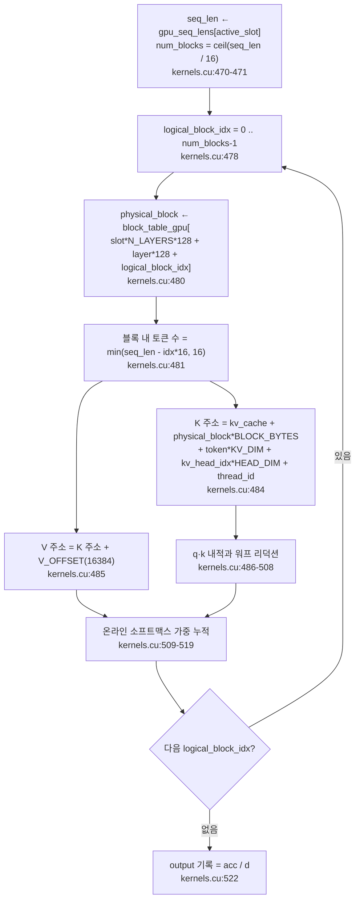

# 6. 블록 단위로 인덱싱되는 paged KV cache

이 글의 모든 경로와 줄 번호는 고정 revision
`e25bf1994efa90bc98b721ba7c527402f86fbeaf` 의 트리를 가리킨다. 표기는
`파일:시작-끝` 형식이며, 실행 결과가 아니라 소스 인용이다.

## 이 장의 질문

KV cache 를 블록으로 나누고 block table 로 참조하면 어텐션 커널은 무엇을 어떻게
읽는가. 코드 범위는 `src/kernels.cu` 와 `src/main.cpp` 두 파일이다. 이 장의 최소
근거는 코드 인용 5건, 테스트 0건, 실행 0건이다.

이 장은 block table 과 paged attention 설명을 소유하는 유일한 장이다. decode 가
왜 prefill 과 다른 커널 변형을 쓰는지는 5편이, 슬롯·큐의 수명주기와 슬롯 종료 시
블록 반납 연쇄는 7편이 맡는다. prefill 의 전체 커널 순서는 3편, cuBLAS 의 전치
플래그와 열 우선 레이아웃은 4편이 소유한다. 여기서는 KV 가 어떤 단위로 저장되고,
그 단위를 무엇으로 참조하며, 어텐션 커널이 그 참조를 어떻게 주소로 바꾸는지에
집중한다.

이 시리즈는 NVIDIA GPU 와 CUDA 툴체인이 없는 환경에서 작성되어 어떤 커널도
실행하지 않았다. 아래의 모든 레이아웃·인덱스·리덕션 주장은 소스 인용이며, 커널
실행 시간·처리량·메모리 사용량은 측정하지 않는다.

## KV cache 할당자 세 조각

`main` 은 cuBLAS 핸들과 가중치를 준비한 뒤 paged attention 용 할당자를 만든다
(`src/main.cpp:574-581`).

- `kv_cache` 는 `KV_CACHE_SIZE_BYTES = 2GB` 를 한 번에 `cudaMalloc` 한다
  (`src/main.cpp:35`, `src/main.cpp:576`).
- `free_blocks` 는 0 부터 `NUM_BLOCKS - 1` 까지 채운 가용 블록 목록이다
  (`src/main.cpp:577-578`).
- `block_table` 은 `MAX_SEQUENCES × N_LAYERS × MAX_BLOCKS_PER_SEQ` 항목을 전부
  `-1` 로 초기화하고(`src/main.cpp:579`), 같은 크기의 디바이스 사본
  `block_table_gpu` 를 `cudaMalloc` 한다(`src/main.cpp:580-581`).

차원을 채우면 `MAX_SEQUENCES = BATCH_SIZE = 2`(`src/main.cpp:29`, `src/main.cpp:38`),
`N_LAYERS = 16`(`src/main.cpp:15`),
`MAX_BLOCKS_PER_SEQ = MAX_SEQ_LEN / BLOCK_SIZE = 2048 / 16 = 128`
(`src/main.cpp:28`, `src/main.cpp:36`) 이므로 block_table 은 2 × 16 × 128 = 4096
항목이다. `-1` 은 "이 (슬롯, 레이어, 논리 블록) 자리에 물리 블록이 아직 없다"는
표시다. 이 세 조각이 이 장의 무대다.

`kv_cache` 의 크기 `KV_CACHE_SIZE_BYTES` 는 `2ULL * 1024 * 1024 * 1024` 로 선언돼
있다(`src/main.cpp:35`). 이 값과 아래 블록 크기가 `NUM_BLOCKS` 를 결정한다.

## 블록 하나의 레이아웃

`BLOCK_SIZE` 는 16 이고, 주석은 이것이 "pagedattn 안의 한 페이지" 크기를 정의한다고
밝힌다(`src/main.cpp:32`). 블록 하나는 K 와 V 를 각각 `16 × KV_DIM(512)` bf16
요소만큼 담는다. `V_OFFSET` 은
`BLOCK_SIZE * KV_DIM * sizeof(__nv_bfloat16) = 16 × 512 × 2 = 16384` 바이트이고
(`src/main.cpp:33`), K 는 블록 시작에, V 는 블록 시작에서 `V_OFFSET` 만큼 뒤에
놓인다. 블록 전체 크기는 `BLOCK_BYTES = V_OFFSET × 2 = 32768` 바이트다
(`src/main.cpp:34`). 2GB 캐시를 이 크기로 나눈 `NUM_BLOCKS` 는 65536 이다
(`src/main.cpp:37`). `BLOCK_SIZE` 16 과 `BLOCK_BYTES` 32768 을 쓰면 2GB 는
`2 × 1024³ / 32768 = 65536` 개 블록이 된다.

같은 상수가 `src/kernels.cu` 에도 독립적으로 정의된다(`src/kernels.cu:16-19`).
`BLOCK_SIZE`(`src/kernels.cu:16`), `V_OFFSET`(`src/kernels.cu:17`),
`BLOCK_BYTES`(`src/kernels.cu:18`), `MAX_BLOCKS_PER_SEQ`(`src/kernels.cu:19`)가
그것이다. 파일 위 TODO 주석은 이 값들이 `main.cpp` 와 중복 정의되었음을 지적한다
(`src/kernels.cu:6`).

블록 안의 주소 산술은 K 와 V 가 같은 블록에서 `V_OFFSET` 만큼 떨어진 두 영역을
이룬다는 사실에 기대며, 그 계산은 커널과 호스트가 동일한 상수를 공유해야 성립한다.

## K/V 가 블록으로 흩어지는 두 지점

KV 가 블록에 기록되는 곳은 두 곳이다. prefill 의 분산과 decode 의 분산이다.

prefill 은 프롬프트를 `BLOCK_SIZE` 토큰씩 잘라 순회한다(`src/main.cpp:251-288`).
토큰 구간마다 논리 블록 인덱스 `block_idx = token_idx / BLOCK_SIZE` 를 계산하고
(`src/main.cpp:264`), block_table 에서 물리 블록을 읽는다(`src/main.cpp:265`). 값이
`-1` 이면 `free_blocks` 의 뒤에서 하나를 꺼내 그 자리에 적고(`src/main.cpp:266-272`),
이미 값이 있으면 prefill 에서는 있을 수 없는 상태로 보고 `assert(false)` 한다
(`src/main.cpp:273-277`). 기록할 토큰 수는 남은 길이와 `BLOCK_SIZE` 중 작은 값으로
자른다(`src/main.cpp:253-257`). K 는 `kv_cache + block * BLOCK_BYTES` 에
(`src/main.cpp:280-282`), V 는 거기서 `V_OFFSET` 만큼 뒤에
(`src/main.cpp:285-287`) D2D `cudaMemcpy` 로 들어간다.

decode 는 슬롯마다 새 토큰 하나를 기존 시퀀스 끝에 이어 붙인다
(`src/main.cpp:851-873`). 이때 위치는 `logical_block_idx = seq_len / BLOCK_SIZE`,
`token_in_block_idx = seq_len % BLOCK_SIZE` 로 나뉜다(`src/main.cpp:855-857`).
새 물리 블록을 할당하는 경우는 `token_in_block_idx == 0`, 즉 새 블록의 첫 토큰일
때뿐이다(`src/main.cpp:859-865`). 그 외에는 이미 할당된 블록의
`token_in_block_idx` 위치에 K 와 V 를 D2D 로 덮어쓴다(`src/main.cpp:866-872`). KV
투영을 슬롯별 배치 버퍼에 모으는 과정 자체는 5편이 소유한다.

두 지점 모두 같은 3항 인덱스 `slot * N_LAYERS * MAX_BLOCKS_PER_SEQ +
layer * MAX_BLOCKS_PER_SEQ + block_idx` 로 block_table 을 찾는다
(`src/main.cpp:265`, `src/main.cpp:858`). 첫 항이 슬롯, 둘째 항이 레이어, 셋째 항이
그 레이어 안의 논리 블록이다. 블록은 슬롯과 레이어마다 독립적으로 할당되므로, 같은
물리 블록 번호라도 어느 슬롯·레이어의 것인지는 이 인덱스가 구분한다.

## 커널이 block table 을 주소로 바꾼다

`pagedAttentionKernel` 은 이 구조를 읽는 유일한 커널이다
([`src/kernels.cu:461-523`](https://github.com/jmaczan/tiny-vllm/blob/e25bf1994efa90bc98b721ba7c527402f86fbeaf/src/kernels.cu#L461-L523)).
시그니처는 다음과 같다.

```cpp
__global__ void pagedAttentionKernel(int layer, int num_active_slots, __nv_bfloat16 *q_proj,
                                     __nv_bfloat16 *kv_cache, int *block_table_gpu, int *gpu_seq_lens,
                                     int *gpu_active_slots, __nv_bfloat16 *output)
```

인용: [`src/kernels.cu:461`](https://github.com/jmaczan/tiny-vllm/blob/e25bf1994efa90bc98b721ba7c527402f86fbeaf/src/kernels.cu#L461)

커널은 세 인덱스로 병렬화된다. `blockIdx.x` 가 활성 슬롯, `blockIdx.y` 가 Q 헤드,
`threadIdx.x` 가 헤드의 64차원이다(`src/kernels.cu:464-467`). 런치는
`<<<dim3(num_active_slots, NUM_Q_HEADS), HEAD_DIM>>>` 이다(`src/kernels.cu:527`).
`HEAD_DIM = 64`(`src/kernels.cu:11`)이므로 한 블록은 64 스레드, 곧 2 워프다.

블록 순회는 이렇게 생겼다(`src/kernels.cu:470-485`).

```cpp
int seq_len = gpu_seq_lens[active_slot];
int num_blocks = (seq_len + BLOCK_SIZE - 1) / BLOCK_SIZE;
...
for (int logical_block_idx = 0; logical_block_idx < num_blocks; ++logical_block_idx)
{
    int physical_block = block_table_gpu[slot * N_LAYERS * MAX_BLOCKS_PER_SEQ + layer * MAX_BLOCKS_PER_SEQ + logical_block_idx];
    int tokens_in_block = min(seq_len - logical_block_idx * BLOCK_SIZE, BLOCK_SIZE);
    for (int token = 0; token < tokens_in_block; ++token)
    {
        __nv_bfloat16 *k = (__nv_bfloat16 *)((char *)kv_cache + physical_block * BLOCK_BYTES + token * KV_DIM * sizeof(__nv_bfloat16) + kv_head_idx * HEAD_DIM * sizeof(__nv_bfloat16) + thread_id * sizeof(__nv_bfloat16));
        __nv_bfloat16 *v = (__nv_bfloat16 *)((char *)kv_cache + physical_block * BLOCK_BYTES + V_OFFSET + token * KV_DIM * sizeof(__nv_bfloat16) + kv_head_idx * HEAD_DIM * sizeof(__nv_bfloat16) + thread_id * sizeof(__nv_bfloat16));
```

인용: [`src/kernels.cu:470-485`](https://github.com/jmaczan/tiny-vllm/blob/e25bf1994efa90bc98b721ba7c527402f86fbeaf/src/kernels.cu#L470-L485)

읽는 순서를 정리하면 다음과 같다.

1. `seq_len` 으로 몇 개의 논리 블록을 봐야 하는지 정한다(`src/kernels.cu:470-471`).
2. 논리 블록마다 `block_table_gpu` 에서 물리 블록 번호를 얻는다
   (`src/kernels.cu:480`). 이 한 줄이 paged attention 의 핵심이다. 논리적으로
   연속인 KV 가 물리적으로는 비연속일 수 있고, 커널은 그 간극을 모른 채 물리 번호만
   따라간다.
3. 블록 안에서 실제로 유효한 토큰 수를 `min` 으로 자른다(`src/kernels.cu:481`).
   마지막 블록은 16 개를 다 채우지 못할 수 있다.
4. 토큰마다 K 주소를 `physical_block * BLOCK_BYTES` 에서 시작해
   `token * KV_DIM` 으로 전진시키고, 그 안에서 `kv_head_idx * HEAD_DIM` 으로 헤드
   슬라이스를, `thread_id` 로 차원 원소를 집는다(`src/kernels.cu:484`). V 주소는
   같은 식에 `V_OFFSET` 만 더한 것이다(`src/kernels.cu:485`).

`kv_head_idx` 는 Q 헤드에서 GQA 비율로 유도된다
(`kv_head_idx = q_head_id / GQA_Q_TO_K_RATIO`, `src/kernels.cu:468`). 즉 K/V 캐시는
K 헤드 8 개 기준으로 저장돼 있고, Q 헤드 32 개가 4 개씩 한 K 헤드를 공유한다
(`KV_DIM = 512`, `HEAD_DIM = 64`, `NUM_Q_HEADS = 32`, `NUM_K_HEADS = 8`,
`GQA_Q_TO_K_RATIO = 4`, `src/main.cpp:18-23`). GQA 자체는 3편이 다룬다.

<!-- visual: block-table-indexing supports: [block-table-indexing, kv-block-layout] -->


이 다이어그램은 `block-table-indexing` 이 답해야 할 "비연속 블록을 어떻게 읽는가"와,
그 주소 계산이 전제하는 블록 레이아웃(`kv-block-layout`)을 함께 담는다. 논리 블록
인덱스가 물리 블록으로 바뀌고, 그 물리 번호가 `BLOCK_BYTES` 와 `V_OFFSET` 을 통해
바이트 주소가 되는 흐름이 전부다.

## 커널이 함께 받는 네 가지 상태

`pagedAttentionKernel` 은 decode 계열 커널 중 유일하게 `kv_cache`,
`block_table_gpu`, `gpu_seq_lens`, `gpu_active_slots` 를 한꺼번에 받는다. 다른
decode 커널들은 이 조합을 받지 않는다. `embeddingGatherKernelDecode` 는
`gpu_last_tokens`·`embed_tokens`·출력만(`src/kernels.cu:347`), `ropeKernelDecode` 는
입력·위치·차원만(`src/kernels.cu:371`), `softmaxKernelDecode` 는 입력과
`seq_len` 만 받는다(`src/kernels.cu:408`). paged attention 만이 KV 저장소와 그
인덱싱 상태, 그리고 이번 스텝에 계산할 슬롯·길이를 모두 필요로 한다.

<!-- visual: paged-attention-inputs supports: [paged-attention-inputs] -->
| 인자 | 의미 | 근거 |
| --- | --- | --- |
| `kv_cache` | 2GB paged KV 저장소. 물리 블록 주소의 기준 | `src/kernels.cu:461`, `src/main.cpp:576` |
| `block_table_gpu` | 논리 블록 → 물리 블록 매핑. `slot`·`layer`·논리 블록의 3항 인덱스 | `src/kernels.cu:480`, `src/main.cpp:878` |
| `gpu_seq_lens` | 활성 슬롯별 현재 시퀀스 길이. 읽을 토큰 수를 정한다 | `src/kernels.cu:470`, `src/main.cpp:751-757` |
| `gpu_active_slots` | 이번 스텝에 계산할 실제 슬롯 목록. `active_slot → slot` 변환 | `src/kernels.cu:465`, `src/main.cpp:750` |
| `q_proj` | 입력 Q. 활성 슬롯 기준으로 압축된 `buf_2048_1` | `src/kernels.cu:469`, `src/main.cpp:763` |
| `output` | 출력. `q_proj` 와 같은 버퍼에 쓴다 | `src/kernels.cu:522`, `src/main.cpp:878` |
| `layer` | block table 인덱스의 레이어 항 | `src/kernels.cu:480`, `src/main.cpp:878` |
| `num_active_slots` | 시그니처에 있으나 커널 본문에서 참조되지 않는다 | `src/kernels.cu:461`, `src/kernels.cu:527` |

두 인덱스 공간이 다르다는 점이 중요하다. `gpu_active_slots[active_slot]` 로 실제
슬롯을 얻고(`src/kernels.cu:465`), `gpu_seq_lens` 도 `active_slot` 으로 읽지만
(`src/kernels.cu:470`), block_table 과 Q/출력은 서로 다른 기준을 쓴다. block_table
은 실제 슬롯 `slot` 으로(`src/kernels.cu:480`), Q 입력과 출력은 압축된
`active_slot` 으로(`src/kernels.cu:469`, `src/kernels.cu:522`) 인덱싱한다. 활성
슬롯 목록이 이 두 공간을 잇는 다리다.

## 워프 리덕션과 온라인 소프트맥스

한 (활성 슬롯, Q 헤드) 쌍에 대해 64 스레드가 각자 헤드 차원 원소 하나를 맡는다.
스레드 하나의 곱셈은 `qk = (float)q * (float)*k` 뿐이고(`src/kernels.cu:486`), 64
개 곱의 합은 두 단계로 모인다. 먼저 워프 안에서 `__shfl_down_sync` 를 오프셋
16, 8, 4, 2, 1 로 다섯 번 적용해 32 개 레인의 합을 레인 0 에 모은다
(`src/kernels.cu:489-493`). 첫 워프의 레인 0(스레드 0)이 `dot_products[0]` 에,
둘째 워프의 레인 0(스레드 32)이 `dot_products[1]` 에 자기 워프 합을 적고
(`src/kernels.cu:494-501`), `__syncthreads` 뒤 스레드 0 이 둘을 더해
`SQRT_HEAD_DIM` 으로 나눈다(`src/kernels.cu:503-506`). `SQRT_HEAD_DIM = 8`
(`src/kernels.cu:12`)이므로 이는 `1/sqrt(64)` 스케일과 같다. 이 두 워프 협력은
`HEAD_DIM = 64` 를 전제한다.

그다음은 온라인 소프트맥스다. 커널은 블록을 순회하며 `current_max`, 분모 `d`,
가중 누적 `acc` 를 갱신한다(`src/kernels.cu:510-519`). 새 점수가 현재 최대보다
크면 최대를 올리고, 이전 누적값들에 보정 계수
`correction_factor = expf(current_max - new_max)` 를 곱해 다시 맞춘 뒤 새 항을
더한다(`src/kernels.cu:515-519`). 이렇게 하면 어텐션 행 전체를 한 번에 보지 않고
블록 단위로 나눠 읽으면서도 정확한 소프트맥스 가중 평균을 얻는다. 커널 안 주석은
이 방식을 온라인 소프트맥스라 부르고 참고 자료 URL 을 함께 적어 둔다
(`src/kernels.cu:473`). 최종 출력은 `acc / d` 다(`src/kernels.cu:522`).

이 리덕션은 prefill 의 블록 내 트리 리덕션과 형태가 다르다. prefill 의 RMSNorm
리덕션은 shared memory 트리 리덕션이고(3편 소유), 여기서는 워프 셔플과 2-워프
결합을 쓴다.

## 출력은 입력과 같은 버퍼에 쓴다

`pagedAttentionKernel` 은 읽은 위치와 같은 위치에 결과를 쓴다. 입력 Q 를 읽는
인덱스는 `active_slot * EMBEDDING_LENGTH + q_head_id * HEAD_DIM + thread_id`
(`src/kernels.cu:469`), 출력을 쓰는 인덱스도 정확히 같다(`src/kernels.cu:522`).
각 스레드는 자기 원소를 한 번 읽어 루프를 돈 뒤 같은 자리에 쓰므로, 한 스레드
안에서는 순서가 분명하다. 블록 차원이 Q 헤드(`blockIdx.y`)라서 서로 다른 헤드의
영역도 겹치지 않는다.

호출부에서도 이 별칭이 그대로 드러난다. 호출 직전 `q_proj` 는 `buf_2048_1`
(`src/main.cpp:763`)이고, `pagedAttention` 호출은 입력과 출력에 같은 `buf_2048_1`
을 넘긴다(`src/main.cpp:878`). 그 결과가 곧바로 O 투영의 입력이 된다
(`src/main.cpp:892`). `buf_2048_1` 의 크기와 공유 관계는 2편이 소유한다.

## 할당과 반납

물리 블록의 수명은 `free_blocks` 목록으로 관리된다. 할당은 뒤에서 꺼내는
`pop_back`(`src/main.cpp:268-269`, `src/main.cpp:861-862`), 반납은 뒤로 넣는
`push_back`(`src/main.cpp:1025`)이다. 초기 목록은 0 부터 65535 까지다
(`src/main.cpp:577-578`).

prefill 은 논리 블록 자리가 `-1` 일 때만 새로 할당하고(`src/main.cpp:266-272`),
decode 는 `token_in_block_idx == 0` 일 때만 할당한다(`src/main.cpp:859-865`). 슬롯이
종료되면 그 슬롯이 소유한 모든 블록을 `free_blocks` 로 돌려주고 block_table 을
`-1` 로 되돌린다(`src/main.cpp:1018-1029`). 이 반납이 일어나는 종료 절차와 슬롯
수명주기는 7편이 소유한다. 여기서는 반납 루프가 block_table 을 3차원으로 훑어
`-1` 이 아닌 항목만 돌려준다는 사실까지만 짚는다(`src/main.cpp:1020-1027`).

block_table 의 변경은 매번 디바이스 사본으로 전체 복사된다. prefill 이 끝난 뒤
한 번(`src/main.cpp:552`), decode 레이어 루프 안에서 매 레이어마다 한 번
(`src/main.cpp:876`), 슬롯 반납 뒤 한 번(`src/main.cpp:1030`)이다. 세 곳 모두
4096 항목 전체를 H2D 로 동기화한다. 소스에는 이를 더 영리하게 하자는 TODO 가 달려
있다(`src/main.cpp:551`).

## 이 장이 다루지 않는 것

- 슬롯과 큐의 수명주기, 슬롯 종료 시 블록 반납으로 이어지는 연쇄: 7편. 이 장은
  block table 을 읽는 커널 쪽에 집중한다.
- decode 계열 커널이 prefill 과 어떻게 다른가, 슬롯별 배치 K/V 투영: 5편.
- prefill 의 전체 커널 호출 순서와 GQA: 3편.
- cuBLAS 의 전치 플래그, leading dimension, 열 우선 레이아웃: 4편.
- KV cache 를 포함한 버퍼 크기 산정과 별칭 설계 전반: 2편.

## 이 장의 한계

- 이 시리즈는 NVIDIA GPU 와 CUDA 툴체인이 없는 환경에서 작성되어 커널을 하나도
  실행하지 않았다. 레이아웃·인덱스·리덕션에 대한 모든 주장은 소스 인용이며 실행
  검증이 없다.
- 논리 인덱스 산술(`slot * N_LAYERS * MAX_BLOCKS_PER_SEQ +
  layer * MAX_BLOCKS_PER_SEQ + block_idx`)의 실행 정합성은 GPU 없이 검증되지
  않았다. block_table 크기 4096 과 `NUM_BLOCKS` 65536 은 상수 산술이며, 실행 시
  실제 할당·기록은 확인하지 않았다.
- 두 워프 결합(`dot_products[2]`, 스레드 0 과 스레드 32)은 `HEAD_DIM = 64` 전제다.
  `HEAD_DIM` 이 64 가 아니면 성립하지 않는다(`src/kernels.cu:463`, `494-506`).
- in-place 출력의 안전성은 읽기·쓰기 인덱스가 같다는 정적 주장이다
  (`src/kernels.cu:469`, `src/kernels.cu:522`). 동시성·경합의 실행 검증은 없다.
- decode 스텝은 매 레이어마다 block_table 4096 항목 전체를 H2D 로 복사한다
  (`src/main.cpp:876`). 이 비용은 측정하지 않았고, 소스의 TODO
  (`src/main.cpp:551`)도 해결되지 않은 상태다.
- `pagedAttentionKernel` 의 `num_active_slots` 인자는 시그니처에 있으나 커널
  본문에서 참조되지 않는다. 그리드 크기가 상한 역할을 한다(`src/kernels.cu:527`).
- 커널 안 온라인 소프트맥스 주석이 가리키는 참고 자료 URL
  (`src/kernels.cu:473`)은 소스에 적힌 것이며, 이 시리즈가 그 자료를 검증한 것은
  아니다.
- 가중치 파일은 gated 모델 `meta-llama/Llama-3.2-1B-Instruct` 의
  `model.safetensors` 라서, paged attention 을 실제로 돌려보는 검증은 후속
  과제로 남는다.

## 출처

- `src/main.cpp:15-38` — `N_LAYERS`, `EMBEDDING_LENGTH`, `KV_DIM`, `HEAD_DIM`,
  `MAX_SEQ_LEN`, `BLOCK_SIZE`, `V_OFFSET`, `BLOCK_BYTES`, `KV_CACHE_SIZE_BYTES`,
  `MAX_BLOCKS_PER_SEQ`, `NUM_BLOCKS`, `MAX_SEQUENCES`.
- `src/main.cpp:251-288` — prefill 의 K/V 블록 분산과 물리 블록 할당.
- `src/main.cpp:574-581` — `kv_cache`, `free_blocks`, `block_table`,
  `block_table_gpu` 할당자.
- `src/main.cpp:851-873` — decode 의 K/V 블록 분산과 `token_in_block_idx` 분기.
- `src/main.cpp:876`, `1030`, `551` — block_table 전체 H2D 동기화와 TODO.
- `src/main.cpp:1018-1029` — 슬롯 종료 시 블록 반납과 block_table 재초기화.
- `src/main.cpp:763`, `878`, `892` — `buf_2048_1` 의 q 프로젝션·pagedAttention
  입출력·O 투영 입력.
- `src/kernels.cu:6`, `11-19` — 커널 쪽 중복 상수 정의와 `HEAD_DIM`,
  `SQRT_HEAD_DIM`.
- `src/kernels.cu:347-458` — decode 계열 커널 중 `pagedAttentionKernel` 만 네
  상태를 받는다는 대비.
- `src/kernels.cu:461-523` — `pagedAttentionKernel` 본문: 시그니처, 그리드 매핑,
  block table 순회, K/V 주소 계산, 워프 리덕션, 온라인 소프트맥스, in-place 출력.
- `src/kernels.cu:525-527` — `pagedAttention` 런치 구성.
- `src/kernels.cuh:28` — `pagedAttention` 선언.
