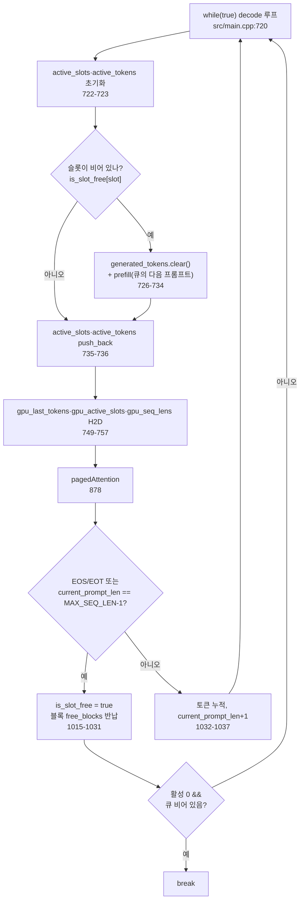

# 7. 슬롯 테이블로 여러 요청을 함께 돌리기

이 글의 모든 경로와 줄 번호는 고정 revision
`e25bf1994efa90bc98b721ba7c527402f86fbeaf` 의 트리를 가리킨다(`guide.md:6`). 표기는
`파일:시작-끝` 형식이며, 실행 결과가 아니라 소스 인용이다.

## 이 장의 질문

여러 프롬프트를 동시에 처리하기 위해 슬롯과 큐를 어떻게 쓰는가(`series.yaml:138`).
코드 범위는 `src/main.cpp` 와 `python/batching_test_tokens.py` 다
(`series.yaml:139-141`). 이 장은 6편 `paged-kv-cache` 에 의존하고(`series.yaml:142-143`),
`required_evidence` 는 code 4 / tests 0 / runtime 0 이다(`series.yaml:144-147`).

continuous batching 의 개념은 이 시리즈의 전제이며, 이 장은 슬롯·큐 구현만
다룬다(`guide.md:200`). prefill 과 decode 의 구분, attention 수식, KV cache 의
존재 이유도 다시 설명하지 않는다(`guide.md:14-16`). runtime 은 0 이므로(결정 003,
`guide.md:75-87`) 아래 모든 주장은 실행 없이 소스 인용으로만 뒷받침된다.

## 슬롯과 큐라는 두 저장소

이 장이 따라가는 상태는 `main` 이 초기화한 두 종류의 저장소다. 하나는 도착하지
않은 요청을 담는 큐, 다른 하나는 이미 실행 중인 시퀀스가 자리하는 슬롯 배열이다.

요청 큐에는 채팅 템플릿 토큰 ID 로 된 프롬프트 4개가 push 된다
([`src/main.cpp:583-594`](https://github.com/jmaczan/tiny-vllm/blob/e25bf1994efa90bc98b721ba7c527402f86fbeaf/src/main.cpp#L583-L594);
Claim 20, `claims.md:375-385`). 동시에 처리할 슬롯 수는 `BATCH_SIZE = 2` 가
정한다([`src/main.cpp:29`](https://github.com/jmaczan/tiny-vllm/blob/e25bf1994efa90bc98b721ba7c527402f86fbeaf/src/main.cpp#L29)).
이 상수는 "not even close to being good"이라는 임시값 주석을 달고 있다. 슬롯
테이블의 행 수 `MAX_SEQUENCES` 도 `BATCH_SIZE` 를 따른다
([`src/main.cpp:38`](https://github.com/jmaczan/tiny-vllm/blob/e25bf1994efa90bc98b721ba7c527402f86fbeaf/src/main.cpp#L38)),
그리고 6편이 소유하는 `block_table` 의 첫 차원도 `MAX_SEQUENCES` 다
([`src/main.cpp:579`](https://github.com/jmaczan/tiny-vllm/blob/e25bf1994efa90bc98b721ba7c527402f86fbeaf/src/main.cpp#L579)).
슬롯과 큐가 연결되는 지점은 블록 테이블이다. 슬롯마다 KV 블록을 가리키는 테이블
행이 하나씩 있다(`guide.md:199`).

슬롯의 점유 상태는 `is_slot_free` 벡터가 관리한다(Claim 19, `claims.md:352-367`).
초기값은 `BATCH_SIZE` 개 모두 `true` 다
([`src/main.cpp:597`](https://github.com/jmaczan/tiny-vllm/blob/e25bf1994efa90bc98b721ba7c527402f86fbeaf/src/main.cpp#L597)).
슬롯별 진행 상태는 세 벡터에 나뉘어 담긴다. `generated_tokens` 는 그 슬롯이 만든
토큰 ID 열, `last_generated_tokens` 는 마지막 토큰, `current_prompt_len` 은
**현재까지의 시퀀스 길이**다([`src/main.cpp:599-601`](https://github.com/jmaczan/tiny-vllm/blob/e25bf1994efa90bc98b721ba7c527402f86fbeaf/src/main.cpp#L599-L601);
`trace.md:176-178`).

한 decode 스텝에서 실제로 계산할 슬롯을 모아 두는 것이 `active_slots` 와
`active_tokens` 다. 소스 주석이 그 목적을 밝힌다. "needed to provide contiguous
data for decode"([`src/main.cpp:603-605`](https://github.com/jmaczan/tiny-vllm/blob/e25bf1994efa90bc98b721ba7c527402f86fbeaf/src/main.cpp#L603-L605)).
이 호스트 배열들이 디바이스 사본으로 올라가는 경로는 뒤에서 다룬다. 디바이스 배열
`gpu_active_slots` 와 `gpu_seq_lens` 는 이 시점에 `cudaMalloc` 으로 할당만 된다
([`src/main.cpp:607-610`](https://github.com/jmaczan/tiny-vllm/blob/e25bf1994efa90bc98b721ba7c527402f86fbeaf/src/main.cpp#L607-L610)).

## prefill 이 슬롯을 점유한다

슬롯은 빈 상태가 아니라 **prefill 이 성공한 상태**에서 점유된 것으로 바뀐다.
`prefill` 은 인자 목록에 `is_slot_free` 와 `slot` 을 받는다
([`src/main.cpp:150`](https://github.com/jmaczan/tiny-vllm/blob/e25bf1994efa90bc98b721ba7c527402f86fbeaf/src/main.cpp#L150)).
진입부의 첫 행위는 큐의 맨 앞 프롬프트를 꺼내는 일이다. `queue.front()` 로 길이를
얻고, `queue.pop()` 으로 큐에서 빼낸 뒤, 해당 슬롯을 점유 표시한다
(`is_slot_free[slot] = false`)([`src/main.cpp:152-155`](https://github.com/jmaczan/tiny-vllm/blob/e25bf1994efa90bc98b721ba7c527402f86fbeaf/src/main.cpp#L152-L155)).

프롬프트 전체를 한 번에 흘리는 커널 호출 순서는 3편이 소유하고(`guide.md:195-196`),
그 안의 cuBLAS 호출부는 4편이 소유한다(`guide.md:204`). 이 장은 **슬롯 상태가
어떻게 갱신되는가**만 본다. prefill 이 끝나면 세 가지를 기록한다. 생성 토큰 열에
첫 토큰을 push 하고, 마지막 토큰을 갱신하며, `current_prompt_len` 을 프롬프트
길이로 맞춘다([`src/main.cpp:546-548`](https://github.com/jmaczan/tiny-vllm/blob/e25bf1994efa90bc98b721ba7c527402f86fbeaf/src/main.cpp#L546-L548)).
그리고 이 슬롯이 쓴 KV 블록 할당 결과를 커널이 쓸 수 있게 `block_table` 을
`block_table_gpu` 로 H2D 동기화한다([`src/main.cpp:550-552`](https://github.com/jmaczan/tiny-vllm/blob/e25bf1994efa90bc98b721ba7c527402f86fbeaf/src/main.cpp#L550-L552);
Claim 14, `claims.md:269-280`).

## 초기 채움: 슬롯 0·1, 큐에 2·3

`main` 은 decode 루프에 들어가기 전에 한 번의 초기 prefill 루프를 돌린다
([`src/main.cpp:695-708`](https://github.com/jmaczan/tiny-vllm/blob/e25bf1994efa90bc98b721ba7c527402f86fbeaf/src/main.cpp#L695-L708);
Claim 19, `claims.md:352-367`). 조건은 `slot < is_slot_free.size() &&
!queue.empty()` 로, 빈 슬롯이 남아 있고 큐에 프롬프트가 남아 있는 동안 반복한다.
`BATCH_SIZE = 2` 이고 큐에 프롬프트가 4개이므로, 이 루프는 슬롯 0·1 만 채우고
프롬프트 2·3 은 큐에 남긴다(`trace.md:75-77`; Claim 20, `claims.md:375-385`).

## decode 루프가 매 반복 슬롯을 재구성한다

decode 루프는 `while(true)` 로 시작한다
([`src/main.cpp:720`](https://github.com/jmaczan/tiny-vllm/blob/e25bf1994efa90bc98b721ba7c527402f86fbeaf/src/main.cpp#L720)).
루프 위 주석은 "an inference server ... foreveeer!!!" 로 상시 운영 서버를
의도하지만, 실제 실행은 유한하다. 이 장의 종료 절에서 다시 다룬다.

매 반복은 먼저 두 활성 배열을 비운다. `active_slots.clear()` 와
`active_tokens.clear()` 다([`src/main.cpp:722-723`](https://github.com/jmaczan/tiny-vllm/blob/e25bf1994efa90bc98b721ba7c527402f86fbeaf/src/main.cpp#L722-L723)).
이어서 슬롯을 하나씩 살펴본다([`src/main.cpp:724-737`](https://github.com/jmaczan/tiny-vllm/blob/e25bf1994efa90bc98b721ba7c527402f86fbeaf/src/main.cpp#L724-L737)).

```text
각 슬롯에 대해:
  비어 있으면 (is_slot_free[slot] == true):
      generated_tokens[slot].clear()
      queue 에 남은 프롬프트로 prefill(slot)   -- is_slot_free[slot] = false
  점유 상태와 무관하게:
      active_slots.push_back(slot)
      active_tokens.push_back(마지막 토큰)
```

빈 슬롯은 이 반복에서 곧바로 큐의 다음 프롬프트로 채워진다
([`src/main.cpp:726-734`](https://github.com/jmaczan/tiny-vllm/blob/e25bf1994efa90bc98b721ba7c527402f86fbeaf/src/main.cpp#L726-L734)).
재사용 전에 `generated_tokens` 를 비우는 이유는 이전 시퀀스의 토큰 열이 남아
있기 때문이다. 그리고 `push_back` 은 `if` 블록 바깥에 있어, 새로 채운 슬롯도
같은 반복의 활성 목록에 들어간다([`src/main.cpp:735-736`](https://github.com/jmaczan/tiny-vllm/blob/e25bf1994efa90bc98b721ba7c527402f86fbeaf/src/main.cpp#L735-L736);
Claim 19).

활성 배열을 다 채운 뒤 `num_active_slots` 를 확인한다. 0 이면 계산할 슬롯이
없다는 뜻이다. 큐가 비어 있으면 루프를 빠져나가고, 큐에 남은 프롬프트가 있으면
다음 반복에서 채우도록 `continue` 한다([`src/main.cpp:738-746`](https://github.com/jmaczan/tiny-vllm/blob/e25bf1994efa90bc98b721ba7c527402f86fbeaf/src/main.cpp#L738-L746)).
`BATCH_SIZE` 와 같은 임시값임을 밝히는 TODO 주석도 이 break 지점에 있다
([`src/main.cpp:743`](https://github.com/jmaczan/tiny-vllm/blob/e25bf1994efa90bc98b721ba7c527402f86fbeaf/src/main.cpp#L743)).

## 활성 슬롯이 디바이스로 올라간다

재구성된 호스트 배열은 decode 스텝의 커널들이 읽을 수 있게 디바이스로 복사된다.
여기서 두 배열이 각각 **어느 디바이스 버퍼로 가는지**를 정확히 짚어야 한다.

- `active_slots` → `gpu_active_slots`
- `active_tokens` → `gpu_last_tokens`

두 복사는 같은 지점에서 일어난다
([`src/main.cpp:749-750`](https://github.com/jmaczan/tiny-vllm/blob/e25bf1994efa90bc98b721ba7c527402f86fbeaf/src/main.cpp#L749-L750)).
`gpu_last_tokens` 는 decode 전용 버퍼로, 슬롯별 마지막 토큰을 담는다
([`src/main.cpp:684-685`](https://github.com/jmaczan/tiny-vllm/blob/e25bf1994efa90bc98b721ba7c527402f86fbeaf/src/main.cpp#L684-L685);
`trace.md:181`). 각 슬롯의 현재 시퀀스 길이는 활성 배열에서 오지 않는다. 호스트의
`seq_lens` 를 `current_prompt_len[active_slot] + 1` 로 **따로 계산**해
`gpu_seq_lens` 로 올린다([`src/main.cpp:751-757`](https://github.com/jmaczan/tiny-vllm/blob/e25bf1994efa90bc98b721ba7c527402f86fbeaf/src/main.cpp#L751-L757);
`trace.md:129`). 디바이스 배열 `gpu_active_slots`·`gpu_seq_lens` 는 앞서
`cudaMalloc` 으로 할당된 것들이며([`src/main.cpp:607-610`](https://github.com/jmaczan/tiny-vllm/blob/e25bf1994efa90bc98b721ba7c527402f86fbeaf/src/main.cpp#L607-L610)),
`+1` 은 방금 생성한 토큰의 KV 가 이미 블록에 기록되었기 때문에 길이에 포함되는
것이다.

이 세 디바이스 배열은 6편이 소유하는 `pagedAttentionKernel` 의 입력이 된다
([`src/main.cpp:878`](https://github.com/jmaczan/tiny-vllm/blob/e25bf1994efa90bc98b721ba7c527402f86fbeaf/src/main.cpp#L878);
Claim 16, `claims.md:303-314`). 활성 슬롯 목록으로 어떤 슬롯을 계산할지, 길이로
각 슬롯의 KV 를 어디까지 읽을지가 정해진다. 슬롯 테이블이 어텐션 커널과 만나는
지점이다.

## 종료: 슬롯 해제와 블록 반납

decode 의 각 슬롯은 생성 토큰이 정지 신호를 만나면 해제된다. 종료 조건은 세
가지다. 생성 토큰이 `<|end_of_text|>`(128001) 또는 `<|eot_id|>`(128009) 이거나,
`current_prompt_len == MAX_SEQ_LEN - 1` 에 도달했을 때다
([`src/main.cpp:1015`](https://github.com/jmaczan/tiny-vllm/blob/e25bf1994efa90bc98b721ba7c527402f86fbeaf/src/main.cpp#L1015);
상수 [`src/main.cpp:26-28`](https://github.com/jmaczan/tiny-vllm/blob/e25bf1994efa90bc98b721ba7c527402f86fbeaf/src/main.cpp#L26-L28);
Claim 13, `claims.md:246-261`). 종료 분기는 세 단계를 밟는다(Claim 13).

1. `is_slot_free[slot] = true` 로 슬롯을 비운다
   ([`src/main.cpp:1017`](https://github.com/jmaczan/tiny-vllm/blob/e25bf1994efa90bc98b721ba7c527402f86fbeaf/src/main.cpp#L1017)).
2. 이 슬롯이 소유한 모든 물리 블록을 `free_blocks` 로 반납한다. 3차원 인덱스로
   `block_table` 을 순회하며 값이 `-1` 이 아닌 항목을 `free_blocks` 에
   `push_back` 하고 다시 `-1` 로 재초기화한다
   ([`src/main.cpp:1018-1029`](https://github.com/jmaczan/tiny-vllm/blob/e25bf1994efa90bc98b721ba7c527402f86fbeaf/src/main.cpp#L1018-L1029);
   Claim 14, `claims.md:269-280`).
3. `block_table` 의 변화를 `block_table_gpu` 로 동기화한다
   ([`src/main.cpp:1030`](https://github.com/jmaczan/tiny-vllm/blob/e25bf1994efa90bc98b721ba7c527402f86fbeaf/src/main.cpp#L1030)).

종료 조건에 걸리지 않으면 토큰을 `generated_tokens` 에 누적하고
`current_prompt_len` 을 1 늘린다([`src/main.cpp:1032-1037`](https://github.com/jmaczan/tiny-vllm/blob/e25bf1994efa90bc98b721ba7c527402f86fbeaf/src/main.cpp#L1032-L1037)).
이렇게 비워진 슬롯은 다음 decode 반복의 슬롯별 분기에서 큐의 다음 프롬프트로
다시 채워진다.

여기서 종료 상한을 정확히 둘 필요가 있다. 조건식이 비교하는 것은 **생성 토큰
수가 아니라 시퀀스 전체 길이**다. `current_prompt_len` 은 프롬프트 길이에서
시작해 생성 토큰마다 1 씩 늘어나므로([`src/main.cpp:548`](https://github.com/jmaczan/tiny-vllm/blob/e25bf1994efa90bc98b721ba7c527402f86fbeaf/src/main.cpp#L548),
[`src/main.cpp:1036`](https://github.com/jmaczan/tiny-vllm/blob/e25bf1994efa90bc98b721ba7c527402f86fbeaf/src/main.cpp#L1036)),
상한은 시퀀스 길이 기준 `MAX_SEQ_LEN - 1` 이고, 생성 토큰 수 상한은 거기서
프롬프트 길이를 뺀 값이다. 별도로 선언된 `MAX_NEW_TOKENS_GENERATED = 20`
([`src/main.cpp:12`](https://github.com/jmaczan/tiny-vllm/blob/e25bf1994efa90bc98b721ba7c527402f86fbeaf/src/main.cpp#L12))은
다른 곳에서 참조되지 않아 종료 조건으로 동작하지 않는다(`trace.md:222-224`).

## 시각 자료: slot-lifecycle

이 장의 시각 자료는 슬롯이 채워지고 비는 생애주기다(`series.yaml:149-152`). 아래
다이어그램은 `is_slot_free` 가 점유 상태를 관리하고 빈 슬롯이 큐의 다음 프롬프트를
받아 채워지며, 활성 슬롯 목록이 decode 스텝마다 커널로 전달되는 흐름을 답한다
(`briefs.md:222-225`). 종료 절차는 Claim 13(`decode-termination`)을 함께 사용한다.

<!-- visual: slot-lifecycle supports: [slot-lifecycle, batching-queue, decode-termination] -->


이 흐름의 두 필수 주장은 모두 Claim 19 가 뒷받침한다. "`is_slot_free` 가 슬롯의
점유 상태를 관리하고 큐에서 다음 프롬프트를 채운다"는 빈 슬롯 분기
([`src/main.cpp:724-737`](https://github.com/jmaczan/tiny-vllm/blob/e25bf1994efa90bc98b721ba7c527402f86fbeaf/src/main.cpp#L724-L737))와
초기 채움 루프([`src/main.cpp:695-708`](https://github.com/jmaczan/tiny-vllm/blob/e25bf1994efa90bc98b721ba7c527402f86fbeaf/src/main.cpp#L695-L708))다.
"활성 슬롯 목록이 decode 스텝마다 커널에 전달된다"는 H2D 지점
([`src/main.cpp:749-757`](https://github.com/jmaczan/tiny-vllm/blob/e25bf1994efa90bc98b721ba7c527402f86fbeaf/src/main.cpp#L749-L757))과
`pagedAttention` 호출([`src/main.cpp:878`](https://github.com/jmaczan/tiny-vllm/blob/e25bf1994efa90bc98b721ba7c527402f86fbeaf/src/main.cpp#L878))이다.
종료 분기로 이어지는 슬롯 해제·블록 반납은 Claim 13 이 담당한다
(`claims.md:246-261`). 함께 나열한 `batching-queue`(Claim 20)·`decode-termination`
(Claim 13)도 이 흐름을 이루는 실존 claim 이다.

## 이 장이 다루지 않는 것

- block table·`free_blocks`·paged attention 커널의 읽기 동작: 6편
  (`guide.md:199`). 이 장은 슬롯이 배열을 채우는 쪽만 다룬다.
- 슬롯·배치 버퍼의 크기 산정 근거: 2편(`guide.md:194`).
- prefill 의 커널 호출 순서와 cuBLAS 전치 트릭: 3편(`guide.md:195-196`), 4편
  (`guide.md:204`). `prefill` 함수의 슬롯 상태 갱신만 이 장이 인용한다.
- decode 계열 커널 변형과 배치 K/V 투영: 5편(`guide.md:198`).
- `python/batching_test_tokens.py` 는 code_scope 이지만(`series.yaml:141`), 이
  테스트를 직접 다루는 claim 은 없다(`briefs.md:218`). 검증은 정적 인용으로만
  한다.

## 이 장의 한계

- 이 시리즈는 NVIDIA GPU 와 CUDA 툴체인이 없는 환경에서 작성되어 커널을 실행하지
  않는다. 이 장의 모든 주장은 소스 인용이며 실행 검증이 없다(`guide.md:75-87`;
  Claim 13·19·20 한계).
- 슬롯 종료는 EOS/EOT 토큰 또는 `MAX_SEQ_LEN-1` 도달뿐이다
  (`trace.md:209-210`). 별도의 생성 토큰 수 상한 `MAX_NEW_TOKENS_GENERATED = 20`
  은 선언만 있고 참조되지 않아 동작하지 않는다(`src/main.cpp:12`,
  `trace.md:222-224`).
- 상시 운영 서버를 의도한 주석(`src/main.cpp:720`)과 달리, `active_slots` 가 0
  이고 큐가 비면 break 하므로 실제 실행은 유한하다(`trace.md:162-164`).
- 활성 배열과 길이의 H2D 복사, 슬롯 재구성의 동시성·경합은 실행 검증되지 않았다.
- `python/batching_test_tokens.py` 는 첨부 근거에 기능 서술이 없어 이 장은
  코드 범위로만 두고 실행 없이 정적 인용으로 다룬다(`briefs.md:218`).
- 이 장의 `required_evidence.tests` 는 0 이다(`series.yaml:146`). 실행 테스트
  없이 정적 인용으로만 구성한다(`briefs.md:203`, `218`).

## 출처

- `series.yaml:136-152` — 이 장의 제목·질문·범위·의존성·근거 최소값·시각 자료.
- `src/main.cpp:12` — `MAX_NEW_TOKENS_GENERATED` 선언(미참조).
- `src/main.cpp:26-29`, `38` — `MAX_SEQ_LEN`·종료 토큰 상수, `BATCH_SIZE`,
  `MAX_SEQUENCES`.
- `src/main.cpp:150-155` — `prefill` 시그니처와 큐 pop·슬롯 점유.
- `src/main.cpp:546-552` — prefill 의 상태 기록과 `block_table` H2D.
- `src/main.cpp:583-594` — 큐 4개 프롬프트.
- `src/main.cpp:597-610` — `is_slot_free`, 세 상태 벡터, 활성 배열과 디바이스
  배열 할당.
- `src/main.cpp:684-685` — `gpu_last_tokens` 할당.
- `src/main.cpp:695-708` — 초기 prefill 루프.
- `src/main.cpp:720-757` — decode 루프의 슬롯 재구성, 활성 배열 H2D, `seq_lens`
  계산.
- `src/main.cpp:878` — `pagedAttention` 호출(6편 소유).
- `src/main.cpp:1015-1037` — 종료 분기·블록 반납·토큰 누적.
- `claims.md:246-261` — Claim 13(`decode-termination`).
- `claims.md:269-280` — Claim 14(`block-table-indexing`, 블록 반납).
- `claims.md:303-314` — Claim 16(`paged-attention-inputs`).
- `claims.md:352-367` — Claim 19(`slot-lifecycle`).
- `claims.md:375-385` — Claim 20(`batching-queue`).
- `trace.md:75-77`, `129`, `162-164`, `176-181`, `209-210`, `222-224` — 초기
  채움, H2D, break 유한성, 상태 변경, 종료 분기, 미참조 상수.
- `guide.md:6`, `14-16`, `75-87`, `194-200`, `204` — 고정 revision, 전제, 실행
  제약, 편별 경계.
- `briefs.md:200-225` — 이 장의 scope·claim·시각 자료 필수 주장.