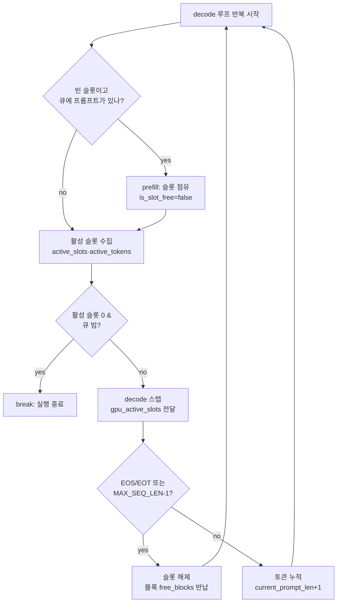

# 7편: 슬롯 테이블로 여러 요청을 함께 돌리기

> tiny-vLLM 코드 읽기 시리즈 · 고정 revision `e25bf1994efa90bc98b721ba7c527402f86fbeaf`

6편에서 `pagedAttentionKernel` 이 `block_table` 을 거쳐 논리 블록을 물리 블록으로
바꾸고 `kv_cache` 의 비연속 블록을 읽는 것을 봤다. 그런데 그 커널은 "누가" 그
블록을 채우고, 동시에 여러 시퀀스가 있으면 각 시퀀스의 현재 길이를 어떻게 아는가?
`pagedAttentionKernel` 의 시그니처에는 `kv_cache`·`block_table_gpu`·`gpu_seq_lens`·
`gpu_active_slots` 가 함께 들어 있는데(Claim 16, `src/kernels.cu:461`,
`src/main.cpp:878`), 이 편의 질문은 그중 뒤의 두 상태를 **누가 매 스텝 갱신하는가**
다. 즉 여러 프롬프트를 동시에 처리하기 위해 슬롯과 큐를 어떻게 쓰는가.

이 편은 6편에 의존한다. 블록 테이블과 paged attention 의 저장 구조는 6편이
소유하고, 여기서는 슬롯·큐가 그 구조를 어떻게 구동하는지만 다룬다. continuous
batching 의 개념 자체는 전제로 두고, 구현에만 분량을 쓴다(`guide.md:200`).

## 슬롯은 고정 크기 배치 상태다

tiny-vLLM 의 동시성 단위는 **슬롯(slot)** 이다. 슬롯 수는 컴파일 타임 상수
`BATCH_SIZE = 2` 로 고정된다(`src/main.cpp:29`). 이 상수에는 "not even close to
being good, it's just here to have batching" 이라는 주석이 달려 있다. 슬롯 수와
시퀀스 수는 같은 값으로 묶여 `MAX_SEQUENCES = BATCH_SIZE`(`src/main.cpp:38`)가
된다. block table 의 첫 번째 차원이 이 `MAX_SEQUENCES` 다(`src/main.cpp:579`).

슬롯의 점유 여부는 `std::vector<bool> is_slot_free(BATCH_SIZE, true)` 하나로
관리된다(`src/main.cpp:597`). 슬롯이 차면 `false`, 비면 `true` 로 바뀐다. 슬롯별
런타임 상태는 세 벡터로 나뉜다(`src/main.cpp:599-601`).

- `generated_tokens[slot]` — 지금까지 생성한 토큰 ID 목록
- `last_generated_tokens[slot]` — 다음 decode 스텝의 입력이 될 마지막 토큰
- `current_prompt_len[slot]` — 현재까지의 시퀀스 길이

여기에 decode 커널에 넘길 연속 배열 두 개가 더 있다. `active_slots` 와
`active_tokens` 이며, 소스 주석은 이 둘의 목적을 "needed to provide contiguous
data for decode" 라고 적는다(`src/main.cpp:603-605`). 슬롯 테이블은 흩어져 있지만
커널에 넘길 때는 활성 슬롯만 모아 **조밀한 배열**로 만든다는 뜻이다. 이 배열이
디바이스로 올라간 것이 `gpu_active_slots` 와 `gpu_seq_lens` 다
(`src/main.cpp:607-610`).

슬롯 하나가 실제로 쓰는 버퍼 크기는 `MAX_BUFFER_SIZE = max(MAX_PROMPT_LEN,
BATCH_SIZE)`(`src/main.cpp:31`)를 기준으로 잡힌다. 어떤 버퍼가 슬롯 수만큼
필요하고 어떤 버퍼가 프롬프트 길이만큼 필요한지는 2편이 소유한다
(`guide.md:194`). 이 편에서는 그 산정을 반복하지 않는다.

## prefill 이 슬롯을 점유한다

슬롯을 채우는 주체는 `prefill` 함수다. `prefill` 의 인자 목록에는
`std::vector<bool> &is_slot_free` 와 `int slot` 이 들어 있다(`src/main.cpp:150`).
함수 본문 첫머리에서 큐를 소비하고 슬롯을 점유한다(`src/main.cpp:152-155`).

```cpp
prompt = queue.front();
prompt_len = prompt.size();
queue.pop();
is_slot_free[slot] = false;
```

즉 `prefill` 은 "큐에서 프롬프트를 하나 꺼내 지정된 슬롯에 넣는다" 는 계약을
가진다. 프롬프트 전체를 임베딩부터 다음 토큰 선택까지 한 번에 흘린 뒤(3편 소유),
슬롯 상태를 기록한다. `generated_tokens[slot]` 에 첫 토큰을 push 하고,
`last_generated_tokens[slot]` 을 그 토큰으로, `current_prompt_len[slot]` 을
프롬프트 길이로 설정한다(`src/main.cpp:546-548`). 마지막으로 `block_table` 전체를
`block_table_gpu` 로 H2D 동기화한다(`src/main.cpp:550-552`).

프로그램 시작 시에는 이 `prefill` 을 슬롯 0 부터 순서대로 호출한다
(`src/main.cpp:695-708`).

```cpp
for (int slot = 0; slot < is_slot_free.size() && !queue.empty(); ++slot)
{
    if (!is_slot_free[slot])
    {
        continue; // slot taken, skip
    }
    prefill(...);
}
```

`is_slot_free.size()` 가 곧 `BATCH_SIZE` 이므로 이 루프는 슬롯 0 과 1을 채우고
멈춘다. 큐에 프롬프트가 4개 있어도 2개는 남는다. 이것이 "고정 슬롯 수" 라는
제약이 첫 번째로 드러나는 지점이다.

## decode 루프가 매 스텝 슬롯을 재구성한다

슬롯이 실제로 여러 요청을 겹치게 만드는 곳은 decode 루프다. 루프는
`while (true)` 로 시작하며(`src/main.cpp:720`), 매 반복마다 활성 슬롯 배열을
비우고 다시 채운다(`src/main.cpp:722-723`). 슬롯별 처리는 다음 순서다
(`src/main.cpp:724-737`).

```cpp
for (int slot = 0; slot < BATCH_SIZE; ++slot)
{
    if (is_slot_free[slot])
    {
        if (queue.empty())
        {
            continue;
        }
        generated_tokens[slot].clear();
        prefill(...);
    }
    active_slots.push_back(slot);
    active_tokens.push_back(last_generated_tokens[slot]);
}
```

읽을 때 주의할 점이 있다. `active_slots.push_back` 과
`active_tokens.push_back` 은 `if` 블록 **바깥**에 있다. 그래서

- 점유 중인 슬롯은 그대로 `active_slots` 에 들어가고,
- 방금 `prefill` 로 채운 슬롯은 `is_slot_free[slot]` 이 `false` 가 된 뒤 같은
  반복에서 `active_slots` 에 들어가며,
- 빈 슬롯인데 큐도 빈 경우만 `continue` 로 건너뛴다.

즉 매 decode 스텝 직전에 "이번 스텝에 계산할 시퀀스" 가 다시 정의된다. 이때
`active_tokens` 에 들어가는 값은 `last_generated_tokens[slot]` 이므로, 새로 채운
슬롯은 prefill 이 고른 첫 토큰부터 decode 를 이어 간다.

활성 슬롯이 하나도 없을 때의 처리는 별도다(`src/main.cpp:738-746`).

```cpp
int num_active_slots = active_slots.size();
if (num_active_slots == 0)
{
    if (queue.empty())
    {
        break; // TODO: continue will make sense when I will finally write to queue, ...
    }
    continue;
}
```

이후 커널에 넘길 상태를 만든다. `active_tokens` 를 `gpu_last_tokens` 로,
`active_slots` 를 `gpu_active_slots` 로 H2D 복사하고(`src/main.cpp:749-750`),
`seq_lens[slot] = current_prompt_len[active_slot] + 1` 을 계산해 `gpu_seq_lens` 로
올린다(`src/main.cpp:751-757`). 여기서 `+ 1` 은 이번 스텝에 새로 쓰게 될 토큰
자리까지 포함한 길이다. 이 중 `gpu_active_slots` 와 `gpu_seq_lens` 가 6편에서 본
`pagedAttentionKernel` 의 입력이 된다(`src/main.cpp:878`). 어떤 시퀀스가 활성인지,
그 길이가 얼마인지를 호스트가 매 스텝 다시 써 주는 구조다.

## 슬롯 해제와 블록 반납

시퀀스가 끝나는 조건은 세 가지다(`src/main.cpp:1015`, 상수 `src/main.cpp:26-28`).

- 생성 토큰이 `<|end_of_text|>`(128001) 이다
- 생성 토큰이 `<|eot_id|>`(128009) 이다
- `current_prompt_len` 이 `MAX_SEQ_LEN - 1` 에 도달했다

이 조건이 참이면 슬롯을 해제한다(`src/main.cpp:1015-1031`). 먼저
`is_slot_free[active_slot] = true` 로 슬롯을 비운다(`src/main.cpp:1017`). 그다음
그 슬롯이 소유한 모든 블록을 `free_blocks` 로 반납한다
(`src/main.cpp:1018-1029`).

```cpp
for (int layer = 0; layer < N_LAYERS; ++layer)
{
    for (int logical_block_idx = 0; logical_block_idx < MAX_BLOCKS_PER_SEQ; ++logical_block_idx)
    {
        int block_idx = active_slot * N_LAYERS * MAX_BLOCKS_PER_SEQ
                      + layer * MAX_BLOCKS_PER_SEQ + logical_block_idx;
        if (block_table[block_idx] != -1)
        {
            free_blocks.push_back(block_table[block_idx]);
            block_table[block_idx] = -1;
        }
    }
}
```

논리 블록 인덱스를 슬롯·레이어·블록의 3차원으로 펼친 뒤, `block_table` 값이
`-1` 이 아니면 그 물리 블록을 `free_blocks` 에 되돌리고 테이블을 `-1` 로
재초기화한다. 이 반납 규약과 `free_blocks` 목록의 소유권은 6편이 다룬다
(`guide.md:199`). 여기서 중요한 것은 **슬롯 해제가 곧 그 슬롯의 KV 블록 반납**이라는
점이다. 슬롯과 KV 자원의 수명이 함께 움직인다.

조건이 거짓이면 다음 토큰을 누적한다(`src/main.cpp:1032-1037`).

```cpp
last_generated_tokens[active_slot] = max_token_idx;
generated_tokens[active_slot].push_back(max_token_idx);
current_prompt_len[active_slot] = current_prompt_len[active_slot] + 1;
```

## continuous batching 의 실체

이 흐름이 continuous batching 의 구현이다. 큐에는 채팅 템플릿 형식의 토큰 ID
열 4개가 들어 있다(`src/main.cpp:583-594`). 주석은 각각 "What is 2+2?",
"Name a color.", "Say hello.", "Capital of France?" 에 대응하는 프롬프트라고
적는다. `BATCH_SIZE = 2` 이므로 초기 `prefill` 루프가 슬롯 0·1을 채우고
프롬프트 2·3은 큐에 남는다(`src/main.cpp:695-708`). 이후 decode 루프의 매
반복에서 빈 슬롯이 생기면 그 슬롯이 큐의 다음 프롬프트로 채워진다
(`src/main.cpp:724-737`). 정적 배치처럼 모든 요청이 끝날 때까지 기다리지 않고,
끝난 슬롯 자리에 다음 요청을 바로 넣는다.

이 구현의 경계도 소스에 드러나 있다. 루프 주석은 스스로를 "an inference server
that's supposed to run foreveeer!!!" 라고 부르지만(`src/main.cpp:720`), 실제
종료 조건은 활성 슬롯이 0이고 큐가 빈 경우의 `break` 하나다
(`src/main.cpp:739-744`). 큐가 미리 정해진 4개라서 실행은 유한하다
(`trace.md:162-164`). 또한 `MAX_NEW_TOKENS_GENERATED = 20` 은 선언만 되고 어디서도
참조되지 않아 종료 조건으로 동작하지 않는다(`src/main.cpp:12`,
`trace.md:222-224`). 생성 길이 상한은 `MAX_SEQ_LEN - 1` 뿐이다.

슬롯 수가 2로 고정된 것도 의도된 설계가 아니라 임시값이다. `BATCH_SIZE`
주석의 "not even close to being good"(`src/main.cpp:29`)과 decode 루프의
`break` TODO(`src/main.cpp:743`)가 그 상태를 그대로 남긴다. continuous batching
의 뼈대는 갖췄지만 배치 폭과 큐 공급은 아직 고정값이라는 뜻이다.

## 슬롯 생애주기

아래 다이어그램은 한 슬롯이 decode 루프 안에서 어떤 상태를 거치는지 요약한다.

<!-- visual: slot-lifecycle supports: [slot-lifecycle, batching-queue, decode-termination] -->


## 한계

- 이 시리즈는 커널 실행 시간·처리량·메모리 사용량을 측정하지 않는다. 이 편의
  `required_evidence.runtime` 은 0 이며(`guide.md:85`), 위 흐름은 모두 고정
  revision 소스의 정적 인용이다. GPU 와 CUDA 툴체인이 없어 실행 검증은
  수행되지 않았다(`guide.md:75-87`).
- 슬롯 상태 전이와 활성 슬롯 수집 순서는 소스 줄 순서에 근거한 정적 주장이며,
  `active_slots.push_back` 이 `if` 바깥에 있다는 관찰도 실행으로 확인되지 않았다.
- `python/batching_test_tokens.py` 는 `series.yaml` 의 code_scope 이지만
  `evidence/claims.md` 에 이 스크립트를 직접 다루는 claim 이 없다. 이 편의 검증은
  커밋된 참조 출력이 아니라 소스 인용으로만 한다.
- 블록 테이블·`free_blocks`·paged attention 의 저장 구조는 6편이 소유하며 이 편은
  슬롯 해제 시의 반납 호출만 인용한다(`guide.md:199`).
- 슬롯 버퍼 크기 산정의 근거는 2편이 소유하며 이 편에서 다시 유도하지 않는다
  (`guide.md:194`).
- `MAX_NEW_TOKENS_GENERATED = 20`(`src/main.cpp:12`)이 미사용이라는 점과 실행이
  유한하다는 점은 `trace.md:222-224`, `trace.md:162-164` 의 정적 관찰을 인용한다.
