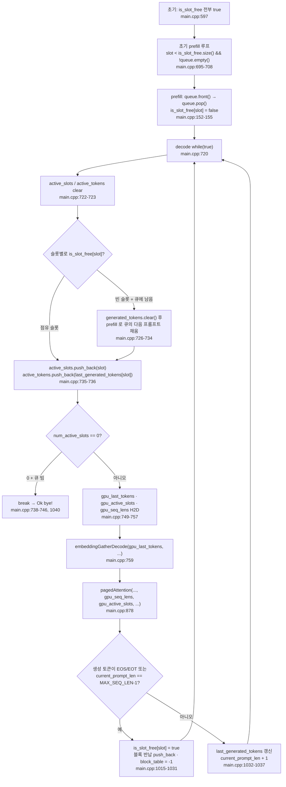

# 7. 슬롯 테이블로 여러 요청을 함께 돌리기

이 글의 모든 경로와 줄 번호는 고정 revision
`e25bf1994efa90bc98b721ba7c527402f86fbeaf` 의 트리를 가리킨다. 표기는
`파일:시작-끝` 형식이며, 실행 결과가 아니라 소스 인용이다.

## 이 장의 질문

여러 프롬프트를 동시에 처리하기 위해 슬롯과 큐를 어떻게 쓰는가. 코드 범위는
`src/main.cpp` 와 `python/batching_test_tokens.py` 두 파일이다. 이 장의 최소 근거는
코드 인용 4건, 테스트 0건, 실행 0건이다. 테스트가 없으므로 모든 검증은 소스
인용으로만 이뤄진다.

continuous batching 의 동기와 개념은 전제로 둔다. 이 장이 소유하는 것은 그
개념이 이 코드베이스에서 **슬롯과 큐라는 두 저장소로 구현된 모습**이다. decode 가
paged KV cache 를 어떻게 읽는지는 6편이 소유하며, 이 장은 6편의 block table
할당·반납 구조 위에서 슬롯이 채워지고 비는 순서만 다룬다. prefill 의 전체 커널
순서는 3편, cuBLAS 의 전치 트릭은 4편, decode 계열 커널 변형은 5편, 버퍼 크기
산정과 별칭 설계는 2편이 맡는다.

이 시리즈는 NVIDIA GPU 와 CUDA 툴체인이 없는 환경에서 작성되어 어떤 decode
스텝도 실행하지 않았다. 아래의 모든 순서·상태 주장은 소스 인용이며, 커널 실행
시간·처리량·메모리 사용량은 측정하지 않는다.

## 두 저장소: 슬롯과 큐

배치는 CPU 쪽 상태 두 개로 시작한다. 하나는 실행 중인 시퀀스의 자리인 슬롯이고,
다른 하나는 아직 시작하지 않은 프롬프트의 대기열이다.

큐는 `std::queue<std::vector<int>>` 다(`src/main.cpp:584`). 각 원소는 채팅
템플릿으로 감싼 프롬프트의 토큰 ID 벡터이고, `main` 이 네 개를 미리 채워 둔다
(`src/main.cpp:583-594`): "What is 2+2?"(길이 17), "Name a color."(길이 14),
"Say hello."(길이 13), "Capital of France?"(길이 14). 이 토큰 ID 열은
`python/batching_test_tokens.py` 가 생산한다. 이 스크립트는
`Llama-3.2-1B-Instruct` 토크나이저로 같은 네 프롬프트를
`<|begin_of_text|><|start_header_id|>user<|end_header_id|>...<|eot_id|><|start_header_id|>assistant<|end_header_id|>`
형식으로 감싸 토큰을 인쇄한다(`python/batching_test_tokens.py:1-21`). `main.cpp` 의
네 push 는 그 결과를 큐 구조로 옮겨 적은 것이다.

슬롯 수는 `BATCH_SIZE = 2` 다. 상수 선언에는 "not even close to being good, it's
just here to have batching" 이라는 주석이 붙어 있다(`src/main.cpp:29`). batching
이 되도록 넣은 임시값이라는 뜻이다. `MAX_SEQUENCES = BATCH_SIZE` 로 별칭되고
(`src/main.cpp:38`), block table 의 첫 차원이 이 값이다(`src/main.cpp:579`).
따라서 block_table 은 2 × 16 × 128 = 4096 항목이고, 슬롯마다
`N_LAYERS × MAX_BLOCKS_PER_SEQ = 16 × 128 = 2048` 개의 항목 묶음이 배정된다.
"슬롯마다 테이블 행이 하나"가 아니라, 슬롯 하나가 레이어·논리 블록 단위로 나뉜
항목 묶음 전체를 갖는다.

점유 상태는 `is_slot_free` 벡터가 관리한다. `std::vector<bool>(BATCH_SIZE, true)`
로 초기화되어("set to false when slot taken, set to true when free") 모든 슬롯이
처음엔 비어 있다(`src/main.cpp:597`). 슬롯마다 세 상태 벡터가 따른다:
`generated_tokens`(생성 토큰 누적), `last_generated_tokens`(마지막 토큰),
`current_prompt_len`(현재 시퀀스 길이, 0 초기화)(`src/main.cpp:599-601`).

decode 가 GPU 커널에 넘길 연속 배열을 만들기 위한 CPU 쪽 모음집도 여기서
선언된다. `active_slots` 와 `active_tokens` 는 "needed to provide contiguous data
for decode" 라는 주석과 함께 빈 벡터로 시작한다(`src/main.cpp:603-605`). 그
사본을 담을 디바이스 배열 `gpu_active_slots`(`src/main.cpp:607-608`)와
`gpu_seq_lens`(`src/main.cpp:609-610`)가 할당된다. 여기에 decode 전용 버퍼
`gpu_last_tokens`(`src/main.cpp:684-685`)가 추가된다. 이 셋이 이 장의 무대다.

## 초기 채움: 슬롯 0·1 이 프롬프트를 가진다

배치가 시작되기 전 `main` 은 한 번의 prefill 루프로 빈 슬롯을 채운다
(`src/main.cpp:695-708`).

```cpp
for (int slot = 0; slot < is_slot_free.size() && !queue.empty(); ++slot)
{
    if (!is_slot_free[slot])
    {
        continue; // slot taken, skip
    }
    prefill(prompt, queue, prompt_len, is_slot_free, slot, ...);
}
```

인용: [`src/main.cpp:695-708`](https://github.com/jmaczan/tiny-vllm/blob/e25bf1994efa90bc98b721ba7c527402f86fbeaf/src/main.cpp#L695-L708)

조건은 `slot < is_slot_free.size() && !queue.empty()` 이다. 빈 슬롯이 남아 있고 큐에
프롬프트가 남아 있는 동안 돌되, 비어 있지 않은 슬롯은 루프 안의 `continue` 로
건너뛴다(`src/main.cpp:697-700`). `is_slot_free.size()` 는 `BATCH_SIZE` 와 같으므로
슬롯은 0·1 두 개뿐이다. 루프는 슬롯 0 과 슬롯 1 을 차례로 `prefill` 로 채우고,
슬롯 2 에서 조건이 끝난다.

`prefill` 진입부가 큐를 소비한다. `prompt = queue.front()`,
`prompt_len = prompt.size()`, `queue.pop()`, `is_slot_free[slot] = false` 순서다
(`src/main.cpp:152-155`). 프롬프트가 슬롯으로 옮겨지면 그 슬롯은 점유 상태가
되고, 대기열에서는 빠진다. 이렇게 슬롯 0·1 이 프롬프트 0·1 을 가진다. 프롬프트
2·3 은 큐에 남는다. prefill 이 슬롯의 상태를 어떻게 기록하는지(생성 토큰·길이,
block_table 동기화)는 3편과 6편이 다룬다.

## decode 루프가 슬롯을 재구성한다

생성은 `while (true)` 루프로 들어간다(`src/main.cpp:720`). 루프 윗주석은 "an
inference server that's supposed to run foreveeer!!!" 라고 말한다. 매 반복은
두 배열을 비우는 것으로 시작한다(`src/main.cpp:722-723`).

```cpp
active_slots.clear();
active_tokens.clear();
for (int slot = 0; slot < BATCH_SIZE; ++slot)
{
    if (is_slot_free[slot])
    {
        if (queue.empty())
        {
            continue;
        }
        generated_tokens[slot].clear();
        prefill(prompt, queue, prompt_len, is_slot_free, slot, ...);
    }
    active_slots.push_back(slot);
    active_tokens.push_back(last_generated_tokens[slot]);
}
```

인용: [`src/main.cpp:722-737`](https://github.com/jmaczan/tiny-vllm/blob/e25bf1994efa90bc98b721ba7c527402f86fbeaf/src/main.cpp#L722-L737)

이 루프가 슬롯을 재구성한다. 슬롯이 비어 있으면(`is_slot_free[slot]`) 큐에서
다음 프롬프트를 꺼내 `prefill` 로 채운다. 이때 그 슬롯의 `generated_tokens` 를
먼저 비운다(`src/main.cpp:732`). prefill 은 `current_prompt_len` 을 프롬프트
길이로 다시 설정하므로(`src/main.cpp:548`), 재사용되는 슬롯은 이전 시퀀스의 길이
상태를 이어받지 않는다. 큐가 비었으면 `continue` 로 그 슬롯은 건너뛴다(`src/main.cpp:728-731`).

핵심은 `active_slots.push_back(slot)` 이 `if` 블록 **밖**에 있다는 점이다
(`src/main.cpp:735`). 방금 채운 슬롯과 이미 점유된 슬롯 모두가 이번 스텝의 활성
목록에 들어간다. `active_tokens` 도 같은 방식으로 채워지고, 각 슬롯의
`last_generated_tokens` 를 담는다(`src/main.cpp:736`). 따라서 이 두 배열은 항상
"지금 계산할 슬롯만"을 압축된 순서로 담는다. 이것이 "contiguous data for decode"
의 실체다.

슬롯 수가 0 이면 루프는 분기한다(`src/main.cpp:738-746`). 큐도 비었으면
`break`, 큐가 남았으면 `continue` 로 다음 반복에서 다시 채우기를 시도한다. 이
break 지점에는 TODO 주석이 있다.

> continue will make sense when I will finally write to queue, for now it has
> predefined size so break instead

인용: [`src/main.cpp:743`](https://github.com/jmaczan/tiny-vllm/blob/e25bf1994efa90bc98b721ba7c527402f86fbeaf/src/main.cpp#L743)

주석이 말하는 것은 큐에 새 요청을 써 넣는 기능이 생기면 `continue` 가 의미를
가질 것이지만, 지금은 큐 크기가 처음부터 정해져 있어 `break` 를 쓴다는 것이다.
`BATCH_SIZE` 와는 무관한 말이다. `BATCH_SIZE` 의 임시값 근거는 별도로 29행의
"not even close to being good" 주석이 담당한다. 이 때문에 실제 실행은 큐가
소진되고 활성 슬롯이 사라지면 끝나는 유한한 프로그램이다.

## 활성 배열을 GPU 로 옮긴다

슬롯이 정해지면 세 배열이 H2D 로 복사된다(`src/main.cpp:748-757`).

- `gpu_last_tokens` ← `active_tokens`(`src/main.cpp:749`).
- `gpu_active_slots` ← `active_slots`(`src/main.cpp:750`).
- `seq_lens[slot] = current_prompt_len[active_slot] + 1` 를 따로 계산해
  `gpu_seq_lens` 로 업로드한다(`src/main.cpp:751-757`).

`+1` 은 방금 scatter 로 기록된 현재 토큰의 KV 를 포함시키는 값이다. decode 가
이번 스텝에서 K/V 를 블록에 쓴 뒤 어텐션을 계산하므로, 어텐션이 읽어야 할
시퀀스 길이는 기존 길이에 현재 토큰 하나가 더해진 것이다(6편의
`seq_len` 소비와 이어지는 해석).

여기서 각 배열의 소비처를 정확히 갈라야 한다. `gpu_last_tokens` 는
`embeddingGatherDecode` 의 입력이다(`src/main.cpp:759`). 반면
`pagedAttentionKernel` 이 받는 상태는 `kv_cache`, `block_table_gpu`,
`gpu_seq_lens`, `gpu_active_slots` 네 개뿐이다. 호출부는 이 넷을 그대로 넘긴다
(`src/main.cpp:878`). `gpu_active_slots` 로 활성 슬롯을, `gpu_seq_lens` 로 각
슬롯의 현재 길이를 얻는다(6편 소유). `gpu_last_tokens` 는 paged attention 의
입력이 아니라, 임베딩 커널이 쓸 슬롯별 마지막 토큰 ID 버퍼다. 두 디바이스 배열은
목적이 다르고 섞이지 않는다.

## 슬롯 수명주기

이 장의 핵심 흐름을 하나로 묶는다. 슬롯이 어떻게 채워지고, 매 스텝 활성 목록에
들어가고, 종료되면서 다시 비워지는지가 전부다.

<!-- visual: slot-lifecycle supports: [slot-lifecycle, decode-termination] -->


이 다이어그램은 `slot-lifecycle` 이 답해야 할 "슬롯이 어떻게 채워지고 비는가"를
담는다. 점유 상태가 `is_slot_free` 로 관리되고, 빈 슬롯이 큐의 다음 프롬프트로
채워지며, 점유 슬롯만 활성 배열로 모여 매 스텝 커널에 전달되고, 종료 조건에서
슬롯이 해제되어 다음 반복의 재채움 대상이 되는 순환이 전부다. 종료 절차의
블록 반납 연쇄는 아래 절에서 이어간다.

## 종료와 블록 반납

매 스텝의 argmax 이후 슬롯별로 종료를 판정한다(`src/main.cpp:1015-1037`).

```cpp
if (max_token_idx == END_OF_TEXT_TOKEN_ID || max_token_idx == EOT_ID_TOKEN_ID || current_prompt_len[active_slot] == MAX_SEQ_LEN - 1)
{
    is_slot_free[active_slot] = true;
    for (int layer = 0; layer < N_LAYERS; ++layer)
    {
        for (int logical_block_idx = 0; logical_block_idx < MAX_BLOCKS_PER_SEQ; ++logical_block_idx)
        {
            int block_idx = active_slot * N_LAYERS * MAX_BLOCKS_PER_SEQ + layer * MAX_BLOCKS_PER_SEQ + logical_block_idx;
            if (block_table[block_idx] != -1)
            {
                free_blocks.push_back(block_table[block_idx]);
                block_table[block_idx] = -1;
            }
        }
    }
    cudaMemcpy(block_table_gpu, block_table.data(), MAX_SEQUENCES * N_LAYERS * MAX_BLOCKS_PER_SEQ * sizeof(int), cudaMemcpyHostToDevice);
}
else
{
    last_generated_tokens[active_slot] = max_token_idx;
    generated_tokens[active_slot].push_back(max_token_idx);
    current_prompt_len[active_slot] = current_prompt_len[active_slot] + 1;
}
```

인용: [`src/main.cpp:1015-1037`](https://github.com/jmaczan/tiny-vllm/blob/e25bf1994efa90bc98b721ba7c527402f86fbeaf/src/main.cpp#L1015-L1037)

종료 조건은 세 가지다. 생성 토큰이 `<|end_of_text|>`(128001,
`src/main.cpp:26`)이거나 `<|eot_id|>`(128009, `src/main.cpp:27`)이거나,
`current_prompt_len[active_slot] == MAX_SEQ_LEN - 1` 이다(`src/main.cpp:1015`).
마지막 조건은 생성 토큰 수가 아니라 **시퀀스 전체 길이**의 상한이다. prefill
길이(프롬프트)와 생성 토큰이 합쳐진 값이 `current_prompt_len` 이므로, `MAX_SEQ_LEN`
한도는 프롬프트가 길면 그만큼 일찍 걸린다.

종료되면 세 가지가 일어난다. 슬롯을 비우고(`is_slot_free[active_slot] = true`,
`src/main.cpp:1017`), 그 슬롯이 소유한 모든 블록을 `free_blocks` 로 돌려준다.
3차원 순회가 `active_slot * N_LAYERS * MAX_BLOCKS_PER_SEQ + layer * MAX_BLOCKS_PER_SEQ +
logical_block_idx` 로 항목을 찾아, 값이 `-1` 이 아닌 것만 `push_back` 하고 다시
`-1` 로 되돌린다(`src/main.cpp:1018-1029`). block table 의 변경을 디바이스 사본에
전체 H2D 로 동기화한다(`src/main.cpp:1030`). 반납된 물리 블록은 이후 다른
슬롯의 할당이 `free_blocks` 의 `pop_back` 으로 다시 쓸 수 있다(6편 소유).

종료가 아니면 슬롯은 계속 산다. `last_generated_tokens` 를 갱신하고,
`generated_tokens` 에 토큰을 누적하며, `current_prompt_len` 을 1 올린다
(`src/main.cpp:1032-1037`). 다음 반복의 `active_tokens.push_back` 이 이 값을 다시
커널로 보낸다.

한 가지 상수는 주목할 만하다. `MAX_NEW_TOKENS_GENERATED = 20` 은 선언만 있고
(`src/main.cpp:12`) 어디에서도 참조되지 않는다. 생성 종료는 오직 EOS/EOT 토큰
또는 `MAX_SEQ_LEN - 1` 도달로만 정해지므로, 이 상수는 종료 조건이 아니다.

## 이 장이 다루지 않는 것

- paged KV cache 의 블록 레이아웃과 `pagedAttentionKernel` 의 읽기 순서: 6편.
  이 장은 슬롯·큐만 다룬다.
- decode 가 prefill 과 다른 커널 변형을 쓰는 이유, 슬롯별 배치 K/V 투영: 5편.
- prefill 의 전체 커널 호출 순서와 GQA: 3편.
- cuBLAS 의 전치 플래그와 열 우선 레이아웃: 4편.
- KV cache 를 포함한 버퍼 크기 산정과 별칭 설계 전반: 2편.

## 이 장의 한계

- 이 시리즈는 NVIDIA GPU 와 CUDA 툴체인이 없는 환경에서 작성되어 decode 루프를
  하나도 실행하지 않았다. 슬롯·큐의 모든 순서 주장은 소스 인용이며 실행 검증이
  없다.
- block table 의 슬롯 인덱스 산술(`slot * N_LAYERS * MAX_BLOCKS_PER_SEQ +
  layer * MAX_BLOCKS_PER_SEQ + logical_block_idx`)의 실행 정합성은 GPU 없이
  검증되지 않았다. 4096 항목과 슬롯별 2048 항목은 상수 산술이다.
- 슬롯 종료는 EOS/EOT 토큰 또는 `MAX_SEQ_LEN - 1` 도달뿐이다. `MAX_SEQ_LEN - 1`
  은 시퀀스 전체 길이 한도이므로, 긴 프롬프트는 생성 토큰 수가 `MAX_SEQ_LEN`
  대비 작아도 일찍 끝난다.
- `MAX_NEW_TOKENS_GENERATED = 20`(`src/main.cpp:12`)은 선언만 있고 참조되지
  않아 생성 토큰 수 제한으로 동작하지 않는다(`src/main.cpp:1015` 기준).
- `while (true)` 루프의 주석(`src/main.cpp:720`)은 상시 운영 서버를 의도하지만,
  활성 슬롯이 0 이 되고 큐가 비면 `break`(`src/main.cpp:739-744`)로 끝난다.
  따라서 실제 실행은 유한하다. 큐에 새 요청을 쓰는 기능은 TODO 로 남아 있다
  (`src/main.cpp:743`).
- `seq_lens = current_prompt_len + 1` 의 `+1` 은 현재 토큰 KV 포함이라는
  해석이다. 소스 흐름과 부합하지만 근거 인용 범위 밖의 추론이며 실행 검증은
  없다.
- decode 는 매 레이어마다 block table 4096 항목 전체를 H2D 로 복사하고
  (`src/main.cpp:876`), 슬롯 반납 후에도 한 번 더 복사한다(`src/main.cpp:1030`).
  이 비용은 측정하지 않았고, 소스의 TODO(`src/main.cpp:551`)도 해결되지 않았다.
- 가중치 파일은 gated 모델 `meta-llama/Llama-3.2-1B-Instruct` 의
  `model.safetensors` 라서, 배치를 실제로 돌려보는 검증은 후속 과제로 남는다.
  `python/batching_test_tokens.py` 의 토큰 ID 열이 이 모델의 토크나이저에 의존하
  는 것도 같은 제약에 묶인다.

## 출처

- `src/main.cpp:12` — `MAX_NEW_TOKENS_GENERATED`(미참조 상수).
- `src/main.cpp:26-29` — 종료 토큰 ID, `MAX_SEQ_LEN`, `BATCH_SIZE`.
- `src/main.cpp:38` — `MAX_SEQUENCES = BATCH_SIZE`.
- `src/main.cpp:152-155` — `prefill` 진입부의 큐 소비와 슬롯 점유.
- `src/main.cpp:546-548` — prefill 의 슬롯 상태 기록.
- `src/main.cpp:579-581` — block table 과 디바이스 사본 할당.
- `src/main.cpp:583-594` — 큐 초기화(프롬프트 4개).
- `src/main.cpp:597` — `is_slot_free` 초기화.
- `src/main.cpp:599-605` — 슬롯별 상태 벡터와 활성 배열.
- `src/main.cpp:607-610`, `684-685` — 디바이스 배열 할당(`gpu_active_slots`,
  `gpu_seq_lens`, `gpu_last_tokens`).
- `src/main.cpp:695-708` — 초기 prefill 루프.
- `src/main.cpp:720-737` — decode 루프의 슬롯 재구성과 재채움.
- `src/main.cpp:738-746` — 활성 슬롯 분기와 break/continue.
- `src/main.cpp:749-757` — 활성 배열 H2D 복사와 `seq_lens` 계산.
- `src/main.cpp:759` — `embeddingGatherDecode(gpu_last_tokens, ...)`.
- `src/main.cpp:878` — `pagedAttention` 호출(네 상태 인자).
- `src/main.cpp:1015-1037` — 종료 판정, 블록 반납, 토큰 누적.
- `src/main.cpp:1040-1043` — 종료 출력과 정리.
- `python/batching_test_tokens.py:1-21` — 큐에 든 토큰 ID 열의 생성 스크립트.