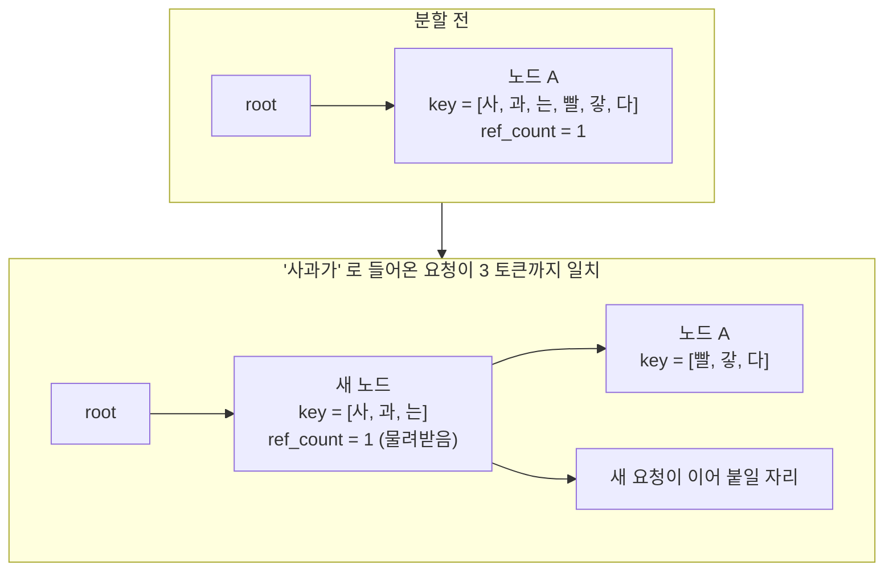

# 5. 접두사를 재사용하는 radix cache와 eviction

4편에서 요청 하나가 자기 자리를 잡는 법을 봤다. 그런데 같은 시스템 프롬프트로
들어오는 요청 백 개가 각자 같은 계산을 반복하면 그 자리는 금방 동난다.

그래서 이미 계산한 접두사를 다시 쓴다. 다시 쓰기 시작하면 두 가지 질문이 새로
생긴다. **어디까지 같은가**를 어떻게 빠르게 찾는가, 그리고 공간이 모자랄 때
**무엇을 버려도 되는가**를 어떻게 아는가.

## 트리를 걷다가, 어긋나면 쪼갠다

접두사 탐색은 루트에서 시작해 자식을 따라 내려간다.

```python
        while prefix_len < indice_len:
            child_node = node.children.get(self.key_fn(input_ids[prefix_len:]))
            if child_node is None:
                return node, prefix_len
            node = child_node  # walk to child node

            # NOTE: at least 1 page is matched, so match_len >= page_size
            match_len = node.get_match_len(input_ids[prefix_len:])
            match_len = align_down(match_len, self.page_size)
            prefix_len += match_len

            # need to split the node if not fully matched
            if match_len != node.length:
                node = node.split_at(match_len)
                node.timestamp = tic
                return node, prefix_len
```

— `python/minisgl/kvcache/radix_cache.py:211-226`

자식을 고르는 열쇠는 첫 토큰이다. `page_size` 가 1 이면 말 그대로 토큰 하나를
그대로 쓴다.

```python
def _get_key_fn(page_size: int) -> KEY_FN:
    if page_size == 1:
        return lambda x: x[0].item()
    return lambda x: tuple(x[:page_size].tolist())
```

— `python/minisgl/kvcache/radix_cache.py:234-237`

자식을 찾았으면 그 노드의 키와 입력이 **어디까지 같은지**를 잰다. 이 비교는
파이썬이 아니다.

```python
def fast_compare_key(x: torch.Tensor, y: torch.Tensor) -> int:
    # compare 2 1-D int cpu tensors for equality
    return _load_radix_module().fast_compare_key(x, y)
```

— `python/minisgl/kernel/radix.py:18-20`

미리 빌드해 둔 C++ 모듈을 부른다(`python/minisgl/kernel/radix.py:13-15`). 접두사
탐색은 요청마다 일어나고 프롬프트는 길다. 이 한 줄을 파이썬 루프로 두면 스케줄러의
CPU 시간이 그대로 지연이 된다 — 6편에서 볼 overlap 의 전제가 여기서도 작동한다.

중간까지만 같으면 노드를 쪼갠다.

```python
    def split_at(self, pos: int) -> RadixTreeNode:
        assert 0 < pos < self.length
        parent = self.parent

        new_node = RadixTreeNode(self.key_fn, self.timestamp)
        new_node.set_key_value(self._key[:pos], self._value[:pos])
        new_node.set_parent(parent)
        new_node.ref_count = self.ref_count

        self.set_key_value(self._key[pos:], self._value[pos:])
        self.set_parent(new_node)

        return new_node
```

— `python/minisgl/kvcache/radix_cache.py:69-81`

앞부분을 담은 새 노드가 만들어져 **부모 자리로 들어가고**, 원래 노드는 뒷부분만
남긴 채 그 아래로 내려간다. 눈여겨볼 줄은 `new_node.ref_count = self.ref_count`
다. 쪼개진 앞부분은 원래 노드를 쓰던 요청들이 여전히 쓰고 있으므로, 참조 수를 그대로
물려받아야 한다. 이 한 줄이 없으면 아직 쓰이는 앞부분이 버려도 되는 것으로 보인다.

<!-- visual: radix-tree-split supports: [radix-tree-split] -->



## 두 개의 크기

버려도 되는 공간과 아닌 공간을 세는 값이 따로 있다.

```python
class SizeInfo(NamedTuple):
    evictable_size: int
    protected_size: int

    @property
    def total_size(self) -> int:
        return self.evictable_size + self.protected_size
```

— `python/minisgl/kvcache/base.py:48-54`

둘을 옮기는 것이 잠금이다.

```python
    def lock_handle(self, handle: BaseCacheHandle, unlock: bool = False) -> None:
        assert isinstance(handle, RadixCacheHandle)
        node = handle.node
        if unlock:
            while not node.is_root():
                node.ref_count -= 1
                assert node.ref_count >= 0
                if node.ref_count == 0:
                    self.evictable_size += node.length
                    self.protected_size -= node.length
                node = node.parent
        else:
            while not node.is_root():
                if node.ref_count == 0:
                    self.evictable_size -= node.length
                    self.protected_size += node.length
                node.ref_count += 1
                node = node.parent
```

— `python/minisgl/kvcache/radix_cache.py:113-130`

<!-- visual: lock-evict-sizes supports: [lock-evict-sizes] -->

| 동작 | ref_count 변화 | evictable | protected | 언제 움직이는가 |
| --- | --- | --- | --- | --- |
| `lock` | 0 → 1 | `- node.length` | `+ node.length` | 첫 사용자가 붙을 때만 |
| `lock` | n → n+1 (n ≥ 1) | 그대로 | 그대로 | 이미 보호 중이므로 |
| `unlock` | 1 → 0 | `+ node.length` | `- node.length` | 마지막 사용자가 떠날 때만 |
| `unlock` | n → n-1 (n ≥ 2) | 그대로 | 그대로 | 아직 쓰는 요청이 남았으므로 |

두 크기의 합은 변하지 않는다. 잠금은 공간을 만들지도 없애지도 않고 **분류만
바꾼다.** 인터페이스 문서가 같은 말을 한다: "This operation will not modify the
cache, but change the size info only."
(`python/minisgl/kvcache/base.py:70-75`).

그리고 잠금은 노드 하나가 아니라 **루트까지 올라가며** 일어난다. 어떤 노드를 쓰면
그 조상들도 전부 쓰이는 중이기 때문이다. 3편에서 본 "잠근 뒤 여유 공간을 다시
확인한다"의 이유가 이것이다. 잠그는 순간 조상들까지 protected 로 옮겨 가므로
`available_size` 가 눈에 띄게 줄 수 있다.

## 버릴 때는 잎부터, 오래된 것부터

```python
        leave_nodes = self._collect_leave_nodes_for_evict()
        heapq.heapify(leave_nodes)
        evicted_indices: List[torch.Tensor] = []
        evicted_size = 0

        while evicted_size < size:
            ...
            node = heapq.heappop(leave_nodes)
            assert node.ref_count == 0 and node.is_leaf() and not node.is_root()
            evicted_size += node.length
            evicted_indices.append(node.value)
            self.evictable_size -= node.length
            parent = node.parent
            del parent.children[self.key_fn(node._key)]
            # NOTE: root is always protected, so won't be evicted
            if parent.is_leaf() and parent.ref_count == 0:
                heapq.heappush(leave_nodes, parent)
```

— `python/minisgl/kvcache/radix_cache.py:155-173`

규칙이 셋이다. **잎만** 버린다(중간 노드를 버리면 그 아래 자식들이 부모를 잃는다).
**참조 수가 0 인 것만** 버린다. 그리고 힙에서 꺼내는 순서는 `timestamp` 다.

```python
    def __lt__(self, other: RadixTreeNode) -> bool:
        return self.timestamp < other.timestamp
```

— `python/minisgl/kvcache/radix_cache.py:83-84`

`_tree_walk` 이 지나간 노드마다 `timestamp` 를 현재 시각으로 갱신하므로
(`python/minisgl/kvcache/radix_cache.py:228-229`), 가장 오래 안 쓰인 잎이 먼저
나간다. 잎 하나를 버리고 나서 부모가 잎이 되면 그 부모를 다시 힙에 넣는다. 가지
하나가 통째로 안 쓰이면 끝에서부터 차례로 걷힌다.

루트를 특별 취급하는 장치는 한 줄이다.

```python
        self.root_node.ref_count = 1  # root is always protected
```

— `python/minisgl/kvcache/radix_cache.py:111`

조건문을 넣는 대신 루트에 영구 참조를 하나 심어 두었다. 덕분에 퇴출 루프에 "루트는
건너뛰라"는 분기가 없다.

## 다시 넣을 때 무엇을 돌려주는가

계산이 끝난 요청은 자기 접두사를 트리에 넣는다.

```python
    def insert_prefix(self, input_ids: torch.Tensor, indices: torch.Tensor) -> InsertResult:
        insert_len = align_down(len(input_ids), self.page_size)
        input_ids, indices = input_ids[:insert_len], indices[:insert_len]
        node, prefix_len = self._tree_walk(input_ids)
        if prefix_len != insert_len:  # NOTE: prefix_len < insert_len
            new_node = RadixTreeNode(self.key_fn)
            new_node.set_key_value(input_ids[prefix_len:], indices[prefix_len:].clone())
            new_node.set_parent(node)
            self.evictable_size += new_node.length
            node = new_node
        return InsertResult(prefix_len, RadixCacheHandle(insert_len, node))
```

— `python/minisgl/kvcache/radix_cache.py:136-146`

돌려주는 `prefix_len` 은 "넣으려 했더니 **이미 트리에 있던** 길이"다. 내가 계산해
둔 그 부분은 이제 중복이므로 호출자가 해제해야 한다. 그 해제가 4편에서 본
`cache_req` 의 구간별 처리다.

```python
        cached_len, new_handle = self.prefix_cache.insert_prefix(insert_ids, page_indices)
        # unlock until all operations on handle is done
        self.unlock(old_handle)
        # this part is already in the prefix cache, free it
        self._free(page_indices[old_handle.cached_len : cached_len])
```

— `python/minisgl/scheduler/cache.py:70-74`

그 위에 달린 주석 블록(`python/minisgl/scheduler/cache.py:56-66`)이 구간을 여섯
줄로 나눠 적어 두었다. 어느 구간이 이미 캐시에 있었고, 어느 구간이 새로 들어갔고,
어느 구간이 꼬리라서 요청이 끝나면 버려야 하는지가 거기 정리돼 있다.

## 안 쓰겠다고 하면 전부 꺼진다

이 모든 것을 끄는 선택지도 같은 인터페이스로 제공된다.

```python
    def match_prefix(self, input_ids: torch.Tensor) -> MatchResult:
        return MatchResult(NaiveCacheHandle())

    def insert_prefix(self, input_ids: torch.Tensor, indices: torch.Tensor) -> InsertResult:
        return InsertResult(0, NaiveCacheHandle())
```

— `python/minisgl/kvcache/naive_cache.py:26-30`

`NaivePrefixCache` 는 언제나 "일치한 것 없음"을 돌려준다. 핸들의
`get_matched_indices` 도 빈 텐서다(`python/minisgl/kvcache/naive_cache.py:12-13`).
스케줄러 쪽 코드는 한 줄도 바뀌지 않는다. 접두사 재사용이 성능 기능이면서 동시에
**꺼도 정확성이 유지되는 기능**임을 이 대조군이 보여 준다.

## 공간 회계는 테스트가 지킨다

4편에서 본 정렬 단언은 eviction 이 끼어들 때 특히 중요하다.

```python
    def test_allocate_after_evict_returns_page_aligned(self):
```

— `tests/core/test_cache_allocate.py:61`

퇴출로 회수한 공간이 페이지 경계에서 시작하는지, 그리고 연속 할당이 겹치지 않는지를
따로 본다.

```python
    def test_consecutive_allocations_after_evict_no_overlap(self):
```

— `tests/core/test_cache_allocate.py:82`

겹침 검사는 실제로 토큰 위치 집합의 교집합을 센다
(`tests/core/test_cache_allocate.py:46-54`). 4편에서 본 대로 자리의 단위가 토큰이기
때문에 가능한 검사다.

## 정리

접두사 재사용은 radix 트리로 이뤄진다. 탐색 중 부분 일치를 만나면 노드를 쪼개고,
쪼갠 앞부분은 참조 수를 물려받는다. 잠금은 공간의 총량을 바꾸지 않고 evictable 과
protected 사이의 분류만 루트까지 올라가며 바꾸며, 퇴출은 참조 수 0 인 잎을
오래된 것부터 걷어 낸다.

다음 편은 지금까지 세운 장부 전체가 **한 루프 안에서** 어떻게 겹치는지를 본다.
스케줄러가 이 트리를 걷고 배치를 짜는 동안 GPU 는 무엇을 하고 있는가.

## 더 읽을거리

- [LMSYS 블로그 (2024-01-17)](https://lmsys.org/blog/2024-01-17-sglang/) —
  저장소의 `docs/features.md` 가 radix attention 도해의 출처로 링크한다. 같은
  문단에서 이 캐시가 SGLang 의 설계를 가져온 것이고 `--cache naive` 로 끌 수
  있다고 밝힌다.
