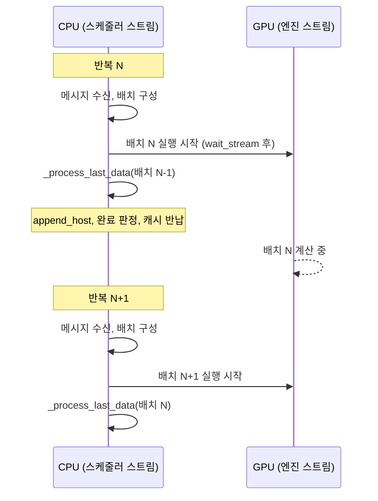

# 6. 두 스트림으로 CPU 스케줄링을 감추기

지금까지 다섯 편에 걸쳐 스케줄러가 하는 일을 봤다. 메시지를 받고, 예산을 계산하고,
트리를 걷고, 페이지를 잡고, 표를 채운다. 전부 **CPU 일**이다.

그동안 GPU 는 무엇을 하고 있는가. 아무것도 안 하고 있다면, 모델을 아무리 빨리
돌려도 그 사이사이가 비어 있다는 뜻이다. 이 편은 그 빈틈을 메우는 루프를 읽는다.

## 두 루프를 나란히 놓으면

같은 파일에 루프가 둘 있다. 먼저 단순한 쪽이다.

```python
    def normal_loop(self) -> None:
        blocking = not (self.prefill_manager.runnable or self.decode_manager.runnable)
        for msg in self.receive_msg(blocking=blocking):
            self._process_one_msg(msg)

        forward_input = self._schedule_next_batch()
        ongoing_data = None
        if forward_input is not None:
            ongoing_data = (forward_input, self._forward(forward_input))

        self._process_last_data(ongoing_data)
```

— `python/minisgl/scheduler/scheduler.py:108-118`

마지막 줄을 보라. 방금 시작한 배치(`ongoing_data`)를 **자기가 바로** 처리한다.
2편에서 본 `_process_last_data` 의 첫 줄이 `copy_done.synchronize()` 이므로
(`python/minisgl/scheduler/scheduler.py:143`), 이 루프는 GPU 가 끝날 때까지 여기서
멈춰 선다. 그동안 다음 배치를 위한 스케줄링은 시작되지 않는다.

이제 겹치는 쪽이다.

```python
    def overlap_loop(self, last_data: ForwardData | None) -> ForwardData | None:
        """
        The main loop of overlapping scheduling and execution.

        It will overlap the execution of current batch and processing of last batch's results,
        which can effectively hide CPU latency and improve GPU utilization.
        """
        blocking = not (
            last_data is not None  # don't block if we have a batch to be processed
            or self.prefill_manager.runnable
            or self.decode_manager.runnable
        )
        for msg in self.receive_msg(blocking=blocking):
            self._process_one_msg(msg)

        forward_input = self._schedule_next_batch()
        ongoing_data = None
        if forward_input is not None:
            with self.engine_stream_ctx:  # run the batch in the engine's stream
                self.engine.stream.wait_stream(self.stream)
                ongoing_data = (forward_input, self._forward(forward_input))

        self._process_last_data(last_data)
        return ongoing_data
```

— `python/minisgl/scheduler/scheduler.py:83-106`

차이는 인자와 마지막 줄 두 군데다. 이번 배치를 **엔진의 스트림에서** 띄워 놓고,
CPU 는 곧바로 **지난 배치**(`last_data`)의 결과를 처리한다. 그리고 이번 배치를
반환해, 다음 호출에서 그것이 `last_data` 가 된다.

```python
            data = None
            while True:
                data = self.overlap_loop(data)
```

— `python/minisgl/scheduler/scheduler.py:129-131`

<!-- visual: normal-vs-overlap supports: [normal-vs-overlap] -->

| | `normal_loop` | `overlap_loop` |
| --- | --- | --- |
| 인자 | 없음 | 지난 배치 `last_data` |
| 배치 실행 스트림 | 호출자 스트림 그대로 | `engine_stream_ctx` 안에서 엔진 스트림 |
| 결과 처리 대상 | 방금 띄운 배치 | **지난** 배치 |
| 동기화 지점 | 같은 반복 안 | 다음 반복 |
| 대기 판단 | 대기·실행 중 요청만 본다 | `last_data` 도 함께 본다 |
| 선택 | `ENV.DISABLE_OVERLAP_SCHEDULING` 이 참일 때 | 기본값 |

기본값은 `env.py` 가 정한다.

```python
    DISABLE_OVERLAP_SCHEDULING = EnvBool(False)
```

— `python/minisgl/env.py:69`

이름이 부정형이고 기본이 거짓이다. 즉 겹치는 쪽이 기본이고, 환경 변수로 끌 수 있다.

<!-- visual: overlap-timeline supports: [overlap-timeline] -->



## 다음 입력은 CPU 를 거치지 않는다

겹치려면 한 가지 조건이 필요하다. 다음 배치의 입력 토큰을 만들 때 **지난 배치의
출력 토큰 값이 필요하면** 겹칠 수 없다. CPU 가 값을 받을 때까지 기다려야 하니까.

이 저장소는 그 의존을 GPU 안에서 끊는다.

```python
    def _forward(self, forward_input: ForwardInput) -> ForwardOutput:
        batch, sample_args, input_mapping, output_mapping = forward_input
        batch.input_ids = self.token_pool[input_mapping]
        forward_output = self.engine.forward_batch(batch, sample_args)
        self.token_pool[output_mapping] = forward_output.next_tokens_gpu
        self.decode_manager.filter_reqs(forward_input.batch.reqs)
        return forward_output
```

— `python/minisgl/scheduler/scheduler.py:227-233`

입력은 `token_pool` 에서 **읽고**, 출력은 같은 `token_pool` 에 **쓴다**. 둘 다 GPU
텐서다. 2편에서 `TableManager` 가 `token_pool` 을 들고 있던 것
(`python/minisgl/scheduler/table.py:11`)이 여기서 쓰인다. 다음 반복에서
`token_pool[input_mapping]` 을 읽으면, 지난 배치가 써 넣은 토큰이 이미 거기 있다.
CPU 는 그 값이 무엇인지 몰라도 된다.

CPU 로 내려오는 복사는 여전히 일어나지만, 그것은 **사람에게 보낼 답을 만들기
위해서**이지 다음 계산을 위해서가 아니다. 2편에서 `complete_one()` 이 샘플링보다
먼저 호출된 것도 같은 이유였다. 길이는 값 없이도 전진할 수 있다.

읽고 쓸 자리는 배치를 준비할 때 미리 만들어 둔다.

```python
def _make_write_tuple(batch: Batch, device: torch.device) -> Indice2D:
    mapping_list = [req.table_idx for req in batch.reqs]
    mapping_host = torch.tensor(mapping_list, dtype=torch.int64, pin_memory=True)
    write_list = [(req.device_len if req.can_decode else -1) for req in batch.reqs]
```

— `python/minisgl/scheduler/scheduler.py:262-265`

더 만들 것이 없는 요청은 쓸 자리가 `-1` 이다. 조건문으로 걸러 내는 대신 인덱스
하나로 처리한다.

## 스트림을 나누는 이유

겹치기는 스트림 두 개 위에서 일어난다. 배치를 띄우기 직전에 한 줄이 있다.

```python
            with self.engine_stream_ctx:  # run the batch in the engine's stream
                self.engine.stream.wait_stream(self.stream)
```

— `python/minisgl/scheduler/scheduler.py:101-102`

엔진 스트림이 스케줄러 스트림을 기다리게 한다. 배치 준비 과정에서 스케줄러 스트림에
올려 둔 복사들 — 4편에서 본 page table 산포 쓰기
(`python/minisgl/scheduler/cache.py:144-146`), 3편에서 본 접두사 토큰 복사
(`python/minisgl/scheduler/prefill.py:58-61`) — 이 전부 `non_blocking=True` 였다.
기다리지 않으면 아직 도착하지 않은 입력으로 모델이 돌 수 있다.

그리고 겹치기를 쓸 때는 시작 지점에서 스트림을 못 박는다.

```python
        if ENV.DISABLE_OVERLAP_SCHEDULING:
            with self.engine_stream_ctx:
                self.engine.stream.wait_stream(self.stream)
                while True:
                    self.normal_loop()
        else:
            assert torch.cuda.current_stream() == self.stream
```

— `python/minisgl/scheduler/scheduler.py:122-128`

겹치지 않는 쪽은 아예 엔진 스트림 안에 들어가 루프를 돌고, 겹치는 쪽은 스케줄러
스트림에 있는지 단언한다. 두 루프가 서로 다른 전제 위에서 돌기 때문에 그 전제를
코드가 직접 확인한다.

엔진 쪽도 같은 확인을 한다. 엔진은 자기 스트림을 만들어 두고
(`python/minisgl/engine/engine.py:38-39`), 배치를 받을 때마다 지금 그 스트림에
있는지 본다.

```python
    def forward_batch(self, batch: Batch, args: BatchSamplingArgs) -> ForwardOutput:
        assert torch.cuda.current_stream() == self.stream
```

— `python/minisgl/engine/engine.py:191-192`

그리고 CPU 로 내려보내는 복사가 언제 끝났는지를 이벤트로 남긴다.

```python
        next_tokens_cpu = next_tokens_gpu.to("cpu", non_blocking=True)
        copy_done_event = torch.cuda.Event()
        copy_done_event.record(self.stream)
        return ForwardOutput(next_tokens_gpu, next_tokens_cpu, copy_done_event)
```

— `python/minisgl/engine/engine.py:203-206`

이 이벤트가 다음 반복에서 `_process_last_data` 가 기다리는 대상이다. 겹치기는 이
기다림을 없애는 것이 아니라 **한 반복 뒤로 미루는 것**이고, 그 사이에 다음 배치가
이미 GPU 로 떠났다.

## 한 번의 준비에 들어가는 것

겹치기가 감추는 CPU 일이 무엇인지는 배치 준비 함수를 보면 한눈에 들어온다.

```python
    def _prepare_batch(self, batch: Batch) -> ForwardInput:
        self.engine.graph_runner.pad_batch(batch)
        self.cache_manager.allocate_paged(batch.reqs)
        batch.positions = _make_positions(batch, self.device)
        input_mapping = _make_input_tuple(batch, self.device)
        write_mapping = _make_write_tuple(batch, self.device)
        batch.out_loc = self.engine.page_table[input_mapping]
        self.engine.attn_backend.prepare_metadata(batch)
```

— `python/minisgl/scheduler/scheduler.py:204-211`

일곱 줄에 이 시리즈가 지나온 것이 거의 다 들어 있다. 페이지 할당은 4편, page table
인덱싱으로 `out_loc` 을 만드는 것도 4편, 마지막 줄의 메타데이터 준비는 7편이다.
`pad_batch` 만 아직 설명하지 않았는데, 그것도 7편 몫이다.

이 일곱 줄이 매 스텝 CPU 에서 돌아간다. 겹치기가 없으면 그 시간만큼 GPU 가 쉰다.

## 정리

`overlap_loop` 은 이번 배치를 엔진 스트림에 띄워 놓고 지난 배치의 결과를 처리한다.
다음 배치의 입력이 `token_pool` 을 통해 GPU 안에서 이어지기 때문에, CPU 가 토큰 값을
기다리지 않아도 된다. 두 루프의 차이는 인자 하나와 마지막 줄 하나이고, 선택은
환경 변수가 한다.

다음 편은 `_prepare_batch` 의 마지막 줄을 연다. 스케줄러가 만든 장부 — 위치, 길이,
`out_loc` — 가 어떤 텐서로 바뀌어 어텐션 커널에 들어가는지, 그리고 CUDA graph
재생이 그 텐서들을 어떻게 고정하는지를 본다.

## 더 읽을거리

- [NanoFlow](https://arxiv.org/abs/2408.12757) — 저장소의 `docs/features.md` 가
  overlap scheduling 의 출처로 링크하는 논문. 같은 절이
  [LMSYS 블로그 (2024-12-04)](https://lmsys.org/blog/2024-12-04-sglang-v0-4/) 의
  도해도 함께 싣는다.
