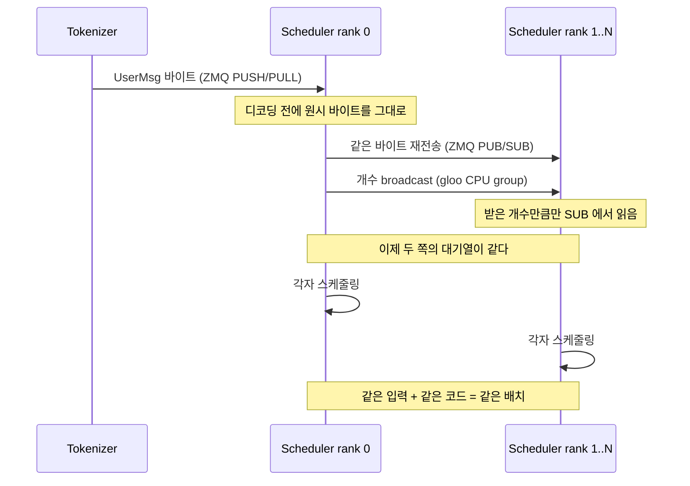

# 8. 여러 rank가 같은 장부를 공유하는 법

1편에서 스케줄러가 TP 크기만큼 뜬다는 것을 보고, 그 뒤 여섯 편은 **하나의**
스케줄러 안에서 일어나는 일을 읽었다. 이제 그 전부를 rank 수만큼 복제한다.

여기서 문제가 생긴다. 스케줄러는 매 스텝 결정을 내린다. 어떤 요청을 배치에 넣을지,
어느 페이지를 잡을지, 언제 무엇을 버릴지. rank 들이 각자 결정하는데 서로 다른 답에
이르면 같은 모델을 쪼개 든 GPU 들이 다른 계산을 하게 된다. 어떻게 같은 답에
도달하는가.

## 답은 "합의하지 않는다"

rank 들은 결정을 주고받지 않는다. **같은 입력을 받아 각자 같은 코드를 돌린다.**
그래서 필요한 것은 결정의 동기화가 아니라 **입력의 동기화**다.

1편에서 넘긴 코드가 그 일을 한다.

```python
    def _recv_msg_multi_rank0(self, blocking: bool = False) -> List[BaseBackendMsg]:
        pending_msgs: List[BaseBackendMsg] = []
        if blocking:
            self.run_when_idle()
            raw = self._recv_from_tokenizer.get_raw()
            self._send_into_ranks.put_raw(raw)
            pending_msgs.append(self._recv_from_tokenizer.decode(raw))

        pending_raw_msgs: List[bytes] = []
        while not self._recv_from_tokenizer.empty():
            pending_raw_msgs.append(self._recv_from_tokenizer.get_raw())

        # broadcast the number of raw messages to all ranks
        src_tensor = torch.tensor(len(pending_raw_msgs))
        self.tp_cpu_group.broadcast(src_tensor, root=0).wait()

        for raw in pending_raw_msgs:
            self._send_into_ranks.put_raw(raw)
            pending_msgs.append(self._recv_from_tokenizer.decode(raw))
        return pending_msgs
```

— `python/minisgl/scheduler/io.py:88-107`

rank 0 만 토크나이저와 연결돼 있다. 받은 바이트를 디코딩하기 전에 그대로 PUB 으로
뿌리고, **개수를 따로 broadcast** 한다. 받는 쪽은 그 개수만큼만 읽는다.

```python
    def _recv_msg_multi_rank1(self, blocking: bool = False) -> List[BaseBackendMsg]:
        pending_msgs: List[BaseBackendMsg] = []
        if blocking:
            self.run_when_idle()
            pending_msgs.append(self._recv_from_rank0.get())

        # ensure all ranks have the same number of raw messages
        dst_tensor = torch.tensor(-1)
        self.tp_cpu_group.broadcast(dst_tensor, root=0).wait()
        dst_length = int(dst_tensor.item())

        for _ in range(dst_length):
            pending_msgs.append(self._recv_from_rank0.get())
        return pending_msgs
```

— `python/minisgl/scheduler/io.py:109-122`

<!-- visual: rank-sync-protocol supports: [rank-sync-protocol] -->



개수를 왜 따로 보내야 하는가. PUB/SUB 은 "지금까지 온 것을 다 읽어라"를 안전하게
표현할 수 없다. 비어 있음을 확인하는 시점이 rank 마다 다르면 어떤 rank 는 두 개를,
다른 rank 는 세 개를 읽는다. 그러면 다음 스텝의 대기열이 달라지고, 3편에서 본
`break` 하나에서 결과가 갈린다. 개수를 먼저 못 박으면 그 가능성이 사라진다.

답을 돌려보내는 쪽은 비대칭이다.

```python
    def _reply_tokenizer_rank1(self, reply: List[DetokenizeMsg]) -> None:
        _ = reply  # do nothing for non-primary ranks
```

— `python/minisgl/scheduler/io.py:132-133`

rank 1 이상은 결과를 계산하고도 아무에게도 보내지 않는다. 같은 답을 N 번 보내면
디토크나이저가 N 번 답하게 되니, 내보내는 것은 rank 0 만 한다
(`python/minisgl/scheduler/io.py:124-130`). 1편에서 ack 를 primary rank 만 보내던
것과 같은 규칙이다.

rank 를 구분하는 값 자체는 단순하다.

```python
class DistributedInfo:  # should not export from here
    rank: int
    size: int

    def __post_init__(self):
        assert 0 <= self.rank < self.size

    def is_primary(self) -> bool:
        return self.rank == 0
```

— `python/minisgl/distributed/info.py:7-15`

## 가중치는 이름으로 잘린다

각 rank 는 모델의 일부만 들고 있다. 무엇을 어느 축으로 자를지는 **파라미터 이름**이
정한다.

```python
_SPLIT_DIM_0 = [".q_proj", ".k_proj", ".v_proj", ".gate_proj", ".up_proj"]
_SPLIT_DIM_1 = [".o_proj", ".down_proj"]
```

— `python/minisgl/models/weight.py:13-14`

<!-- visual: tp-shard-map supports: [tp-shard-map] -->

| 이름 패턴 | 자르는 축 | 이유 |
| --- | --- | --- |
| `.q_proj`, `.k_proj`, `.v_proj` | 0 (출력) | 헤드를 나눠 가진다 |
| `.gate_proj`, `.up_proj` | 0 (출력) | 중간 차원을 나눈다 |
| `.o_proj`, `.down_proj` | 1 (입력) | 앞 레이어가 나눈 결과를 받는다 |
| `lm_head`, `embed_tokens` | 0 (어휘) | 어휘를 구간으로 나눈다 |
| 그 외 | 자르지 않음 | 전 rank 복제 |

실제 코드가 이 표 그대로다.

```python
def _shard_tensor(key: str, value: torch.Tensor, r: int, n: int, num_kv_heads: int):
    """Extract rank r's shard from a single tensor. Returns a contiguous copy."""
    if any(key.count(sub) for sub in _SPLIT_DIM_0):
        is_kv_proj = any(key.count(sub) for sub in (".k_proj", ".v_proj"))
        if is_kv_proj and num_kv_heads is not None and num_kv_heads < n:
            head_dim = value.shape[0] // num_kv_heads
            head_idx = r * num_kv_heads // n
            return value[head_idx * head_dim : (head_idx + 1) * head_dim].clone()
        return value.chunk(n, dim=0)[r].clone()
    elif any(key.count(sub) for sub in _SPLIT_DIM_1):
        return value.chunk(n, dim=1)[r].clone()
    elif key.count("lm_head") or key.count("embed_tokens"):
        num_embeddings = value.shape[0]
        num_embeddings_per_partition = div_ceil(num_embeddings, n)
        vocab_start_idx = r * num_embeddings_per_partition
        vocab_end_idx = min((r + 1) * num_embeddings_per_partition, num_embeddings)
        return value[vocab_start_idx:vocab_end_idx, :].clone()
    else:
        return value
```

— `python/minisgl/models/weight.py:34-52`

특별한 경우가 하나 있다. KV 헤드 수가 rank 수보다 적으면 나눌 수가 없다. GQA 처럼
KV 헤드를 여럿이 공유하는 모델에서 생기는 상황인데, 그때는 자르는 대신 **같은 헤드를
여러 rank 가 복제해서 든다**(38-41 행). 4편에서 본 KV 버퍼의
`local_kv_heads` 가 `div_even(..., allow_replicate=True)` 로 계산된 이유가
이것이다.

자르는 쪽과 합치는 쪽은 짝이다.

```python
    def forward(self, x: torch.Tensor) -> torch.Tensor:
        y = F.linear(x, self.weight, self.bias)
        if self._tp_size > 1:
            y = self._comm.all_reduce(y)
        return y
```

— `python/minisgl/layers/linear.py:102-106`

입력 축으로 잘린 레이어(`o_proj`, `down_proj`)는 각 rank 가 부분합을 내므로 더해야
완성된다. 그 덧셈이 all-reduce 다. 출력 축으로 잘린 레이어는 각자 자기 몫의 출력을
그대로 들고 다음 레이어로 넘긴다 — 다음 레이어가 입력 축으로 잘려 있기 때문에
그대로 맞아떨어진다. 어휘를 나눈 임베딩도 같은 방식으로 합친다
(`python/minisgl/layers/embedding.py:42`).

통신 구현은 갈아 끼울 수 있게 돼 있다.

```python
class DistributedImpl(ABC):
    @abstractmethod
    def all_reduce(self, x: torch.Tensor) -> torch.Tensor: ...
```

— `python/minisgl/distributed/impl.py:16-18`

`torch.distributed` 를 쓰는 구현과 PyNCCL 을 직접 부르는 구현이 둘 다 있고
(`python/minisgl/distributed/impl.py:25-26`, `:45-48`), 호출부는 어느 쪽인지
모른다. 두 구현이 같은 결과를 내는지는 테스트가 확인한다.

```python
    test_correctness(lambda x: comm.all_reduce(x, "sum"))
```

— `tests/kernel/test_comm.py:137`

## 모델은 `torch.nn.Module` 이 아니다

여기까지 읽고 나면 레이어 클래스들이 PyTorch 의 표준 모듈을 상속하지 않는다는 점이
눈에 들어온다. 대신 자체 `state_dict` 를 구현한다.

```python
class BaseOP:
    @abstractmethod
    def forward(self, *args: Any, **kwargs: Any) -> Any: ...

    def state_dict(self, *, prefix: str = "", result: _STATE_DICT | None = None) -> _STATE_DICT:
        result = result if result is not None else {}

        for name, param in self.__dict__.items():
            if name.startswith("_"):
                continue
            if isinstance(param, torch.Tensor):
                result[_concat_prefix(prefix, name)] = param
            elif isinstance(param, BaseOP):
                param.state_dict(prefix=_concat_prefix(prefix, name), result=result)

        return result
```

— `python/minisgl/layers/base.py:15-30`

`__dict__` 를 그대로 훑어 텐서면 이름을 붙이고, 하위 `BaseOP` 면 접두사를 이어
재귀한다. 밑줄로 시작하는 이름은 건너뛴다 — 그래서 위에서 본 `self._comm` 이나
`self._tp_size` 는 가중치로 오해받지 않는다. 1편에서 본 메시지 직렬화
(`python/minisgl/message/utils.py:20-35`)와 같은 발상이다. 스키마를 따로 두지 않고
객체의 필드를 규칙으로 읽는다.

## 정리

rank 들은 결정을 합의하지 않는다. rank 0 이 받은 원시 바이트를 그대로 뿌리고 개수를
broadcast 해서 **입력을 같게** 만들고, 나머지는 각자 같은 코드로 같은 결론에
도달한다. 가중치는 파라미터 이름으로 축을 정해 잘리고, 입력 축으로 잘린 레이어는
all-reduce 로 부분합을 합친다.

이 시리즈는 여기서 끝난다. 1편의 프로세스 지도에서 시작해 요청 하나의 장부,
배치 예산, 페이지 할당, 접두사 재사용, 두 스트림, 커널 인자, 그리고 rank 복제까지
왔다. 각 편이 다음 편에 넘긴 질문을 따라오면, `python/minisgl/` 아래 1 만 줄이
어떻게 하나의 서빙 루프로 맞물리는지가 보인다.

## 더 읽을거리

- [SGLang](https://github.com/sgl-project/sglang) — 저장소 `README.md` 가 도입부에
  밝히는 원본 프로젝트. Mini-SGLang 이 축약한 구조를 실제 규모에서 보고 싶다면
  여기서 시작한다.
- 저장소의 `docs/structures.md` — 제어 메시지는 ZMQ, GPU 사이의 큰 텐서는
  `torch.distributed` 를 통한 NCCL 이라는 역할 분담을 밝혀 둔다. 이 편이 읽은
  두 경로가 각각 그 둘이다.
