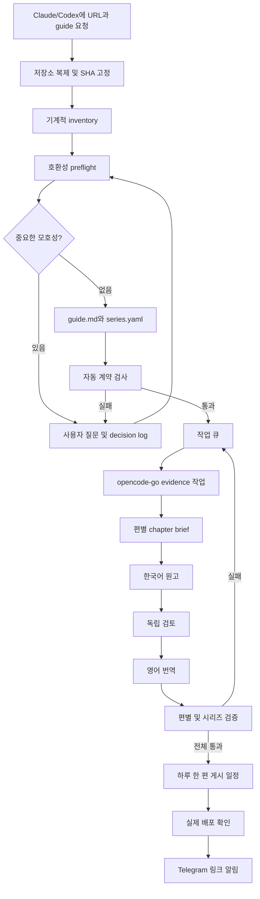

# 오픈소스 코드 분석 시리즈 자동화 설계

작성일: 2026-09-09

## 1. 목적

오픈소스 저장소 URL 하나를 Claude 또는 Codex에 주면, 에이전트가 사용자와
대화하며 분석 방향을 정하고 상세한 시리즈 guide를 만든다. guide가 완성된
뒤에는 opencode-go와 정기 작업이 코드 근거 수집, 한국어·영어 원고 작성,
교차 검증, 하루 한 편 게시, Telegram 알림까지 자동으로 수행한다.

이 도구의 핵심은 저장소 전체를 거대한 프롬프트 한 번으로 분석하는 것이
아니다. 기계적으로 만든 inventory와 작은 근거 문서를 쌓고, 이를 편별
brief로 압축한 뒤 원고를 만드는 계층형 파이프라인이다. 모든 분석은 guide
생성 시점의 commit SHA에 고정한다.

첫 파일럿은 다음 세 저장소다.

- `https://github.com/jmaczan/tiny-vllm`: 작은 C++/CUDA 교육용 추론 엔진
- `https://github.com/sgl-project/mini-sglang`: Python/CUDA 기반 모듈형 분산
  추론 서버
- `https://github.com/openxla/shardy`: Bazel, C++/MLIR, TableGen, RFC와 많은
  pass를 포함한 컴파일러 프로젝트

세 저장소는 크기, 언어, 문서 형태, 실행 환경이 서로 다르다. 파일럿에서
같은 목차를 강제로 적용하지 않고, 공통 분석 절차가 서로 다른 guide를
안정적으로 만드는지 검증한다.

## 2. 사용자 경험

사용자의 기본 인터페이스는 CLI가 아니라 자연어다.

```text
https://github.com/openxla/shardy 프로젝트 분석 시리즈 guide 만들어줘
```

명시적으로 skill을 호출하는 방식도 지원한다.

```text
# Codex
$code-series-guide https://github.com/openxla/shardy

# Claude Code
/code-series-guide https://github.com/openxla/shardy
```

에이전트는 URL을 받은 뒤 다음 작업을 알아서 수행한다.

1. URL과 원격 저장소를 검증한다.
2. 기본 브랜치의 commit SHA를 고정한다.
3. 저장소를 안전하게 복제하고 inventory를 만든다.
4. 규모, 구조, 라이선스, 실행 제약과 템플릿 적합성을 조사한다.
5. 분석 방향에 영향을 주는 모호성을 사용자에게 질문한다.
6. 답변을 결정 기록에 남기고 필요한 만큼 추가 조사한다.
7. 미결 질문이 없으면 `guide.md`와 `series.yaml`을 만든다.
8. 스키마와 근거 검사가 통과하면 별도 승인 없이 자동 작업 큐에 등록한다.
9. 이후 상태와 예상 게시 일정을 사용자에게 보고한다.

사용자가 직접 내부 CLI의 여러 옵션을 채우는 흐름은 기본 사용법이 아니다.
CLI는 skill과 cron이 호출하는 결정적 실행 엔진이며, 진단과 복구를 위한
운영 인터페이스로만 문서화한다.

## 3. 인간 개입 경계

guide 생성이 사용자가 분석 방향을 정하는 유일한 단계다. guide가 완성된
뒤의 조사, 집필, 번역, 검토, 게시에는 사용자가 일상적으로 개입하지 않는다.

### 3.1 질문 원칙

저장소에서 결정적으로 알아낼 수 있는 언어, 빌드 시스템, 기본 브랜치,
엔트리포인트, 테스트 위치, 라이선스는 에이전트가 직접 조사한다. 다음처럼
결과를 크게 바꾸면서 저장소만 보고 결정할 수 없는 사항은 적극적으로
질문한다.

- 예상 독자 수준과 선수 지식
- 특히 깊게 보고 싶은 하위 시스템
- 구현, 알고리즘, 성능, 교육 중 강조점
- 대형 저장소에서 포함할 제품 또는 디렉터리 범위
- 여러 대표 실행 경로 중 시리즈의 중심 서사
- 상위 프로젝트나 대안 구현과의 비교 범위
- 빌드와 벤치마크에 사용할 수 있는 자원
- 라이선스가 모호한 코드와 그림의 사용 범위
- 긴 시리즈를 여러 시즌으로 나눌 기준
- 비정형 프로젝트를 위한 템플릿 확장 방향
- 문서와 코드가 충돌할 때 분석 기준

질문은 다음 순서를 따른다.

1. 저장소에서 발견한 사실
2. 무엇이 모호한지
3. 선택이 guide에 미치는 영향
4. 에이전트의 권고와 이유
5. 사용자가 답할 한 가지 질문

서로 무관한 여러 결정을 한꺼번에 묻지 않는다. 사용자의 답은 대화 기록에만
두지 않고 `decision-log.md`에 저장한다.

### 3.2 자동화 중 새 모호성

guide 이후 중요한 모순이나 미결 사항이 발견되면 opencode가 임의로 방향을
정하지 않는다. 프로젝트를 `needs-guidance`로 전환하고 증거와 영향 범위를
보고한 뒤 guide 개정 단계로 돌아간다. 기존 완료 결과는 보존하고, guide가
개정되면 영향을 받는 작업만 무효화하여 재개한다.

이 예외도 콘텐츠 단계의 임의 지시가 아니라 guide 계약을 수정하는 절차다.

## 4. 접근 방식

다음 세 접근을 비교했다.

1. 프로젝트마다 하나의 에이전트 세션으로 끝까지 분석: 구현은 간단하지만
   긴 문맥에서 근거와 용어 일관성을 잃기 쉽고 부분 재실행이 어렵다.
2. `guide -> evidence -> chapter brief -> article` 계층형 파이프라인:
   작은 산출물이 파일 계약으로 통신해 재현성과 재시도가 좋고 프로젝트
   규모에 따라 작업 수만 조정할 수 있다.
3. 범용 AST 지식 그래프: 강력하지만 Python, C++, CUDA, MLIR, TableGen과
   다양한 빌드 시스템을 처음부터 정확히 지원해야 해 초기 범위를 넘는다.

2번을 선택한다. 정적 분석기는 버리지 않고 계층형 파이프라인의 결정적
inventory와 근거 수집 보조 도구로 사용한다.

## 5. 전체 아키텍처



### 5.1 책임 경계

- Skill: 자연어 요청 인식, 저장소 조사, 사용자 질문, guide 작성과 큐 등록을
  지휘한다.
- 내부 CLI: 저장소, inventory, 스키마, 상태 전이와 파일 쓰기를 결정적으로
  수행한다.
- opencode-go worker: 큐에 적힌 작은 조사, 집필, 번역, 검토 작업 하나를
  수행한다.
- publisher: 전체 검증이 끝난 시리즈에서 오늘 예정된 글만 Hugo workspace로
  옮긴다.
- notifier: 게시 URL이 실제로 열린 뒤 Telegram을 보내고 중복을 막는다.

각 단위는 파일 계약으로 통신한다. 숨은 세션 상태나 이전 모델 대화에 결과를
의존시키지 않는다.

## 6. Agent Skill

Claude Code와 Codex는 모두 `SKILL.md` 기반 Agent Skills 형식을 지원하므로
canonical skill 하나를 저장소에 둔다.

```text
automation/skills/code-series-guide/
├── SKILL.md
├── references/
│   ├── guide-contract.md
│   ├── questioning-policy.md
│   ├── compatibility-policy.md
│   └── evidence-policy.md
└── assets/
    ├── guide-template.md
    ├── series-template.yaml
    └── decision-log-template.md

.agents/skills/code-series-guide
└── ../../automation/skills/code-series-guide

.claude/skills/code-series-guide
└── ../../automation/skills/code-series-guide
```

Codex의 저장소 skill 위치는 `.agents/skills`, Claude Code의 저장소 skill
위치는 `.claude/skills`다. 두 위치에는 저장소 내부 canonical 디렉터리를
가리키는 상대 symlink를 둔다. 두 제품 모두 symlink skill을 지원한다.

`SKILL.md`의 description은 저장소 URL, 오픈소스 분석, 코드 읽기, 구조 연구,
시리즈 guide 요청에 반응하도록 범위와 trigger를 앞부분에 명확히 쓴다.
본문은 짧게 유지하고 상세 계약은 필요할 때만 `references/`에서 읽는다.

## 7. 저장 구조

분석 산출물은 workspace의 다음 경로에 저장한다.

```text
data/code-series/<project-slug>/
├── project.yaml
├── guide.md
├── decision-log.md
├── compatibility-report.md
├── series.yaml
├── inventory/
│   ├── files.jsonl
│   ├── symbols.jsonl
│   ├── dependencies.jsonl
│   └── docs.jsonl
├── recon/
│   ├── purpose.md
│   ├── build-and-run.md
│   ├── architecture.md
│   ├── runtime-flow.md
│   ├── data-and-state.md
│   ├── algorithms.md
│   ├── tests.md
│   ├── performance.md
│   ├── history.md
│   └── gaps.md
├── evidence/
│   ├── glossary.yaml
│   ├── claims.jsonl
│   └── diagrams/
├── chapters/
│   └── <NN>-<chapter-slug>/
│       ├── brief.md
│       ├── evidence.jsonl
│       ├── article.ko.md
│       └── article.en.md
└── state.json
```

복제한 소스와 임시 모델 출력은 커밋하지 않는다.

```text
.cache/code-series/repos/<project-slug>/<commit>/
.cache/code-series/work/<project-slug>/<task-id>/
```

### 7.1 파일 역할

- `project.yaml`: URL, 고정 SHA, 라이선스, 생성 설정과 안정적인 식별자
- `guide.md`: 사람이 읽는 시리즈 목적, 서사, 범위와 편별 계획
- `decision-log.md`: guide 단계의 관찰, 질문, 사용자 결정과 영향
- `compatibility-report.md`: 표준 템플릿과의 차이 및 권장 대응
- `series.yaml`: cron이 읽는 편 순서, 의존성, 필수 근거와 시각 자료 계약
- `inventory/*`: LLM 추측 없이 만든 저장소 색인
- `recon/*`: 작은 관점별 정찰 결과
- `claims.jsonl`: 사실 주장과 고정 SHA 코드 근거
- `brief.md`: 한 편을 쓰는 데 필요한 범위로 압축한 집필 계약
- `state.json`: 실행 횟수, 비용, 오류, lease와 다음 작업

`guide.md`와 `series.yaml`은 같은 의미를 사람이 읽는 형식과 기계가 읽는
형식으로 각각 표현한다. 상태처럼 실행 중 변하는 값은 guide에 넣지 않는다.

## 8. 저장소 획득과 안전

분석 대상은 신뢰하지 않는 입력으로 취급한다.

- GitHub HTTPS URL만 기본 지원하고 owner와 repository 이름을 검증한다.
- 기본 브랜치의 SHA를 해석한 뒤 해당 SHA를 명시적으로 checkout한다.
- guide 생성 중에는 저장소의 스크립트, Git hook, setup 파일을 실행하지 않는다.
- submodule은 자동 초기화하지 않고 호환성 보고서에 기록한다.
- symlink가 복제 루트 밖을 가리키면 읽지 않는다.
- 저장소 크기, 파일 수, 단일 파일 크기와 총 추정 token 상한을 적용한다.
- `.git`, generated, vendor, binary, model weight, build output은 기본 제외한다.
- 실행 검증은 별도 컨테이너에서 read-only source, 비밀 없음, 제한된 CPU,
  메모리와 시간, 기본 network off 정책으로 수행한다.
- network나 GPU가 필요한 검증은 guide 계약이 허용한 경우만 별도 프로파일로
  실행한다.

모든 코드 링크는 고정 SHA의 GitHub permalink를 사용한다. 원격 `main`이
바뀌어도 기존 글의 설명과 링크가 흔들리지 않는다.

## 9. 기계적 inventory

LLM을 호출하기 전에 다음을 추출한다.

- 파일, 디렉터리, 확장자, 언어, 크기, 줄 수와 content hash
- README, RFC, docs, example과 test 색인
- 빌드 파일, 패키지와 target 경계
- Python import, C/C++ include와 지원 가능한 build dependency
- 클래스, 함수, pass, CLI 엔트리포인트와 공개 심볼
- 구현 파일과 테스트의 이름 및 참조 관계
- 라이선스, submodule과 외부 코드
- generated/vendor/binary 판정과 제외 근거

첫 구현은 가벼운 언어별 extractor와 build-file parser를 사용한다. 완전한
범용 AST 그래프는 만들지 않는다. extractor가 이해하지 못한 언어 또는
빌드 시스템은 조용히 무시하지 않고 compatibility 판정에 반영한다.

## 10. 호환성 preflight

guide를 만들기 전에 템플릿 적합성을 네 단계로 판정한다.

| 판정 | 동작 |
|---|---|
| `supported` | 기존 템플릿으로 자동 진행 |
| `adapted` | 프로젝트 전용 분석 축을 guide에 추가하고 자동 진행 |
| `needs-review` | 차이와 확장안을 사용자에게 묻고 큐 등록 보류 |
| `blocked` | 분석 불가능한 이유와 필요한 조건을 보고하고 중지 |

다음 신호를 검사한다.

- 파일 수, 코드량 또는 예상 모델 입력량이 상한을 크게 초과
- 여러 독립 제품이 섞인 monorepo
- generated 또는 vendored 코드 비율이 높음
- 핵심 코드가 submodule이나 외부 저장소에 있음
- 지원하지 않는 언어, DSL 또는 빌드 시스템이 핵심임
- 문서와 실제 코드가 크게 불일치
- 특수 하드웨어, 비공개 데이터 또는 자격 증명이 실행에 필요
- 라이선스가 코드 인용 또는 그림 재사용을 제한
- 표준적인 엔트리포인트나 대표 실행 흐름을 찾을 수 없음
- 기존 분석 축으로 핵심 설계를 설명할 수 없음

`compatibility-report.md`에는 판정만 쓰지 않고 기존 템플릿과 다른 점, 자동
분석 가능 범위, 누락 위험, 템플릿 확장안, 프로젝트 전용 접근, 예상 비용과
편수 변화를 기록한다.

에이전트는 공통 템플릿을 조용히 수정하지 않는다. `needs-review`이면 사용자와
guide를 개정한 뒤 프로젝트 profile 또는 범용 extractor를 명시적으로
추가한다.

## 11. guide와 시리즈 분할

`guide.md`는 목차가 아니라 다음 자동 작업의 상위 설계서다.

```text
# <프로젝트> 코드 분석 시리즈 가이드

## 분석 대상과 고정 revision
## 독자, 목표와 선수 지식
## 포함 범위와 제외 범위
## 템플릿 적합성 및 실행 제약
## 전체 아키텍처 지도
## 대표 실행 경로
## 시리즈 전체 서사와 편별 의존성
## 편별 핵심 질문, 코드 범위와 필수 근거
## 필요한 표, 다이어그램과 코드 예제
## 공통 용어집과 중복 방지 규칙
## 검증 및 게시 조건
```

편수는 파일 개수나 고정 상한이 아니라 독립 개념과 실행 경로로 결정한다.

- 작은 단일 흐름 프로젝트: 대략 4~7편
- 여러 하위 시스템이 있는 애플리케이션: 대략 7~12편
- 컴파일러, 대형 런타임, monorepo: 12편 이상 또는 여러 시즌
- 한 편의 질문과 코드 범위가 지나치게 크면 하위 편으로 분리
- 서로 독립적인 제품은 하나의 시리즈로 억지로 묶지 않음

예상 범위는 guide 질문을 시작하기 위한 진단값일 뿐 강제 목표가 아니다.

`series.yaml`은 각 편에 다음을 요구한다.

```yaml
chapters:
  - id: request-lifecycle
    order: 1
    title: 요청 하나가 토큰이 되어 돌아오기까지
    questions:
      - 어떤 프로세스들이 요청 처리에 참여하는가?
      - 프로세스 사이에서 어떤 메시지가 이동하는가?
    code_scopes:
      - python/minisgl/server/**
      - python/minisgl/tokenizer/**
      - python/minisgl/message/**
      - python/minisgl/scheduler/io.py
    depends_on: []
    required_evidence:
      code: 6
      tests: 2
      runtime: 1
    visuals:
      - sequence-diagram
      - component-table
```

근거 숫자는 분량을 채우는 할당량이 아니라 근거가 빈약한 자동 게시를 막는
최소 조건이다.

## 12. 분석 작업 그래프

cron 한 번은 다음 작업 중 하나만 처리한다.

1. `recon`: 관점별 정찰 문서 하나 생성
2. `trace`: 대표 실행 경로 하나를 코드 수준으로 추적
3. `evidence`: 한 편의 주장과 근거 수집
4. `brief`: 근거를 편별 집필 지시서로 압축
5. `write-ko`: 한국어 원고 작성
6. `review-ko`: 새 문맥에서 사실성, 범위와 중복 검사
7. `translate-en`: 검증된 한국어 원고 번역
8. `review-en`: 구조, 용어, 코드와 수치 보존 검사
9. `series-review`: 순서, 반복, 모순과 누락 검사
10. `schedule`: 전체 통과 후 게시일 배정

각 opencode 작업은 필요한 파일만 입력으로 받으며 지정된 출력 파일 하나만
쓴다. 원고 작업은 저장소 전체 대신 guide, glossary, 해당 편 brief와
evidence, 앞편 요약만 읽는다.

기존 `papers/summarize.py`의 opencode subprocess, JSONL event, output file,
timeout, 비용과 모델 fallback 중 범용 부분은 두 번째 실제 소비자가 생기는
이 시점에 `core/agent_runner.py`로 옮긴다. 논문 전용 프롬프트와 본문 정책은
`papers`에 남긴다.

## 13. 주장과 근거 계약

`claims.jsonl`의 레코드는 다음 정보를 가진다.

```json
{
  "id": "scheduler-overlap-001",
  "chapter": "overlap-scheduling",
  "claim": "스케줄러는 이전 배치 결과 처리와 다음 배치 GPU 실행을 겹친다.",
  "kind": "behavior",
  "confidence": "verified",
  "evidence": [
    {
      "type": "code",
      "path": "python/minisgl/scheduler/scheduler.py",
      "symbol": "Scheduler.overlap_loop",
      "lines": [66, 91],
      "commit": "9a91cfafe754aa85daee49998176275667eb58f2",
      "permalink": "https://github.com/sgl-project/mini-sglang/blob/9a91cfafe754aa85daee49998176275667eb58f2/python/minisgl/scheduler/scheduler.py#L66-L91"
    }
  ],
  "limitations": [
    "실제 GPU timeline은 재현하지 못했고 코드 경로만 확인했다."
  ]
}
```

근거 강도는 다음처럼 구분한다.

- `verified`: 코드와 테스트 또는 실행 결과로 확인
- `documented`: 공식 문서에는 있지만 실행으로 확인하지 못함
- `inferred`: 여러 코드 경로를 토대로 도출한 해석
- `conflicted`: 문서와 구현 또는 테스트가 서로 다름
- `unknown`: 확인할 근거가 부족함

`inferred`를 사실처럼 단정하거나 `conflicted`를 숨기면 검사를 통과하지
못한다. 소스 코드 인용은 설명에 필요한 짧은 범위만 사용하고 나머지는
permalink로 연결한다.

## 14. 글과 시각 자료

모든 글을 경직된 형식에 끼우지는 않지만 다음 내용을 기본으로 다룬다.

1. 이 편이 답할 질문과 전체 시리즈에서의 위치
2. 필요한 선수 개념
3. 핵심 컴포넌트와 책임
4. 대표 입력의 코드 실행 경로
5. 중요한 데이터 구조와 상태 변화
6. 설계 선택과 trade-off
7. 코드 근거가 포함된 심층 분석
8. 테스트 또는 실행 확인
9. 확인하지 못한 범위와 주의점
10. 다음 편으로 이어지는 질문
11. 고정 SHA와 출처

시각 자료는 주장과 연결한다.

- 컴포넌트 관계: Mermaid flowchart
- 요청이나 compiler pass의 시간 순서: sequence diagram
- 객체와 요청의 상태 변화: state diagram
- 계층과 소유권: tree 또는 class diagram
- 모듈, 구현과 trade-off 비교: 표
- 메모리 배치: 자체 작성 블록 다이어그램
- 성능: 재현 가능한 데이터가 있을 때만 chart

상위 프로젝트의 그림은 라이선스가 명확할 때만 재사용한다. 그렇지 않으면
코드를 근거로 Mermaid 또는 자체 도식을 만들고 출처를 밝힌다. 장식 목적의
그림을 의무적으로 만들지 않는다.

## 15. 품질 검사

### 15.1 편별 검사

- guide의 필수 질문을 본문에서 실제로 답함
- 강한 사실 주장마다 코드 근거가 있음
- 모든 코드 링크가 고정 SHA를 사용함
- 존재하지 않는 파일, 심볼 또는 line link가 없음
- 문서와 코드의 차이를 숨기지 않음
- 실행하지 못한 내용을 실행 결과처럼 표현하지 않음
- Mermaid, code fence, 표와 수식 구조가 정상
- Hugo front matter와 내부 및 외부 링크가 유효
- glossary와 용어가 일치함
- 다른 편의 핵심 범위를 과도하게 반복하지 않음
- 라이선스와 attribution 조건을 충족함

### 15.2 시리즈 검사

모든 편이 완료된 뒤 원고 작성과 분리된 새 모델 문맥에서 검사한다.

- guide의 모든 핵심 질문이 어느 편엔가 배정됨
- 선수 지식과 실행 흐름에 맞는 순서임
- 같은 컴포넌트, 함수명, 수치와 SHA 설명이 일관됨
- 앞편에서 뒤편에 필요한 개념을 먼저 설명함
- 중요 컴포넌트가 디렉터리 설명 사이에서 누락되지 않음
- 한 편에 내용이 지나치게 몰리지 않음
- 결론이 실제 근거보다 과장되지 않음

한 편이라도 실패하면 시리즈 게시 일정을 만들지 않는다. 실패 범위에 따라
evidence, brief, writing 또는 translation 단계로 되돌린다.

### 15.3 영어 번역

영어판은 한국어 원고를 다시 요약하지 않고 번역한다. 제목 계층, code fence,
코드, Mermaid 식별자, 표 구조와 수치, 수식, 파일 경로, 심볼, SHA link,
근거와 한계 표현을 보존한다. 한국어 또는 영어 중 하나라도 실패한 편은
게시 일정에 넣지 않는다.

## 16. 실행 및 benchmark 정책

직접 실행 결과에는 다음 provenance가 있어야 한다.

- commit SHA와 실행 명령
- OS, architecture와 toolchain 버전
- Python, compiler, CUDA/ROCm 버전
- GPU, CPU와 memory
- 설정, 모델과 입력 데이터
- exit code와 원본 stdout/stderr
- 측정 횟수와 요약 방식

GPU가 없거나 빌드가 지나치게 무거우면 정적 분석으로 전환하고 한계를
명시한다. upstream benchmark는 직접 측정과 분명히 구분한다. 실행 재현이
안 된 수치를 새로 측정한 것처럼 쓰지 않는다.

## 17. 상태 머신과 재시도

프로젝트 상태는 다음처럼 이동한다.

```text
preflight
-> needs-guidance | queued
-> researching
-> drafting
-> reviewing
-> series-review
-> scheduled
-> publishing
-> deployed
-> notifying
-> complete
```

편별 상태는 다음과 같다.

```text
pending
-> researching
-> evidence-ready
-> drafting-ko
-> reviewed-ko
-> translating-en
-> reviewed-en
-> series-verified
-> scheduled
-> published
-> deployed
-> notified
```

실패는 다음처럼 분류한다.

| 분류 | 처리 |
|---|---|
| `transient` | network, GitHub, provider 장애를 backoff 후 자동 재시도 |
| `output-invalid` | JSON, Mermaid, 길이 계약 실패를 깨끗한 작업 문맥에서 재시도 |
| `evidence-missing` | 해당 편의 evidence 단계로 복귀 |
| `environment` | 실행 제약을 기록하고 허용된 대체 분석 적용 |
| `needs-guidance` | 증거와 영향 범위를 제시하고 guide 개정 대기 |
| `permanent` | 라이선스, 저장소 삭제, SHA 접근 불가 등의 이유로 중지 |

같은 원인의 자동 재시도에는 상한을 둔다. 상한 뒤에는 마지막 출력과 재현
명령을 보존한다. 작업은 project와 task ID 기반 lease를 가져 중복 cron이
같은 산출물을 동시에 쓰지 못하게 한다. 파일은 임시 경로에 쓴 뒤 원자적으로
교체한다.

## 18. 정기 실행과 게시

역할을 세 timer로 분리한다.

```text
code-series-worker.timer
└── 우선순위가 가장 높은 미완료 작업 하나 수행

code-series-publisher.timer
└── 오늘 예정됐고 전체 검증이 끝난 글 하나 게시

code-series-notifier.timer
└── 게시됐지만 알림이 끝나지 않은 글의 배포 확인과 알림 재시도
```

하루 한 편 게시 날짜는 전체 시리즈가 검증된 뒤에만 만든다. 한 편이 먼저
완성돼도 공개하지 않는다. publisher는 Hugo content를 원자적으로 만들고
기존 배포 workflow가 처리할 커밋을 생성한다.

현재 계정에서 GitHub `schedule`이 안정적으로 발화하지 않는 운영 제약은
기존 papers 파이프라인과 같다. 로컬 systemd가 private automation 저장소의
workflow를 dispatch하고 실제 작업은 runner에서 수행하는 방식을 기본으로
재사용한다. timer 시간과 게시 timezone은 설정값으로 두며 README에 실제
운영값을 기록한다.

## 19. Telegram 게시 알림

논문과 코드 시리즈 모두 파일 commit 시점이 아니라 실제 공개 URL이 열린
뒤 알린다.

1. `draft: false` 게시 commit을 push한다.
2. Hugo deploy 성공을 기다린다.
3. 예상 URL을 GET해 HTTP 200과 제목을 확인한다.
4. 준비된 한국어와 영어 URL을 Telegram으로 보낸다.
5. 안정적인 notification ID와 message hash를 `sent`로 기록한다.

논문 알림 예:

```text
📄 새 논문 리뷰가 게시되었습니다

제목: <제목>
arXiv: <ID>
한국어: https://jaehun.me/posts/...
English: https://jaehun.me/en/posts/...
원문: https://arxiv.org/abs/...
```

코드 시리즈 알림 예:

```text
🔍 새 코드 분석 글이 게시되었습니다

Mini-SGLang 코드 읽기 3/9
스케줄러는 어떻게 prefill과 decode를 함께 처리하는가

한국어: https://jaehun.me/posts/...
English: https://jaehun.me/en/posts/...
프로젝트: https://github.com/sgl-project/mini-sglang
분석 기준: 9a91cf...
```

전송 실패는 게시를 되돌리지 않는다. `notify-pending`으로 남기고 다음 timer가
재시도한다. `notification_id`, 게시 commit, URL, 시도 횟수, 전송 시각과
message hash를 상태에 보관해 workflow 재실행에서도 중복 발송을 막는다.

`~/workspace/macro`의 구현에서 검증된 다음 동작을 공통 `core/notify.py`에
반영한다.

- `httpx` timeout
- Telegram 4096자 제한보다 여유 있는 3900자 clipping
- notification 실패가 본 작업을 죽이지 않는 처리
- HTTP client가 URL을 log해도 Bot token을 가리는 handler-level filter

자격 증명 우선순위는 다음과 같다.

1. `TELEGRAM_BOT_TOKEN`, `TELEGRAM_CHAT_ID` 환경 변수
2. `BLOG_TELEGRAM_CONFIG`가 가리키는 YAML의 `notify.telegram`
3. 알림 비활성화

로컬 기본 운영은 `BLOG_TELEGRAM_CONFIG=/home/jaehun/workspace/macro/config.yaml`
로 기존 설정을 참조한다. 예약 프로젝트의 ID와 password는 읽지 않는다.
GitHub Actions는 로컬 파일을 볼 수 없으므로 Telegram 값 두 개를 repository
secret으로 별도 등록한다. secret 값은 설정, 상태, stdout 또는 commit에
기록하지 않는다.

## 20. 코드 배치

```text
automation/
├── core/
│   ├── agent_runner.py
│   └── notify.py
├── skills/
│   └── code-series-guide/
├── tasks/
│   ├── papers/
│   └── code_series/
│       ├── README.md
│       ├── cli.py
│       ├── layout.py
│       ├── repository.py
│       ├── inventory.py
│       ├── compatibility.py
│       ├── guide.py
│       ├── schema.py
│       ├── state.py
│       ├── queue.py
│       ├── evidence.py
│       ├── runner.py
│       ├── article.py
│       ├── review.py
│       ├── translate.py
│       ├── publish.py
│       ├── notify.py
│       └── defaults/
│           ├── config.yaml
│           └── prompts/
├── systemd/
└── tests/
    ├── code_series/
    └── test_notify.py
```

파일 목록은 책임 경계를 보여 주며 모든 파일을 처음부터 만들라는 의미는
아니다. 구현 plan에서 vertical slice에 필요한 최소 모듈부터 추가한다.
공통 모듈에는 papers와 code_series가 실제로 함께 쓰는 동작만 둔다.

## 21. 문서

`automation/tasks/code_series/README.md`는 다음을 포함하는 운영 매뉴얼이다.

1. 자동화의 목적과 지원 범위
2. 자연어 및 명시적 skill 요청 예
3. 대화형 guide 생성 과정
4. 사용자가 답하는 질문과 에이전트가 직접 조사하는 정보의 경계
5. 생성 디렉터리와 파일 의미
6. guide에서 게시까지 상태 머신
7. opencode-go model, variant, 비용과 timeout 설정
8. cron, systemd와 GitHub Actions 구성
9. 한국어와 영어 원고 생성 규칙
10. 코드 링크, 표와 diagram 생성 규칙
11. 비정형 프로젝트 판정과 대응
12. 실패, 재시도와 guide 개정
13. Telegram 설정과 보안
14. 파일럿 예시
15. 새 언어, build system과 project profile 확장법
16. 문제 해결 checklist

최상위 `automation/README.md`에는 `papers`와 `code_series`의 차이, 공유 core,
자연어 진입점과 각 작업 문서 링크를 추가한다. 내부 CLI는 자동화와 진단용임을
명시해 사용자가 많은 옵션을 직접 입력해야 한다는 인상을 주지 않는다.

## 22. 테스트

### 22.1 단위 테스트

- GitHub URL 정규화와 안전한 slug
- default branch와 SHA 고정
- file, language와 size inventory
- generated, vendor와 binary 제외
- symbol과 dependency 추출
- `series.yaml` schema와 guide 미결 질문 검사
- claim과 고정 SHA permalink 검증
- 허용 및 금지 상태 전이
- lease, 중복 cron 실행 방지와 원자적 write
- 재시도 횟수와 실패 분류
- Hugo path와 한국어·영어 URL
- Telegram token 마스킹, clipping과 HTTP error
- notification ID와 중복 방지

### 22.2 통합 테스트

실제 network와 모델 없이 fixture 저장소와 fake backend로 다음 전체 흐름을
검증한다.

```text
URL
-> SHA
-> inventory
-> compatibility
-> guide
-> queue
-> evidence
-> 한국어 원고
-> 영어 원고
-> 전체 검증
-> 게시
-> 배포 확인
-> Telegram
```

opencode JSONL event, GitHub 응답, Telegram API와 공개 URL 요청은 fake로
대체한다. 모델이 약속한 파일을 쓰지 않거나 짧은 보고문만 쓰는 경우도
회귀 테스트한다.

### 22.3 Golden 테스트

세 파일럿의 특성을 축소한 fixture를 둔다.

- tiny-vLLM형: 핵심 로직이 큰 파일 하나에 집중
- Mini-SGLang형: Python package와 여러 runtime component
- Shardy형: Bazel, C++/MLIR, TableGen, RFC와 많은 test

템플릿이나 extractor 변경 때 compatibility 판정, guide 골격과 편별 범위가
의도치 않게 흔들리지 않는지 확인한다. 날짜, SHA처럼 변하는 필드만 golden
비교 전에 정규화한다.

### 22.4 실제 파일럿 순서

1. tiny-vLLM으로 guide부터 알림까지 가장 작은 end-to-end를 검증한다.
2. Mini-SGLang으로 분산 process, scheduler, cache와 backend 관계를 검증한다.
3. Shardy로 대형 MLIR/Bazel 분할, 비정형 감지와 장기 시리즈를 검증한다.

Shardy까지 서로 다른 구조의 guide를 만들지 못하면 범용 템플릿 완료로
판정하지 않는다.

## 23. 완료 조건

- 사용자는 저장소 URL과 자연어 요청만 제공한다.
- Claude와 Codex가 같은 canonical skill과 guide 계약을 사용한다.
- 에이전트는 중요한 모호성을 guide 단계에서 근거와 권고를 붙여 질문한다.
- 미결 질문이 없는 guide 생성 시 commit SHA를 고정하고 자동 큐에 등록한다.
- 비정형 프로젝트는 차이, 위험과 확장안을 사용자에게 보고한다.
- 작은 파일 계약 단위로 중단과 재시도가 가능하다.
- 모든 중요 주장에는 고정 SHA로 추적 가능한 근거가 있다.
- 코드, 표와 필요한 Mermaid를 포함한 상세 한국어·영어 시리즈를 만든다.
- 전체 시리즈가 검증되기 전에는 한 편도 게시하지 않는다.
- 전체 검증 후 하루 한 편씩 게시한다.
- 실제 한국어·영어 링크가 열린 뒤 Telegram으로 알린다.
- 논문 게시에도 같은 Telegram 후처리를 적용한다.
- 세 파일럿이 각자의 구조에 맞는 서로 다른 guide를 생성한다.

## 24. 범위 밖

초기 구현에서는 다음을 하지 않는다.

- 모든 언어를 위한 완전한 AST/semantic graph
- 임의의 저장소 코드를 host에서 무제한 실행
- guide 없이 모델이 시리즈 범위와 방향을 나중에 임의 변경
- 분석 중 원격 `main`을 따라가며 기존 근거를 자동 교체
- 근거가 없는 benchmark 수치 생성
- 모든 상위 프로젝트 이미지를 자동 복제
- 비정형 프로젝트에 맞춰 공통 템플릿을 조용히 변형
- 일부 편만 먼저 공개
- Telegram 외 여러 알림 채널의 선제적 일반화

새 요구가 실제로 생길 때 project profile, extractor 또는 notification adapter를
작은 단위로 확장한다.
